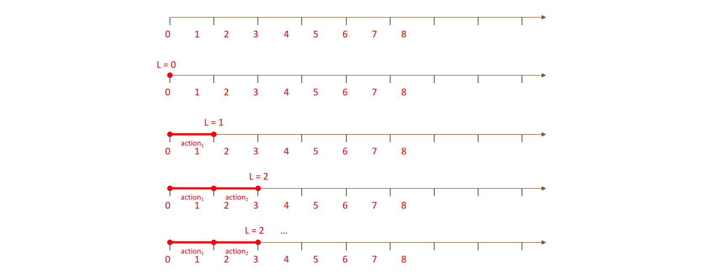
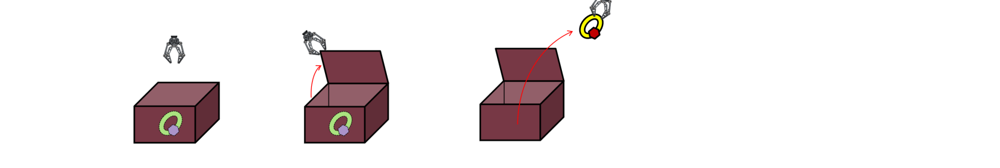

# SATPlan

Starting from a PDDL representation of the agent’s knowledge base KB (specifying the initial state and the
actions) and the goal g, the plan is build as follows:
- SATPlan tries to build a plan of length L, starting with L = 0 and then incrementing L by 1 at each
attempt (a strategy analogous to the iterative deepening search strategy)
- for every value of L = 0, 1, 2, ... a partially different propositional representation of KB ∧ g is
generated, and the attempt to build a model of such representation is carried out (for example using
the DPLL algorithm)
- if for some value of L a model of KB ∧ g is found, a plan of length L is extracted from the model
- if the available time and/or space resources are exhausted before a model is found, the planning effort
fails

The basic idea of SATPlan is that if the representation for a given L is satisfiable (i.e., if we can find a
model), this means that the goal can be achieved from the initial state, and thus the planning
problem is solved

## Example
We shall see how SATPlan works on a very simple example: picking a ring from an initially closed
box, which can be solved with L = 2

Initial state: $Closed(b)$, $In(R,B)$, $Free$

Goal: $Holds(R)$

Action $open(x)$:
- Precond: $Closed(x) \land Free$
- Effect: $\lnot Closed(x) \land Open(x)$

Action $pickUp(x,y)$:
- Precond: $In(x,y) \land Open(y) \land Free$
- Effect: $\lnot In(x) \land \lnot Free \land Holds(x)$

## From PDDL to PL
- Starting from the PDDL representation, we introduce a minimal set of propositional symbols
that is sufficient for representing both facts and actions
- Every symbol P will take an apex t = 0, 1, ... denoting the time instant (i.e., action step) at
which the truth of the symbol is considered; e.g., ¬P^4 will mean that P is false at instant t = 4
- Note that PL representations are interpreted according to classical logical semantics, which
means that we have no CWA

In our example:
- $Open(B) \to OpenB^t $ 
- $Closed(B) \to \lnot OpenB^t $ 
- $In(R,B) \to InRB^t $ 
- $Holds(R) \to HoldsR^t $ 
- $Free(B) \to \lnot HoldsR^t $
- $open(B) \to openB^t $ open B at time t (with effects at t+1)
- $pickUp(B) \to pickUpB^t $ pick up R from B at time t (with effects at t+1)

## Execution
### L = 0
We now build a propositional representation for L = 0.

In so doing, we assume that the goal is achieved at instant t = 0, i.e., by executing a plan of length zero,
or an empty plan, which actually means doing nothing

The representation includes:
- A representation of the initial state, in our example: $\lnot OpenB^0$, $InRB^0$, $\lnot HoldsR^0$
- A representation of the goal, on the assumption that it is already achieved at t = 0. In our example: $HoldsR^0$
- nothing else, because at t = 0 no action has been performed yet

Considering our example to the human eye, it is obvious that the set of propositional sentences is unsatisfiable, because we immediately see the logical contradiction. An artificial agent may reach the same conclusion by applying DPLL. Given that we found no plan for L = 0, SATPlan will proceed and build the representation for L = 1.

### L = 1
The representations for L > 0 are more complex than the one for L = 0, because we must
consider the possibility of executing actions at every t < L

#### Precondition axioms
Let us start with the preconditions of an action that is executed at a generic instant t:
In SATPlan the preconditions of an action are considered as necessary conditions for the
execution of the action, i.e., as conditions that must hold at t if the action is executed at t (with
effects at t+1); e.g:
- if the action of opening x is executed at t
then x is closed and the gripper is free at t

We therefore represent the action preconditions with the following
propositional sentences:
$$openB^t \implies \lnot OpenB^t \land \lnot HoldsR^t$$
$$pickUpRB^t \implies InRB^t \land OpenB^t \land \lnot HoldsR^t$$

In view of the application of DPLL, the precondition axioms must be converted in CNF:
$$openB^t \implies \lnot OpenB^t \land \lnot HoldsR^t \newline
\to \lnot openB^t \lor (\lnot OpenB^t \land \lnot HoldsR^t)
\newline \to ¬openB^t ∨ ¬OpenB^t
\newline ¬openB^t ∨ ¬HoldsR^t$$
$$pickUpRB^t ⇒ InRB^t ∧ OpenB^t ∧ ¬HoldsR^t
\newline \to ¬pickUpRB^t ∨ (InRB^t ∧ OpenB^t ∧ ¬HoldsR^t)
\newline \to ¬pickUpRB^t ∨ InRB^t
\newline ¬pickUpRB^t ∨ OpenB^t
\newline ¬pickUpRB^t ∨ ¬HoldsR^t$$

These clauses have to be included in the SATPlan representation for every time instant from 0 to L−1
until a plan of length L is found (because actions can be performed at every t such that 0 ≤ 𝑡 < 𝐿) or
the planning effort is abandoned.

#### Fluent axioms
In order to deal with the **frame problem**, SATPlan represents the effects of actions indirectly, by
using fluent axioms that specify the necessary and sufficient conditions for a fluent (predicate
that changes over time) to hold at time t+1 (i.e., after an action has been executed at t)
The general structure of a fluent axiom for P is as follows:

$$P^{t+1} ⟺ actionCausingP^t ∨ (P^t ∧ ¬actionCausingNotP^t)$$

In our problem the **fluent axioms** are simplified because only two actions are possible:
$$OpenB^{t+1} ⟺ openB^t ∨ OpenB^t$$

because we are not considering the action of closing a box
$$InRB^{t+1} ⟺ InRB^t ∧ ¬pickUpRB^t$$
$$HoldsR^{t+1} ⟺ pickUpRB^t ∨ HoldsR^t$$
because we are not considering the action of putting a ring into a box

*Also the fluent axioms must be converted into CNF*.

#### Action exclusion axioms
We now consider a final point: is it possible to execute more than one action at the same time?
or the execution of an action at $t$ rules out the possibility of executing also other actions at $t$?

In our case the action preconditions are sufficient to exclude that $openB^t$ and $pickUpRB^t$ are
executed at the same $t$ (because the box should be both closed and open at $t$)
In general, however, this is not the case: think for example of adding a $closeB^t$ action, which can
always be executed in the states in which $pickUpRB^t$ can be executed.

# Exam questions
### 2020 02 13 Q4.2
To put the air conditioning to work one has to press the START button when the ON-OFF switch is ON
and the air conditioning is not already working. Initially, the ON-OFF switch is OFF and the air conditioning is not working. The
goal is to put the air conditioning to work.

Show how one can start to solve the problem using SATplan, briefly explaining
every step. In particular:
- List all the propositional symbols that you are going to use and explain their meaning.
- Formulate a SATplan representation for t = 0.
- Show that no solution is found for t = 0.
- Formulate a SATplan representation for t = 1.

  
Solution

  
Propositional symbols:
- $On^t$ the switch is on at time t
- $Working^t$ the air conditioner is working at time t
- $switchOn^t$ turn on the switch at timet
- $start^t$ start the air conditioner at time t

L=0 representation:
- The initial state is: $\lnot On^0 \land \lnot Working^0$
- The goal state is: $Working^0$

There is no solution at L=0 because $Working^0$ of the goal is contraddicted by the pure literal $\lnot Working^0$ in the state.

The representation for t = 1 consists of the initial state, goal, precondition axioms, fluent axioms, and exclusion axioms in
CNF:
- The initial state is: $\lnot On^0 \land \lnot Working^0$
- The goal state is: $Working^1$
- The precondition axioms: 
	- $switchOn^0 \implies \lnot On^0$, in CNF: $\lnot switchOn^0 \lor \lnot On^0$
    - $start^0 \implies On^0 \land \lnot Working^0$, in CNF: $(\lnot start^0 \lor On^0) \land (\lnot start^0 \lor \lnot Working^0)$
- The fluent axioms:
	- $On^1 \iff switchOn^0 \lor On^0$, divided:
    	1. $On^1 \implies switchOn^0 ∨ On^0$ becomes $\lnot On^1 \lor switchOn^0 \lor On^0$
    	2. $switchOn^0 ∨ On^0 \implies On^1$ becomes $(\lnot switchOn^0 \lor On^1) \land (\lnot On^0 \lor On^1)$
- The exclusion axioms:
	- $\lnot switchOn^0 \lor \lnot start^0$

