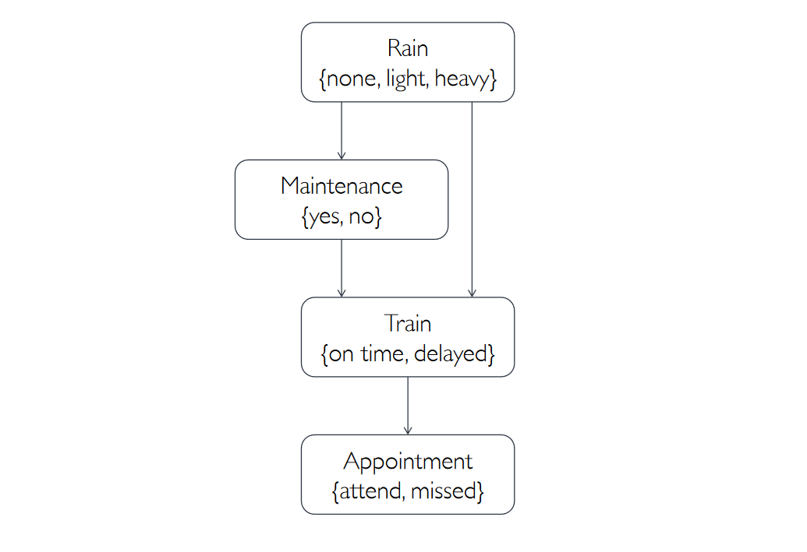
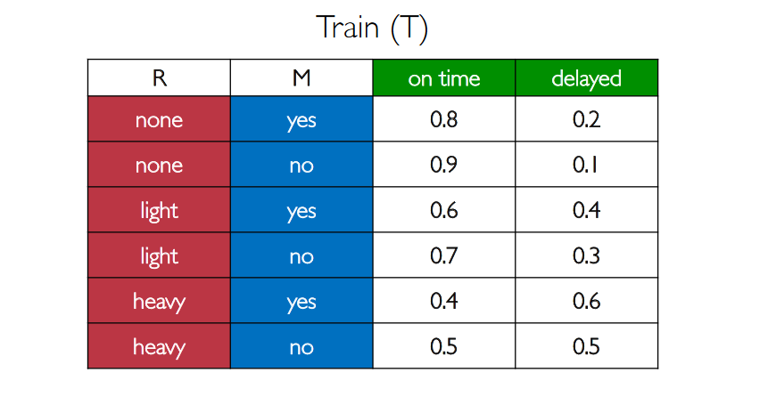
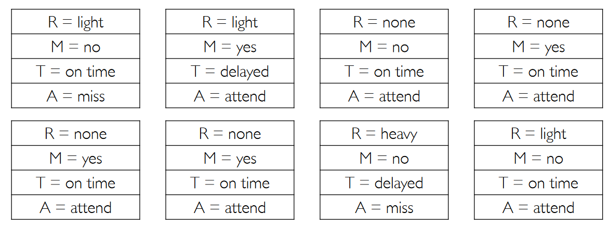
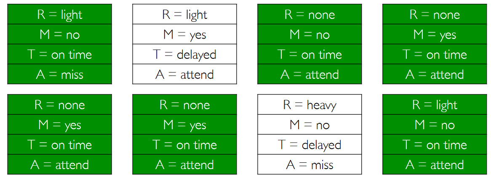

# Bayesian Networks

Bayesian Networks are data structure that represents the dependencies among random **categorical** variables:
- Directed graph
- Each node represents a random variable
- A direct edge from $X$ to $Y$ means $X$ is a parent of $Y$
- Each node $X$ has probability distribution $P( X | Parents(X) )$

For example:

- "Rain" ($R$) is independent and it has the probabilities $P(R)=\lang 0.7, 0.2, 0.1 \rang$
- "Mainteance" ($M$) depends only on $R$, so:
	- $P(M|R=\text{none})=\lang 0.4,0.6 \rang$	
    - $P(M|R=\text{light})=\lang 0.2,0.8 \rang$
    - $P(M|R=\text{heavy})=\lang 0.1,0.9 \rang$
- "Train" ($T$) depends both on $M$ and on $R$, resulting in the following probabilities:

- "Appointment" ($A$) depends only on $T$:
	- $P(A|T=\text{on time})=\lang 0.9, 0.1 \rang$
	- $P(A|T=\text{delayed})=\lang 0.6, 0.4 \rang$
    
## Computing join probabilities
From a bayesian network we can easily compute some interesting probabilities which are not explicitly defined.

In our example we could compute:
- $P(R=\text{light} \land M=\text{no}) = P(R=\text{light})P(M=\text{no}|R=\text{light})$
- $P(R=\text{light} \land M=\text{no} \land T=\text{delayed})=P(R=\text{light})P(R=\text{light} | M=\text{no})P(T=\text{delayed} | R=\text{light} ∧ M=\text{no})$
- $P(R=\text{light} \land M=\text{no} \land T=\text{delayed} \land A=\text{missed})=P(R=\text{light})P(R=\text{light} | M=\text{no})P(T=\text{delayed} | R=\text{light} ∧ M=\text{no})P(A=\text{missed} | R=\text{light} ∧ M=\text{no} \land T=\text{delayed})$

## Inference using bayesian networks
We want to compute distribution of a variable $X$ and we can observe an evidence variables $E$ for the event $e$. There is also a hidden variables $Y$ which is not observable. The goal is to compute $P(X | e)$.

In our example we may want to compute the probability to be on time but we do not know the probability of the train being delayed. However, we know there is light rain outside and there is no mainteance today.

We want to compute $P(A|R=\text{light} \land M=\text{no})$. Using **marginalization**:

$P(A|R=\text{light} \land M=\text{no}) = \alpha P(A \land R=\text{light} \land M=\text{no}) = \alpha [P(A \land R=\text{light} \land M=\text{no} \land T=\text{on time}) + P(A \land R=\text{light} \land M=\text{no} \land T=\text{delayed})]$

This is called **inference by ennumeration** which, in general, is:
$$P(X|e) = \alpha P(X \land e) = \alpha \sum_{y}{P(X \land e \land y)}$$

Where $y$ ranges over the possible values of the hidden variable and $\alpha$ is a normalization term.

Using this approach I need to ennumerate all the possible combinations and it is computationaly intensive.

### Approximated inference
I can use **sampling** to approximate the inference.

I start with the independent variables (eg. $R$) and I sample one of its values using the probabilities.
Now I can sample the variables which depends only on the independent variables (eg. $M$). I can do this because I have the sample of the $Parents(X)$ so I can use $P(X|Parent(X))$ to sample. I can repeat the procedure for all the nodes.

I can repeat this process over and over to generate
several samples from the same distribution.

When I have a sufficient amount of samples I can compute the inference just by counting matching samples.

For example, if I produce the following samples:

Then I can compute $P(T=\text{on time})$ just by counting the matching samples.

### Rejection sampling
If I want to compute a conditional probability $P(R=\text{light} | T=\text{on time})$ I could consider only the samples matching the condition ($T=\text{on time}$) and then count the samples ($R=\text{light}$).
This is called **rejection sampling**.

The problem with rejection sampling is that if the conditional is a very unlikely event then we are going to reject many samples, and to have a sufficient ammount of samples to compute the probability we would have to generate a huge ammount of samples.

### Likelihood Weighting
Another approach is to:
- Fix the values for evidence variables
- Sample non evidence variables using conditional probabilities in the Bayesian network
- Weight each sample by its likelihood (the probability of all the evidence)

For example, to compute $P(R=\text{light} | T=\text{on time})$ we can fix the evidence variable $T$ to $T=\text{on time}$, then we can sample the variables for which $T$ depends on ($R$ and $M$) in the usual way, while for the variables which depends on $T$ ($A$) we fix the evidence $T=\text{on time}$.

After sampling we weight the sample using the probability based on the evidence ($T=\text{on time}$).

Let's say the sample is: $(R=\text{light}, M=\text{yes}, T=\text{on time}, A=\text{attend})$ then the weight of this sample is equal to the probability of $T=\text{on time}$ given $R=\text{light} \land M=\text{yes}$, so it is $P(T=\text{on time} | R=\text{light} \land M=\text{yes}) = 0.6$.