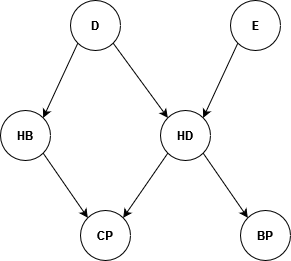

# Example problems on uncertainty

Some example problems that could be asked in the exam:
- Given some knowledge about a problem, represent such knowledge as a Bayesian network
- Given a Bayesian network, specify what formula you need to compute a given probability
- Given a Bayesian network, compute the probability

### Example
You are trying to design a Bayesian network to model the knowledge about the relation between the following series of variables:
- Exercise (with values Yes and No) $E$, 
- Diet (with values Healthy and Unhealthy) $D$, 
- HeartDisease (with values Yes and No) $HD$, 
- BloodPressure (with values High and Low) $BP$, 
- HeartBurn (with values Yes and No) $HB$, 
- ChestPain (with values Yes and No) $CP$.

The physician describes the relation between these variables as follows: “Patients can experience chest pain if they have
heartburn but also if they have a heart disease. Unhealthy diet influence possible heart diseases and heartburn. Regular
exercise can limit problems of heart diseases. High blood pressure can be an effect of a heart disease.”

#### Exercise 1
Draw the Bayesian network that represent the physician knowledge.

  
Solution

  
  

#### Exercise 2
Suppose that I want to compute $P(BP=\text{High}, HD=\text{No}, E=\text{No}, D=\text{Yes})$. What computation
should I perform to be able to compute it?

  
Solution

  
   It is join probability so it can be computed using a "top-down" approach. I start from the independent variables and proceed in the network.

  The result is $P(D=\text{Yes})P(E=\text{No})P(HD=\text{No}|D=\text{Yes}, E=\text{No})P(BP=\text{High}|HD=\text{No})$

#### Exercise 3
What if I did not know anything about the Diet?

  
Solution

  
  I would need to do the computation for the all the possible values of Diet and then I would need to normalize.

#### Exercise 4
What if I wanted to compute $P(BP=\text{High})$?

  
Solution

  
  I could do inference by ennumeration to calculate the probability or use sampling for an approximation.

