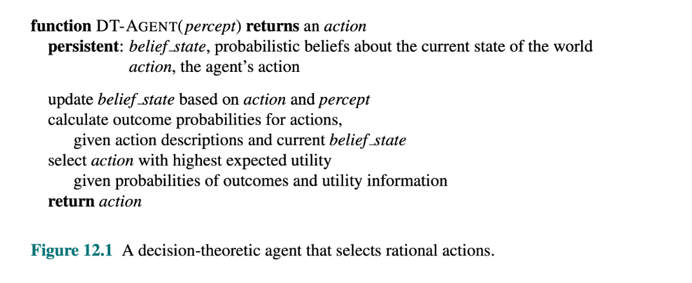

# Introduction to uncertainty

Agents in the real world need to handle uncertainty, whether
due to partial observability, nondeterminism, or adversaries.

An agent may never know for sure what state it is in
now or where it will end up after a sequence of actions.

## Logical reasoning and uncertainty
Applying logic to cope with domains like medical diagnosis often fails because:
- It is too much work to list the complete set of antecedents or consequents needed to ensure an exceptionless rule
- it is too hard to use such rules
- Medical science has no complete theory for the domain
- Even if we know all the rules, we might be uncertain about a particular patient because not all the necessary tests have been or can be run

## Belief states
Problem-solving and logical agents handle uncertainty by keeping track of a belief state which represent the set of all possible world states that the agent might be in.

The agent needs a contingency plan that handles every possible eventuality that its sensors may
report during execution.

Using a belief states has some drawbacks:
- The agent must consider every possible explanation for its sensor observations, no matter how unlikely.
- A correct contingent plan that handles every eventuality can grow arbitrarily large and must consider arbitrarily unlikely contingencies.
- Sometimes there is no plan that is guaranteed to achieve the goal, yet the agent must act. It must have some way to compare the merits of plans that are not guaranteed.

## Decision theory
Decision theory is a mix of probability theory and utility theory.

An agent is rational, according to decison theory, if and only if it chooses the action that yields
the highest expected utility, averaged over all the possible outcomes of the action. This is called the principle of maximum expected utility (MEU).
