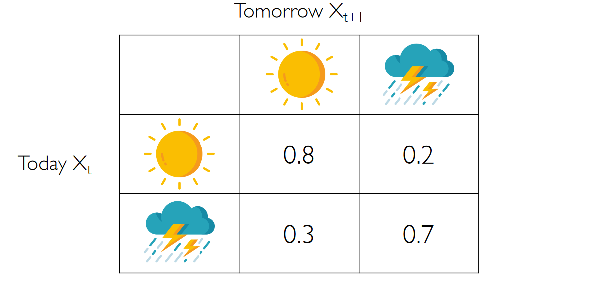
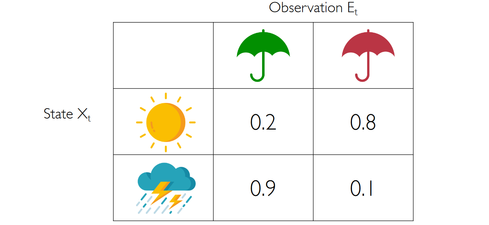
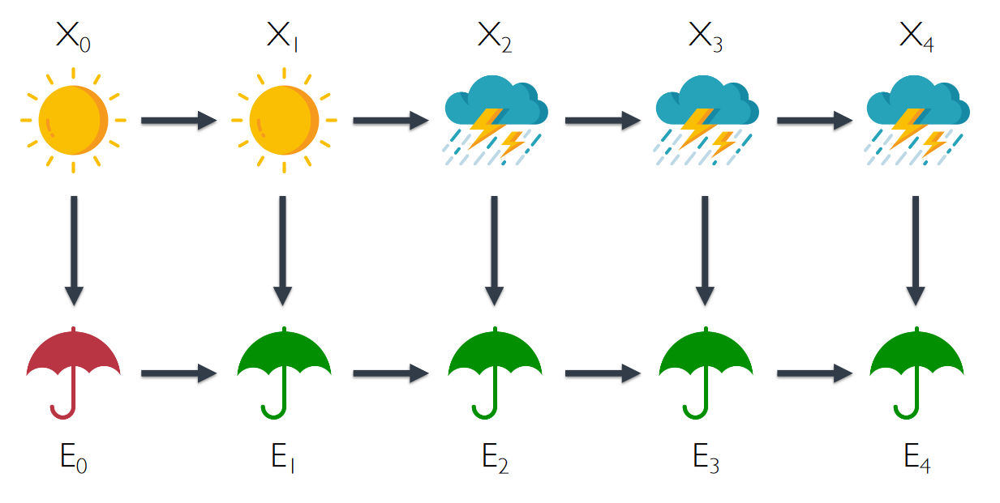
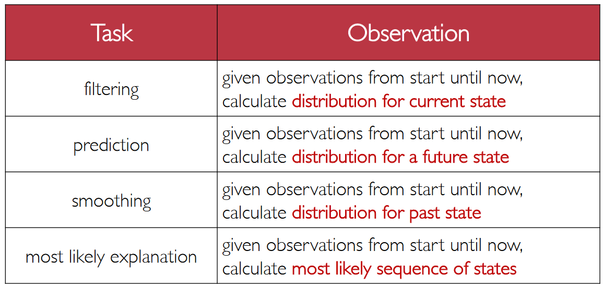

# Uncertainty over time

We consider the **Markov assumption**: The current state $X_t$ depends on only
a finite fixed number of previous states.

A **Markov chain** is a sequence of random variablesfor which the distribution of each variable
follows the Markov assumption.

We can define a **transition model**, for example:

In many cases we have an hidden state which is not observable but we can observe some variables. For example:
- We want to know the robot position but we can observe only the sensors data
- We want to know the words spoken but we observe only the audio waveforms
- We want to know the weather outside but we can only see how many people have an umbrella

An **hidden Markov model** is a Markov model for a system with hidden
states that generate some observed event.

**Sensor Markov assumption**: the evidence variable depends only the corresponding state

The possible tasks we could want to do in this context are:
