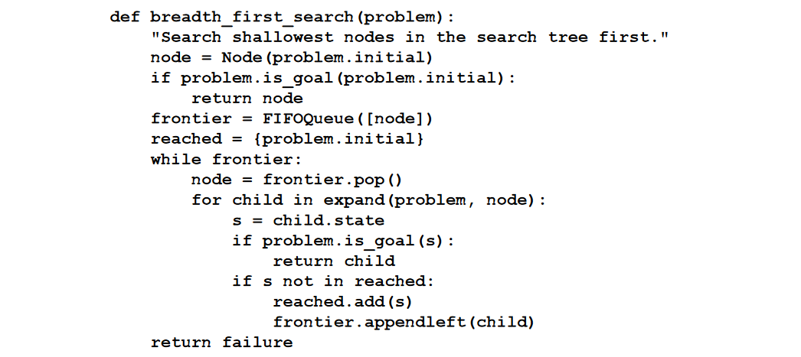

# Breadth-first search

When all actions have the same cost, an appropriate strategy is **breadth-first search**, in
which the root node is expanded first, then all the successors of the root node are expanded
next, then their successors, and so on. This is a **systematic** search strategy that is therefore
complete even on infinite state spaces.

We can do an **early goal test**,
checking whether a node is a solution as soon as it is generated, rather than the **late goal test**
that best-first search uses, waiting until a node is popped off the queue. 

## Cost Optimality and completeness
Breadth-first search always finds a solution with a minimal number of actions, because
when it is generating nodes at depth *d* it has already generated all the nodes at depth *d-1*
so if one of them were a solution, it would have been found.
That means it is cost-optimal
for problems where all actions have the same cost or if the path cost to any node is a non-decreasing function of the depth of the node. It is complete in either case.

## Time and space complexity
The root of the search tree generates
nodes, each of which generates more nodes, for a total of at the second level. Each of
these generates more nodes, yielding nodes at the third level, and so on. Now suppose
that the solution is at depth Then the total number of nodes generated is 1 + b + b^2 + b^3 + ⋯ + b^d = O(b^d)

All the nodes remain in memory, so both time and space complexity are **O(b^d)**

*Note*: The memory requirements are a bigger problem for
breadth-first search than the execution time. Exponential complexity search problems cannot be solved by uninformed search for any but the smallest
instances.