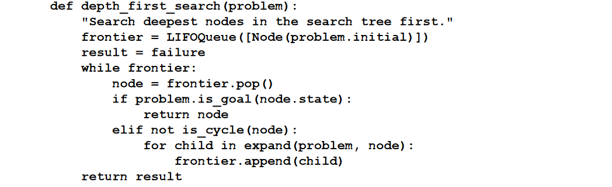
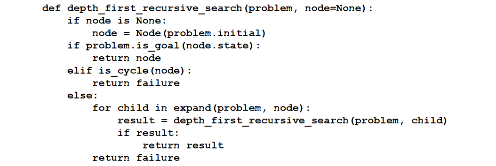

# Depth-first search

Depth-first search always expands the deepest node in the frontier first. It could be
implemented as a call to BEST-FIRST-SEARCH where the evaluation function $f$ is the negative of
the depth. However, it is usually implemented not as a graph search but as a **tree-like search**
that does not keep a table of reached states. 

The search proceeds immediately to the deepest level of the search tree, where the
nodes have no successors. The search then “backs up” to the next deepest node that still has
unexpanded successors.

The goal test is applied when a node is extracted from the frontier.

## Evaluation
Depth-first search is **not cost-optimal**; it returns the first solution it
finds, even if it is not cheapest.

For finite state spaces that are trees it is efficient and complete; for acyclic state spaces it
may end up expanding the same state many times via different paths, but will (eventually)
systematically explore the entire space.

In cyclic state spaces it can get stuck in an infinite loop; therefore some implementations of
depth-first search check each new node for cycles. Finally, in infinite state spaces, depth-first
search is not systematic: it can get stuck going down an infinite path, even if there are no
cycles. Thus, depth-first search is incomplete.

## Complexity
For problems where a tree-like search is
feasible, depth-first search has **much smaller needs for memory**. We don’t keep a reached
table at all, and the frontier is very small

For a finite tree-shaped state-space a depth-first tree-like
search takes time proportional to the number of states, and has memory complexity of only $O(bm)$ where $m$ is the branching factor and is the maximum depth of the tree

## Backtracking variant
A variant of depth-first search called backtracking search uses even less memory. In backtracking, only one successor is generated at a time
rather than all successors; each partially expanded node remembers which successor to
generate next. In addition, successors are generated by modifying the current state
description directly rather than allocating memory for a brand-new state.

This reduces the
memory requirements to just one state description and a path of $O(m)$ actions.
With backtracking we also have the option
of maintaining an efficient set data structure for the states on the current path, allowing us
to check for a cyclic path in time $O(1)$ rather than $O(n)$.

For backtracking to work, we must
be able to undo each action when we backtrack.