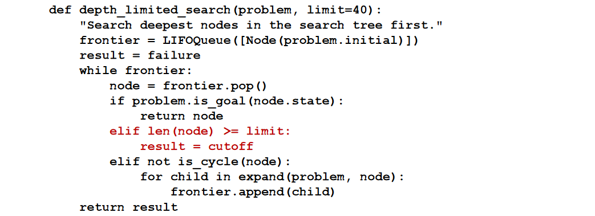

# Depth-limited and iterative deepening search

# Depth-limited
To keep depth-first search from wandering down an infinite path, we can use depth-limited
search, a version of depth-first search in which we supply a depth limit, $l$, and treat all
nodes at depth $l$ as if they had no successors.

## Evaluation and complexity
The time complexity is $O(b^l)$ and the space complexity is $O(bl)$. Unfortunately, if we make a poor choice for $l$ the algorithm will fail to reach the solution, making it incomplete again.

Sometimes a good depth limit can be chosen based on knowledge of the problem.

# Iterative deepening search
Iterative deepening search solves the problem of picking a good value for $l$ by trying all
values: first 0, then 1, then 2, and so on—until either a solution is found, or the depth-
limited search returns the failure value rather than the cutoff value.

## Evaluation and complexity
Its memory requirements are modest: $O(bd)$ when there is a solution, $O(bm)$ or on finite state spaces with no solution.

Optimal for problems where all actions have the same cost,
and is complete on finite acyclic state spaces, or on any finite state space when we check
nodes for cycles all the way up the path.

The time complexity is $O(b^d)$ when there is a solution, or $O(b^m)$ when there is none.

Iterative deepening search may seem wasteful because states near the top of the search tree
are re-generated multiple times. But for many state spaces, most of the nodes are in the
bottom level, so it does not matter much that the upper levels are repeated.

So the total number of nodes generated in the worst case is:
$$N(IDS) = (d)b^1 + (d-1)b^2 + (d-2)b^3 + ... + b^d$$
Which gives a time complexity of $O(b^d)$, asymptotically the same as breadth-first search.

In general, iterative deepening is the
preferred uninformed search method when the search state space is larger than can fit in memory
and the depth of the solution is not known.