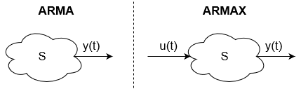

# Auto regressive processes with exogenous input

With ARMA we model time-series: we analize the output of a system without observing any input.

In many application, however, we can observe an input process $u(t)$.

$$
y(t)=a_1y(t-1)+...+a_my(t-m)+\newline 
b_0u(t-d)+b_1u(t-d-1)+...+b_pu(t-d-p)+\newline 
c_0e(t)+c_1e(t-1)+...+c_ne(t-n)
$$
Where $d$ is the **delay** between input and output.

We denote $ARMAX(m,p,n)$ and $ARX(m,p)=ARMAX(m,p,0)$

## Operatorial notation
If we use the shift operator we can define:
$$A(z)=1-a_1z^{-1}-...-a_mz^{-m}$$
$$B(z)=b_0+b_1z^{-1}+...+b_pz^{-p}$$
$$C(z)=c_0+c_1z^{-1}+...+c_nz^{-n}$$

Which gives the recursive equation:
$$A(z)y(t)=B(z)u(t-d)+C(z)e(t)$$

And the ARMAX process is the steady state solution of the recursive equation:
$$y(t)=\frac{B(z)}{A(z)}u(t-d)+\frac{C(z)}{A(z)}e(t)$$

Note that the resulting ARMAX is the sum of:
- A **deterministic part** $\frac{B(z)}{A(z)}u(t-d)$
- A **stochastic part** $\frac{C(z)}{A(z)}e(t)$ which is an ARMA process

On the other hand, an ARX process is:
$$y(t)=\frac{B(z)}{A(z)}u(t-d)+\frac{1}{A(z)}e(t)$$
Where the stochastic part is an AR process.