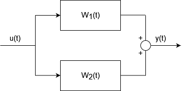

# Transfer function (digital filter)

A transfer function $W(z)=\frac{C(z)}{A(z)}$ is an operator that given a process $v(t)$ outputs the steady state solution of the recursive equation $y(t)$:
$$y(t)=W(z)v(t) \iff A(z)y(t)=C(z)v(t)$$

We are particularry interested in the case when the proces $v(t)$ is a zero mean white solution because in that case $y(t)$ is the steady state solution of an ARMA process.

## Composition rules of transfer functions
### Series

$$y(t)=[W_1(z)W_2(z)]u(t)=\frac{C_1(z)C_2(z)}{A_1(z)A_2(z)}u(t)$$
### Parallel

$$y(t)=W_1(z)u(t)+W_2(z)u(t)$$

## Switching transfer function powers sign
$W(z)$ is a rational function of polinomials of shift operators with positive **or** negative powers. Thw two representation are equivlent and we can switch from one to the other.

Given the process: $$y(t)=\frac{C(z)}{A(z)}u(t)=\frac{c_0+c_1z^{-1}+...+c_nz^{-n}}{1-a_1z^{-1}-...-a_mz^{-m}}u(t)$$

Where $m\ge n$ (the dual case is equivalent), then:
$$y(t)=\frac{c_0+c_1z^{-1}+...+c_nz^{-n}}{1-a_1z^{-1}-...-a_mz^{-m}}\frac{z^m}{z^m}u(t)$$

We obtain a series of transfer functions, if we multiply the two transfer function we succesfully switched to positive powers:
$$y(t)=\frac{c_0z^m+c_1z^{m-1}+...+c_nz^{m-n}}{1-a_1z^{m-1}-...-a_m}u(t)$$

For example:
$$
y(t)=\frac{1+\frac{1}{3}z^{-1}}{1-\frac{1}{2}z^{-1}}e(t)=\frac{1+\frac{1}{3}z^{-1}}{1-\frac{1}{2}z^{-1}}\frac{z^1}{z^1}e(t)=\frac{z^1+\frac{1}{3}}{z^1-\frac{1}{2}}e(t)
$$

## Zeros and poles of a transfer function
If we *pretend* that $W(z)$ is a function of the complex-valued variable $z$ then we can define:
- **zeros**: all the values of $z\in\mathbb{C}$ such that $C(z)=0=W(z)$
- **poles**: all the values of $z\in\mathbb{C}$ such that $A(z)=0=W^{-1}(z)$

When both $C(z)$ and $A(z)$ are polinomial with **positive powers** then we can find the zeros and the poles finding the roots of $C(z)$ and $A(z)$. We will find tha **zeros and poles are either real or complex conjugate**.

## Asymptotically stable and minimum phase transfer functions
The transfer function $W(z)=\frac{C(z)}{A(z)}$ is:
- Assintotically stable if all poles have absolute value $<1$: $$as. stable \iff |poles|<1$$
- Minimum phase if all zeros have absolute value $<1$: $$min. phase \iff |zeros|<1$$

Where, since $z\in\mathbb{C}$, the absolute value of the variable $z=\sqrt{\mathbb{R}^2+\mathbb{I}^2}$.