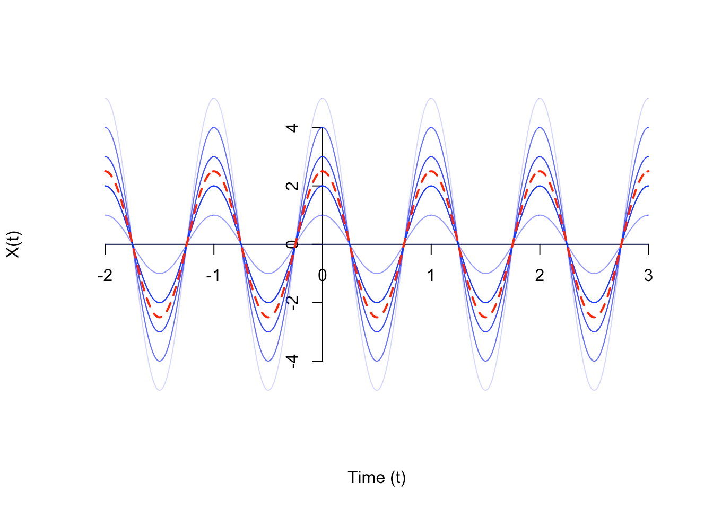

# Stochastic processes and weak description

A signal is a function of time, usually symbolized $v(t,s)$. In a noisy signal, the exact value of the signal is random. Therefore, we will model noisy signals as a random function $v(t,s)$, where at each time $t$, $v(t,s)$ is a random variable. These “noisy signals” are formally called random processes or stochastic processes.

A stochastic or random process is a mathematical object usually defined as a family of random variables. Stochastic processes are widely used as mathematical models of systems and phenomena that appear to vary in a random manner.

Observations $y(1),y(2),...,y(w)$ will be interpreted as realization of a stochastic process which is **sequence of random variables defined on the same probabilistic space**.

We denote $v(t, s)$ with $t=0,\pm 1,\pm 2,...$ where $s$ is the outcome in a probabilistic space. "Outcome" implies that the quantities of interest depends on some variables. For a stochastic process the are multiple realizations, one for each value of $s$.

We will denote $v(t)$ for simplicity but we mean the stochastic process $v(t,s)$.

## Weak description of stochastic processes
A complete, strong, description of stochastic processes is given by the probability distribution but in practice it is hard to obtain this description. Therefore we use some partial idicators to conceive a weak description.

In particular the weak (wide sense) characterization of a stochastic process is given by:
- The mean function
- The covariance function
This means that two processes with the same mean and covariance are considered equal.

### Mean function
The mean function $m_v(t)$ of a random process $v(t,s)$ is a function that specifies the expected value at each time $t$. It is the sequence of the mean of $v(t,s)$ which coincide with the expected value computed over the variability of $s$.

$$m_v(t)=\mathbb{E}[v(t,s)]=\int_{s}{v(t,s)\mathbb{P}ds}$$

The mean function is interpreted as the central (baricentric) value around which the realization of $v(t,s)$ take value.

<iframe width="560" height="315" src="https://www.youtube-nocookie.com/embed/R_zn7d47VUQ" title="YouTube video player" frameborder="0" allow="accelerometer; autoplay; clipboard-write; encrypted-media; gyroscope; picture-in-picture" allowfullscreen></iframe>

### Variance function
The variance function $V_v(t)$ of a random process $v(t,s)$ is a function that specifies the variance of the process at each time t. The variance functions provides a quantification of the dispersion around the mean.

$$V_v(t)=Var[v(t,s)]=\mathbb{E}[(v(t,s)-m_v(t))^2]$$

<iframe width="560" height="315" src="https://www.youtube-nocookie.com/embed/csrEDdchD4o" title="YouTube video player" frameborder="0" allow="accelerometer; autoplay; clipboard-write; encrypted-media; gyroscope; picture-in-picture" allowfullscreen></iframe>

### Covariance function
The covariance function $\lambda_v(t,\tau)$ specifies the covariance between the value of the process at time $t$ and the value at time $t-\tau$:

$$\gamma_v(t,\tau)=\mathbb{E}[(v(t,s)-m_v(t))(v(t-\tau ,s)-m_v(t-\tau ))]$$

It provides an indication of correlation of variables defining the stochastic process at different time instants:
- $\gamma_v(t,\tau)>0$ indicates a tendency to preserve the sign from $t-\tau$ to $t$
- $\gamma_v(t,\tau)<0$ indicates a tendency to change the sign from $t-\tau$ to $t$

**Observation**: the variance function can be obtained from the covariance function:
$$V_v(t)=\gamma_v(t,0)$$

<iframe width="560" height="315" src="https://www.youtube-nocookie.com/embed/ogBcGFUV4wk" title="YouTube video player" frameborder="0" allow="accelerometer; autoplay; clipboard-write; encrypted-media; gyroscope; picture-in-picture" allowfullscreen></iframe>

## Questions from past exams
##### Give the definition of the mean function and the covariance function for a generic stochastic process and explain what is the interpretation of these two indicators.
See above.