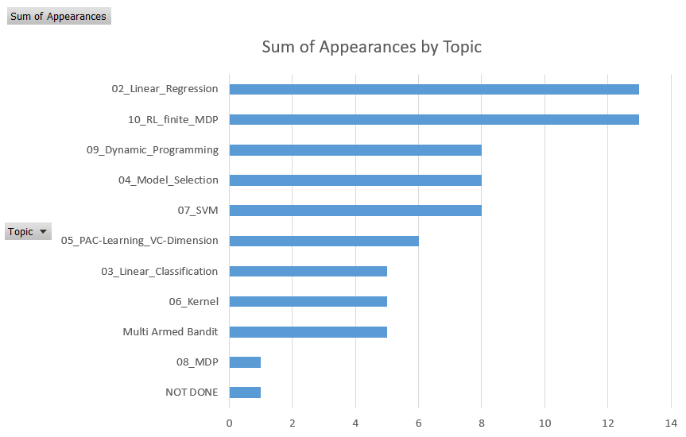

# list of questions

List of question and appearances as 2023-06-06:

| Question                                                                                                                                                                                                                                                          | Appearances | Topic                        |
| ----------------------------------------------------------------------------------------------------------------------------------------------------------------------------------------------------------------------------------------------------------------- | ----------- | ---------------------------- |
| Describe and compare Ridge regression and LASSO algorithms to solve linear regression problems.                                                                                                                                                                   | 9           | 02_Linear_Regression         |
| Describe Support Vector Machines (SVMs) for supervised classification problems. In particular explain how do they work, their strengths and weaknesses. Which algorithm can we use to train an SVM? Provide an upper bound to the generalization error of an SVM. | 8           | 07_SVM                       |
| Explain what is the VC dimension of a hypothesis space and what it is used for.                                                                                                                                                                                   | 6           | 05_PAC-Learning_VC-Dimension |
| Describe and compare Q-learning and SARSA.                                                                                                                                                                                                                        | 4           | 10_RL_finite_MDP             |
| Describe the Bayesian Linear Regression method and how it compares to Ridge Regression.                                                                                                                                                                           | 3           | 02_Linear_Regression         |
| Describe and compare Monte Carlo and Temporal Difference for model-free policy evaluation.                                                                                                                                                                        | 3           | 10_RL_finite_MDP             |
| Give the definition of valid kernel and describe how valid kernels can be built. Provide an example of a methods that uses kernels and specify the advantages of using them in this specific method.                                                              | 3           | 06_Kernel                    |
| Explain what are eligibility traces and describe the TD(λ) algorithm.                                                                                                                                                                                             | 3           | 10_RL_finite_MDP             |
| Describe the UCB1 algorithm. Is it a deterministic or a stochastic algorithm?                                                                                                                                                                                     | 3           | Multi Armed Bandit           |
| Describe the policy iteration technique for control problems on Markov Decision Processes.                                                                                                                                                                        | 3           | 09_Dynamic_Programming       |
| Describe the PCA technique and what it is used for.                                                                                                                                                                                                               | 3           | 04_Model_Selection           |
| Describe the logistic regression model and how it is trained.                                                                                                                                                                                                     | 2           | 03_Linear_Classification     |
| Describe the value iteration algorithm and its properties. Does the algorithm always return the optimal policy?                                                                                                                                                   | 2           | 09_Dynamic_Programming       |
| Describe and compare the Value Iteration algorithm and the Policy Iteration algorithm.                                                                                                                                                                            | 2           | 09_Dynamic_Programming       |
| Describe the difference between on-policy and off-policy reinforcement learning techniques. Make an example of an on-policy algorithm and an example of an off-policy algorithm.                                                                               | 2           | 10_RL_finite_MDP             |
| Provide an overview of the feature selection methods that you know and explain their pros and cons.                                                                                                                                                               | 1           | 04_Model_Selection           |
| Describe the perceptron model and how it is trained.                                                                                                                                                                                                              | 1           | 03_Linear_Classification     |
| Explain what the Kernel Trick is, what it is used for, and in which ML methods it can be used.                                                                                                                                                                    | 1           | 06_Kernel                    |
| Describe the Thomson Sampling algorithm for multi-armed bandit problems.                                                                                                                                                                                          | 1           | Multi Armed Bandit           |
| Describe the logistic regression algorithm and compare it with the perceptron algorithm.                                                                                                                                                                          | 1           | 03_Linear_Classification     |
| Describe and compare ordinary least squares and Bayesian linear regression.                                                                                                                                                                                       | 1           | 02_Linear_Regression         |
| Describe the properties of the Bellman operators.                                                                                                                                                                                                                 | 1           | 08_MDP                       |
| Explain the cross-validation procedure and for what it can be used.                                                                                                                                                                                               | 1           | 04_Model_Selection           |
| Describe and compare the Bagging and Boosting meta-algorithms.                                                                                                                                                                                                    | 1           | 04_Model_Selection           |
| Describe one technique for solving the stochastic multi-armed bandit problem.                                                                                                                                                                                     | 1           | Multi Armed Bandit           |
| Describe the two problems tackled by Reinforcement Learning (RL): prediction and control. Describe how the Monte Carlo RL technique can be used to solve these two problems.                                                                                      | 1           | 10_RL_finite_MDP             |
| Describe which methods can be used to compute the value function Vπ of a policy π in a discounted Markov Decision Process.                                                                                                                                        | 1           | 09_Dynamic_Programming       |
| Describe the Gaussian Processes model for regression problems.                                                                                                                                                                                                    | 1           | 06_Kernel                    |
| Describe the unsupervised learning technique denominated K–means for clustering problems.                                                                                                                                                                         | 1           | NOT DONE                     |
| Describe the supervised learning technique denominated K–Nearest Neighbor for classification problems.                                                                                                                                                            | 1           | 03_Linear_Classification     |
| Describe the Bias-Variance tradeoff for regression problems. Explain how is it possible to evaluate the bias-variance tradeoff by looking at the train error and at the test error.                                                                               | 1           | 04_Model_Selection           |
| Illustrate the AdaBoost algorithm, explain its purpose and in which case it is useful.                                                                                                                                                                            | 1           | 04_Model_Selection           |

