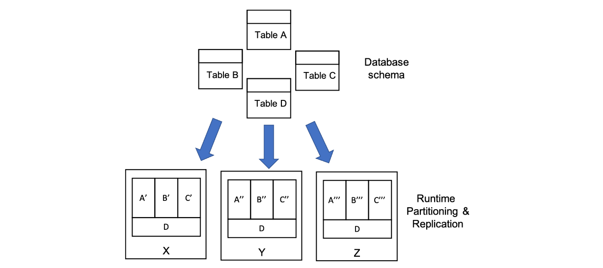

# Alloy

## Syntax and semantics
In Alloy **everything is a set**.

**Atoms** are Alloy's primitive entities, they are actually a set with only one element. **Relations** associate atoms with one another and are represented as a set of *typed* tuples.

### Logic
#### Constants
In alloy the following constants are defined:
- `none` empty set
- `univ` universal set
- `iden` identity relation

For example:
```
Name = {(N0), (N1), (N2)}
Addr = {(A0), (A1)}
none = {}
univ = {(N0), (N1), (N2), (A0), (A1)}
iden = {(N0,N0), (N1,N1), (N2,N2), (A0,A0), (A1,A1)}
```

#### Set operatorn
- `+` union
- `&` intersection
- `-` difference
- `in` subset
- `=` equality


```
Name = {(N0), (N1), (N2)}
Alias = {(N1), (N2)}
Group = {(N0)}
RecentlyUsed = {(N0), (N2)}

Alias + Group = {(N0), (N1), (N2)}
Alias & RecentlyUsed = {(N2)}
Name – RecentlyUsed = {(N1)}
RecentlyUsed in Alias = false
RecentlyUsed in Name = true
Name = Group + Alias = true
```

There is also the cross product `->`:
```
Name = {(N0), (N1)}
Addr = {(A0), (A1)}
Book = {(B0)}
Name->Addr = {(N0, A0), (N0, A1), (N1, A0), (N1, A1)}
Book->Name->Addr = {(B0, N0, A0), (B0, N0, A1), (B0, N1, A0), (B0, N1, A1)}
```
#### Relational composition (join)
- `.` dot join
- `[]` box join

Note that the two operators can be exchnged:
```
e1[e2] = e2.e1
a.b.c[d] = d.(a.b.c)
```
```
Book = {(B0)}
Name = {(N0), (N1), (N2)}
Addr = {(A0), (A1), (A2)}
Host = {(H0), (H1)}
myName = {(N1)}
myAddr = {(A0)}
address = {(B0, N0, A0), (B0, N1, A0), (B0, N2, A2)}
host = {(A0, H0), (A1, H1), (A2, H1)}
Book.address = {(N0, A0), (N1, A0), (N2, A2)}
Book.address[myName] = {(A0)}
Book.address.myName = {}
host[myAddr] = {(H0)}
address.host = {(B0, N0, H0), (B0, N1, H0), (B0, N2, H1)}
```

#### Unary operators
- `~` transpose
- `^` transitive closure
- `*` reflexive transitive closure

```
^r = r + r.r + r.r.r + ...
*r = iden + ^r
```

```
Node = {(N0), (N1), (N2), (N3)}
next = {(N0, N1), (N1, N2), (N2, N3)} a list
~next = {(N1, N0), (N2, N1), (N3, N2)}
^next = {(N0, N1), (N0, N2), (N0, N3), (N1, N2), (N1, N3), (N2, N3)}
*next = {(N0, N0), (N0, N1), (N0, N2), (N0, N3), (N1, N1), (N1, N2), (N1, N3), (N2, N2), (N2, N3), (N3, N3)}
```

#### Restriction and override
- `<:` domain restriction
- `:>` range restriction
- `++` override

```
p ++ q = p – (domain[q] <: p) + q
```
```
Name = {(N0), (N1), (N2)}
Alias = {(N0), (N1)}
Addr = {(A0)}
address = {(N0, N1), (N1, N2), (N2, A0)}
address :> Addr = {(N2, A0)}
Alias <: address = {(N0, N1), (N1, N2)}
address :> Alias = {(N0, N1)}
workAddress = {(N0, N1), (N1, A0)}
address ++ workAddress = {(N0, N1), (N1, A0), (N2, A0)}
```
#### Boolean operators
- `!` `not` negation
- `&&` `and` conjunction
- `||` `or` disjunction
- `=>` `implies` implication
- `,` `else` alternative
- `<=>` `iff` bi-implication

#### Quantifiers
- `all` F holds for every x in e
- `some` F holds for at least one x in e
- `no` F holds for no x in e
- `lone` F holds for at most one x in e
- `one` F holds for exactly one x in e
```
all x: e | F
all x: e1, y: e2 | F
all x, y: e | F
all disj x, y: e | F
```
1. some name maps to some address — address book not empty
```
some n: Name, a: Address | a in n.address
```
2. no name can be reached by lookups from itself — address book acyclic
```
no n: Name | n in n.^address
```
3. every name maps to at most one address — address book is functional
```
all n: Name | lone a: Address | a in n.address
```
4. no name maps to two or more distinct addresses — same as above
```
all n: Name | no disj a, a': Address | (a + a') in n.address
```

#### Relation declarations
- `set` any number
- `one` exactly one (default, can be ommitted)
- `lone` zero or one
- `some` one or more
```
RecentlyUsed: set Name
senderAddress: Addr
senderName: lone Name
receiverAddresses: some Addr
```

#### Relation declarations
```
r: A m -> n B
```
```
workAddress: Name -> lone Addr
homeAddress: Name -> one Addr
members: Group lone -> some Addr
```

#### Set definitions
```
{x1: e1, x2: e2, ..., xn: en | F}
```
1. set of names that don't resolve to any actual addresses
```
{n: Name | no n.^address & Addr}
```
2. binary relation mapping names to reachable addresses

```
{n: Name, a: Address | n -> a in ^address}
```

#### If and let
```
f implies e1 else e2
let x = e | formula
let x = e | expression
```
Four equivalent constraints:
```alloy
all n: Name |
	(some n.workAddress
		implies n.address = n.workAddress
		else n.address = n.homeAddress)
        
all n: Name |
	let w = n.workAddress, a = n.address |
		(some w implies a = w else a = n.homeAddress)
        
all n: Name |
	let w = n.workAddress |
		n.address = (some w implies w else n.homeAddress)
        
all n: Name |
	n.address = (let w = n.workAddress |
		(some w implies w else n.homeAddress))
```

#### Cardinalities
- `#r` number of tuples in r
- `0`,`1`,... integer literal
- `+` plus
- `-` minus
- `=` equals
- `<` less than
- `>` greater than
- `=<` less than or equal to
- `>=` greater than or equal to

Sum of integer expression ie for all singletons x drawn from e:
```
sum x: e | ie
```
1. all bags have 3 or less marbles: `all b: Bag | #b.marbles =< 3`
2. the sum of the marbles across all bags equals the total number of marbles: `#Marble = sum b: Bag | #b.marbles`

### The Alloy Language
- **Signatures**: define types and relationships
- **Facts**: properties of models (constraints!)
- **Predicates/functions**: reusable expressions
- **Assertions**: properties we want to check
- **Commands**: instruct the Alloy Analyzer which assertions to check, and how

Signatures, predicates, facts and functions tell how correct worlds (models) are made.

Assertions and commands tell which kind of checks must be performed over these worlds.

#### Signatures
Signatures by using keyword `sig` represents a **set of atoms**. The **fields** of a signature are **relations** whose domain is a subset of the signature.

- `extends` keyword is used to declare a subset of a signature.
- `abstract` signature has no element except those belonging to the signatures that extend it
- `m sig A {}` where `m` is to declare the multiplicity, the number of elements of A. For example we use `one` to define sigletons.

```alloy
abstract sig Person {
	father: lone Man,
	mother: lone Woman
}
sig Man extends Person {
	wife: lone Woman
}
sig Woman extends Person {
	husband: lone Man
}
```
##### Relations
Relations are declared as fields of signatures. In `sig A {f : m e}`:
- `A` is the domain
- `e` is the range
- `m` is the multiplicity (default to `one`)

##### Multirelations
```alloy
sig Person {
  access: Card -> Door
}
```
In this case access is a ternary relationship, where each element of `access` is a relation of form `Person -> Card -> Door`.

Multirelations have a special kind of multiplicity:
```
r: A m -> n B
```
This says that each member of A is mapped to n elements of B, and m elements of A map to each element of B. If not specified, the multiplicities are assumed to be set.

#### Predicates
Predicates are facts that return a boolean which doe not have to hold in every model but they are used to check if a constraint hold in some model. Predicates must have a name and may have some parameters.
```
pred foo[a: Set1, b: Set2...] {
  expr
}
```

##### Modeling operations with predicates
We can use predicates to model operations.

In general we pass as argument the atom `x` which will become the atom `x'` after the operation. We may pass as arguments also other atom which will not be modified by the operation but are needed to perform it.

We define some **preconditions** on the atoms to which the operation can be applied, and some **postconditions** where we define how the resulting atoms should be. It is important to define both the fields that change and the fields which does not change.
```alloy
pred subscribeToTopic[c, c': Configuration, s, s': Subscriber, t: Topic] {
	// Pre condition
	t not in s.subscribed
	s in c.subscribers
    
    // Post conditions
    s'.buffer = s.buffer // Unchanged field
    s'.subscribed = s.subscribed + t // Changed field
    c'.publishers = c.publishers
    c'.subscribers = c.subscribers - s + s'
}
```

#### Facts
Facts are used to modle some **constraints** which **must hold in every model** (global predicates). Facts can have a name for readability purposes. A fact is always considered true by the Analyzer. Any models that would violate the fact are discarded instead of checked.
```alloy
fact name {
  constraint
}
```
For example:
```alloy
fact husbandIffWife {
	all m: Man, w: Woman | m.wife = w <=> w.husband = m
}
```

We can also write implicit facts
```alloy
sig Node {
  edge: set Node
} {
  this not in edge
}
```
which is the same of:
```
fact {
	all node: Node | node not in node.edge
}
```

#### Functions
Alloy functions have the same structure as predicates but also return a value.
```
fun name[a: Set1, b: Set2]: output_type {
  expression
}
```

## Past exams exercises
### 2021 06 24 WE1 Q1 (7 points) Truck Company
Consider a transportation company that is organizing a package pick-up service.
The company has a certain number of trucks and drivers. All trucks have the same size. Each day, each driver drives a single truck (the same driver can drive different trucks in different days).

A pick-up request is specified by the origin and the size of the package (for simplicity, assume there are only two sizes, small and large).

A travel plan is associated with a driver and a truck in a certain day and is defined in terms of the packages that must be collected by that driver during the day, using the specified truck.

#### Point A (2 points)
Define suitable Alloy signatures – and any related constraints – to describe the problem above.

**SOLUTION**
```alloy
abstract sig Size {}
one sig Small extends Size {}
one sig Large extends Size {}
sig Place {}
sig Day {}

sig Package {
  origin: Place,
  size: Size
}
sig Driver {}
sig Truck {}

sig TravelPlan {
  day: Day,
  driver: Driver,
  packages: set Package,
  truck: Truck
}

fact packageInAtMostOneTravelPlan {
  all pk: Package, tp1: TravelPlan, tp2: TravelPlan |
    (tp1 != tp2 and pk in tp1.packages) implies pk not in tp2.packages
}
```

#### Point B (2 points)
Define a signature **TruckStatus** that represents the snapshot of a truck, that is, the truck with its current content and current driver. Ensure that the following constraint holds: a truck never exceeds its maximum capacity, which corresponds to an amount of packages whose size is equivalent to 2 large packages. We consider that the size of one large package is equivalent to the size of 4 small packages.

**SOLUTION**
```alloy
pred sizePackagesCoherent[ps: set Package] {
  // 0 Large
  (#ps <= 8 and no p: Package | p in ps and p.size = Large) or
  // 1 large
  (#ps <= 5 and one p: Package | p in ps and p.size = Large) or
  // 2 Large
  (#ps <= 2)
}

sig TruckStatus {
  truck: one Truck,
  currentDriver: lone Driver,
  currentContent: set Package
}{sizePackagesCoherent[currentContent]}
```

#### Point C (1.5 points)
Formalize the following constraint: a travel plan should never exceed the truck capacity.

**SOLUTION**
```alloy
fact noTravelPlanExceedsCapacity {
  all tp: TravelPlan | sizePackagesCoherent[tp.packages]
}
```

#### Point D (1.5 points)
Formalize the following constraint: drivers and trucks cannot be assigned to multiple travel plans in the same day.

**SOLUTION**

```alloy
fact AtMostOneTralvelPlanPerDayAndDriver {
  all disj tp1, tp2: TravelPlan | (tp1.driver = tp2.driver) => tp1.day != tp2.day
}

fact AtMostOneTralvelPlanPerDayAndTruck {
  all disj tp1, tp2: TravelPlan | (tp1.truck = tp2.truck) => tp1.day != tp2.day
}
```

### 2021 02 05 WE1 Q1 (7 points) DBMS
Consider the following figure that describes the status of a replicated and partitioned database management system (DBMS). The figure shows that database tables are deployed on three “nodes”. More specifically, in the example, tables A, B, and C are partitioned and each partition is deployed on a different node (for instance, the whole table A is composed of A’, A’’ and A’’’, where A’, A’’ and A’’’ are sets of disjoint tuples belonging to table A). Table D, instead, is replicated on all subsystems, which means that all its tuples occur in all nodes.
[](../../../images/a60d036635_PODLXpYE3hJHkBMM-image-1644146541895.png)

#### Point A (4 points)
Define in Alloy the signatures to represent the concepts of node, tuple, replicated tables, and partitioned tables, together with any other concept you may need.

**SOLUTION**
```alloy
sig Node {}
sig Tuple {}

sig abstract Table {
	tuples : set Tuple
}

sig Partition extends Table 
	node: Node
}
sig PartitionedTable extends Table {
	partitions: some Partition
}

sig Replication extends Table {
	node: Node
}
sig ReplicatedTable extends Table {
	replications: some Replication
}

fact partitionedTableHasAllTuples {
	all pt: PartitionedTable, p: Partition, t: Tuple |
		(p in pt.partitions and t in p.tuples) implies (t in pt.tuples)
	all pt: PartitionedTable, t: Tuple |
		(t in pt.tuples) implies (one p: Partition | p in pt.partitions and t in p.tuples)
}

fact replicationsSameTuples {
	all rt: ReplicatedTable, disj r1, r2: Replication |
    	(r1 in rt.replications and r2 in rt.replications) => (all t: Tuple | (t in r1.tuples <=> t in r2.tuples)
}
```

#### Point B (1.5 points)
Define a fact to ensure that each replicated table is deployed on at least two nodes.

**SOLUTION**
```alloy
fact replicatedInAtLeatTwoNodes {
	all rt: ReplicatedTable | #rt.replications > 1
	all rt: ReplicatedTable, disj r1, re: Replication |
		(r1 in rt.replications and r2 in rt.replications) implies r1.node != r2.node
}
```

#### Point C (1.5 points)
Define a fact to ensure that each partitioned table does not contain tuples that are replicated on multiple nodes.

**SOLUTION**
```alloy
fact noDuplicateTuplesInNodes {
	all pt: PartitionedTable, disj p1, p2: Partition |
		p1 in pt.partitions and p2 in pt.partitions and p1.node & p2.node = none
		implies
		p1.tuples & p2.tuples = none
}
```
### 2021 01 13 Q1 (7 points) publish-subscribe
Consider the mechanisms of a publish-subscribe framework. In the framework there are 2 types of components, publishers and subscribers. For simplicity, assume that a component can only be either a publisher, or a subscriber, but not both. Publishers publish events, and subscribers receive them. Each event regards a topic. Each publisher publishes events that correspond to a set of topics; dually, subscribers subscribe to topics in which they are interested, and for which they will receive events. Each publisher keeps a buffer of events to be sent of up to 10 events, and each subscriber keeps a buffer of at most 5 incoming events.

#### Point A (2 points).
Define Alloy signatures that capture publishers, subscribers, and events they publish/subscribe. Define suitable constraints to make the system consistent.

**SOLUTION**
```alloy
sig abstract Component {}
sig Topic {}
sig Event {
	topic: Topic
}
sig Publisher extends Component {
	buffer: set Event,
    publishTo: set Topics
}{
	buffer.Topic in publishTo
	#buffer < 11
}
sig Subscriber extends Component {
	subscribed: set Topics,
	buffer: set Event
}{
	buffer.Topic in subscribed
	#buffer < 6
}
```

#### Point B (1 points).
Define an Alloy signature to describe a configuration of the publish-subscribe framework.

**SOLUTION**
```alloy
sig Configuration {
	publisher: set Publisher,
    subscribers: set Subscriber
}
```

#### Point C (2 points).
Define a predicate capturing the operation with which a subscriber subscribes to a topic. The operation takes as input a configuration and a subscriber and updates the topics of the subscriber in the configuration.

**SOLUTION**
```alloy
pred subscribeToTopic[c, c': Configuration, s, s': Subscriber, t: Topic] {
	t not in s.subscribed
	s in c.subscribers
    
    s'.buffer = s.buffer
    s'.subscribed = s.subscribed + t
    c'.publishers = c.publishers
    c'.subscribers = c.subscribers - s + s'
}
```

#### Point D (2 points).
Define a predicate capturing the operation with which an event is dispatched to a subscriber. The operations takes as input a configuration, an event, and a subscriber, and adds the event to the buffer of the subscriber in the configuration.

**SOLUTION**
```alloy
pred eventDispatched[c, c': Configuration, e: Event, s, s': Subscriber] {
	s in c.subscribers
    e in c.publishers.buffer
    e not in s.buffer
    #s.buffer < 5
    e.topic in s.subscribed

	s'.buffer = s.buffer + e
    s'.subscribed = s.subscribed
    c'.publishers = c.publishers
    c'.subscribers = c.subscribers - s + s'
}
```

### 2020 06 17 Q1 (7 points) Online exams
We want to develop an integrated system that supports the execution of online exams. Each online exam is handled by one or more instructors, it can be taken by some students, it is associated with a virtual room and with the exam text, plus the answers by the students. The following rules hold:
1) Only students who registered for the exam can enter the virtual room.
2) While the exam is running, students in the room must have their camera, mic and screen sharing on, otherwise the system assumes they have exited the room.
3) If the exam is running or it has ended, students that result to have exited the room cannot enter again

Consider the following Alloy signatures that provide a partial model for the problem at hand:
```alloy
sig Person {}
sig Instructor extends Person {}
sig Exam {
	instructors: some Instructor,
	students: set Student,
	vr: VirtualRoom,
	test: ExamTest,
	examStatus: EStatus
}
sig Description {}
sig ExamTest {
	description: Description,
	answers: set Student
}
sig EStatus {}
one sig Planned extends EStatus{}
one sig Running extends EStatus{}
one sig Ended extends EStatus{}
```
#### Point A (2 points)
Define the concept of Student, who must own some devices (camera, mic and screen sharing). Add all signatures/constraints/facts needed to make the Student concept self-contained and coherent with the description above.

**SOLUTION**
```alloy
sig Student extends Person {
	camera: Camera,
    mic: Mic,
    screen: Screen
}
sig abstract DeviceStatus {}
one sig On extends DeviceStatus {}
one sig Off extends DeviceStatus {}
sig abstract Device {
	status: DeviceStatus
}
sig Camera extends Device {}
sig Mic extends Device {}
sig Screen extends Device {}
```
#### Point B (1 point)
Define the concept of VirtualRoom that separately captures the students who entered the room at some point, those that are currently in the room, and those that exited the room, in addition to the instructors supervising the room. Add all signatures/constraints/facts you need.

**SOLUTION**
```alloy
sig VirtualRomm {
	entered: set Student,
    inside: set Student,
    exited set Student,
    instructors: some Instructor
}{
	inside + exited = entered
    inside & exited = none
}
```

#### Point C (1 point)
Define a fact modelling constraint 1) “Only students who registered for the exam can enter the virtual room”.

**SOLUTION**
```alloy
fact onlyRegisteredInRoom {
	all e: Exam, vr: VirtualRoom, s: Student |
    	(vr in e.vr and s not in e.students) => (s not in vr.entered)
}
```

#### Point D (1 point)
Define a fact modelling constraint 2) “While the exam is running, students in the room must have their camera, mic and screen sharing on, otherwise the system assumes they have exited the room”.

**SOLUTION**
```alloy
fact devicesOnInRunningExam {
	all e: Exam, vr: VirtualRoom, s: Student |
    	(e.examStatus=Running and vr=e.vr and s in vr.inside) => (s.mic.status = On and s.camera.status = On and s.screen.status = On)
}
```

#### Point E (2 point)
Define a predicate modelling operation letIn that is invoked to let students into the room, and which enforces constraint 3) “If the exam is running or it has ended, students that result to have exited the room cannot enter again. If the exam is planned, they can get in even if they have been out”.

**SOLUTION**
```alloy
pred letIn[e, e':  Exam, s: Student] {
	s in e.students
	(e.status = Planned) or (s not in e.vr.entered)
    
    e'.vr.entered = e.vr.entered + s
    e'.vr.inside = e.vr.inside + s
    e'.vr.exited = e.vr.exited - s
    
    e'.instructors = e.instructors
	e'.students = e.students
    e'.test = e.test
	e'.examStatus = e.examStatus
}
```