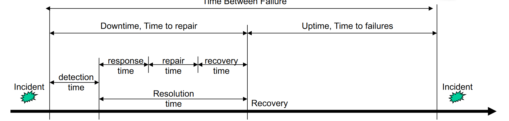
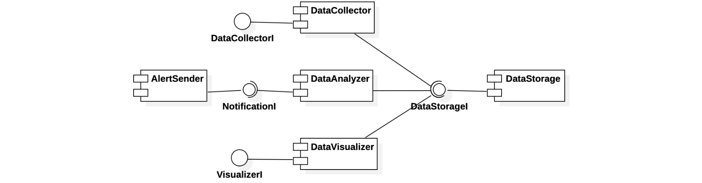
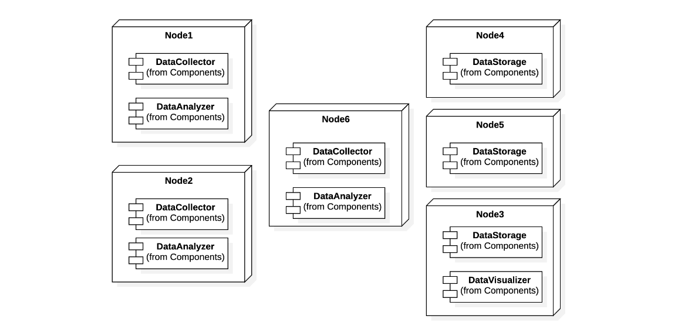

# Availability

- **Mean Time to Repair ($MTTR$)**: Average time between the occurrence of a fault and service recovery, also known as the downtime
- **Mean Time To Failures ($MTTF$)**: Mean time between the recovery from one incident and the occurrence of the next incident, also known as uptime
- **Mean Time Between failure ($MTBF$)**: Mean time between the occurrences of two consecutive incidents

We can then define:
1. **Availability**: The probability that a component is working properly at time $t$:
$$A = MTTF / (MTTF+MTTR)$$
A given component could have failed in the interval $(0,t)$, but it could have been repaired before t

2. **Reliability**: The probability that a component has always been working properly during a time interval $(0,t)$, it requires that the component never fails in the interval.
$$R = e^{-λt} \space where \space λ = 1/MTTF$$

Availability is typically specified in **nines notation**. For example 3-nines availability corresponds to 99.9%, 5-nines availability corresponds to 99.999% availability.

Given the availability the **downtime** is calculated as: $$Downtime=(1-A)*365 \frac{days}{year}$$

### Calculating availability
#### Availability in series
If failure of a part leads to the combination becoming inoperable. The combined system is operational only if every part is available.

The combined availability is the product of the availability of the component parts:
$$A=\prod_{i=1}^{n}{A_i}$$

#### Availability in parallel
If failure of a part leads to the other part taking over the operations of the failed part. The combined system is operational if at least one part is available.

The combined availability is 1 - (all parts are unavailable):
$$A = 1 - \prod_{i=1}^{n}{(1-A_i)}$$

If we have a desired availabillity of $DA$ then the number $n$ of components with availability $A$ to put in parallel is: $$n \ge \log_{1-A}{(1-DA)}$$

## Past exams exercises
### 2021 07 26 Q2 (5 points) Plant
Consider the following architecture of a system for the monitoring of a safety-critical plant.

The *DataCollector* module receives data (in a push manner) from the plant and stores it in the
*DataStorage* component. The *DataAnalyzer* module periodically reads data from the *DataStorage*
module and elaborates it; if it detects anomalies, it uses the *AlertSender* module to alert the plant (human) supervisor. Finally, the *DataVisualizer* module is used by the supervisor to see statistics concerning the plant.

The *AlertSender* module is deployed on a very reliable server, so it has 99.999% availability. We want to find a suitable, economical deployment of the other modules that guarantees a sufficient level of availability. Imagine that we have at our disposal a server that can host all modules, that guarantees 99.999% availability, and that costs 20Keuro. We also have cheaper servers at our disposal, but which guarantee lower availability, and which can host fewer modules. In particular, we have servers that cost 2keuro, which can host 2 modules each, and which guarantee 95% availability.

Define a suitable deployment of modules so that the data collection and data analysis functions have a 99.9% availability, while the visualization function has a 90% availability. The cheaper the deployment, the better.

**SOLUTION**

Consider the following deployment, where the *DataCollector*, *DataAnalyzer*, and *DataStorage*
components are triplicated. The data collection chain is composed of the *DataCollector* and *DataStorage* components, while the data analysis chain is composed of the *DataAnalyzer* and *DataStorage* components. The triplicated components have availability $1-(1-0.95)^3 = 0.999875$. Their series has availability $0.999875\*0.999875 = 0.99975$ which higher than the desired one.

The data visualization chain, instead, has one instance of *DataVisualizer*, which is hosted on a server that also hosts an instance of *DataStorage*. Hence, if the server with *DataVisualizer* fails, also one of the instances of *DataStorage* fails. Then, we can consider the visualization chain to be made of one instance of *DataVisualizer*, in series with 2 parallel instances of *DataStorage*. As a consequence, the data visualization chain has availability $0.95\*(1-(1-0.95)^2) = 0.947625$, which is sufficient. The 6 nodes in total cost 12Keuro, which is less than the cost of the single, highly reliable server on which they could all be deployed.

### 2021 02 05 Q3 (3 points) DBMS
Consider a DBMS replicated and partitioned in three subsystems. Assume that nodes are coordinated by a frontend component that is in charge of acting as an intermediary between the external clients and the nodes. In particular, this frontend accepts two types of requests coming from clients: *QueryOnA*, and *QueryOnD*. The frontend computes *QueryOnA* by passing it to all three subsystems and merging the results obtained by the three. It computes *QueryOnD*, instead, by passing it to only one subsystem. If this one does not answer before a fixed timeout, then the query is passed to another subsystem. Knowing that the availability of the frontend component is 99.99% and that the availability of each node is 90%, compute the availability of the whole DBMS for what concerns *QueryOnA* and *QueryOnD*.

**SOLUTION**

For *QueryOnA* the subsystems are in series betwen each other and with the frontend so:
$$0.9999\*0.90^3 = 0.7289271$$

For *QueryOnD* the subsystems are in parallel and they are in series with the frontend so:
$$0.9999\*(1-(1-0.90)^3) = 0.9989001$$

### 2020 06 17 Q3 (3 points) Pipeline
We want to build a pipeline of the type: *DataCollection* → *DataProcessing* → *DataStorage*

*DataCollection* components are cheap (200 euros each), but not very available (availability of 80%). *DataProcessing* components, instead, are quite expensive (5000 euros each), but have good availability (availability of 99.9%). Finally, *DataStorage* components cost 2000 euros each, and have availability of 95%.

We have a budget of 20000 euros. Define an architecture that stays within the budget while achieving an availability of 99.99%. Motivate adequately your choices.

**SOLUTION**

The whole chain is in series.

We know that each component needs at leat an availability of 99.99% (may be even higher because then the component are in series) so we need $n$ components where $n \ge \log_{1-A}{0.0001}$:
- We need two *DataProcessing* because $n \ge \log_{0.001}{0.0001}$ , we can check $1-0.001^2=0.999999$. They cost 10000€.
- We need four *DataStorage*: $1-0.05^4=0.99999375$. They cost 8000€.
- We need six *DataCollection*: $1-0.2^6=0.999936$. They cost 1200€.

If we put in series these components: $$0.999999 \times 0.99999375 \times 0.999936 = 0.9999287$$ which is enouth. The total cost is 19200€, which is within the budget.