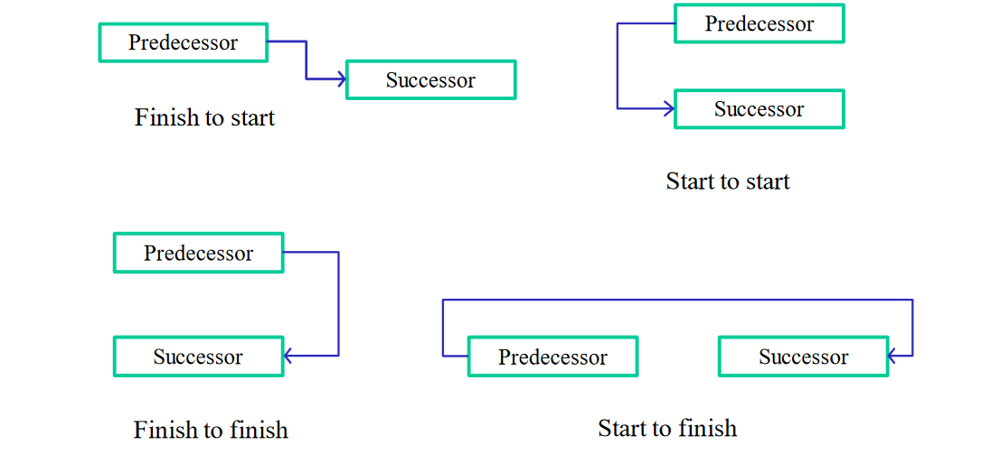
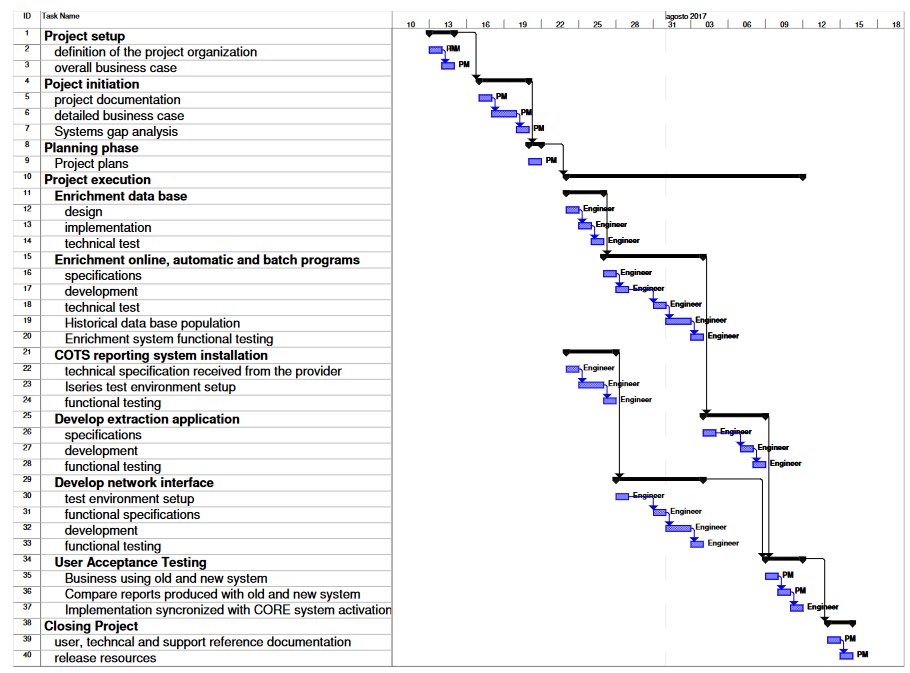

# Critical Path Method

It is used to estimate the minimum project duration.

This schedule network analysis technique calculates the **early start**, **early finish**, **late start**, and **late finish** dates for all activities without delaying the project finish date or violating a schedule constraint, the difference is called task float.

If it is zero then the task is critical. Critical path results in a **connected sequence of tasks that runs from the start till the end of the project. Any change to the tasks on the critical path changes the project finish date.**

## Sequencing tasks

## Methods to reduce CP length
### Fast tracking
You push tasks to occur faster than they would, normally introducing negative lag time.

### Crashing
Shorten the tasks on the critical path (maybe paying more, for example hiring another resource that works in parallel).

## Past exams exercises
### 2019 06 25 Q3 (3 points)
While replacing a local banking system with a multi-country one, it is required to implement the application that covers the Italian regulatory obligations. The Gantt diagram in the next page is the project schedule defined for the implementation of this application. The diagram represents the tasks with their mutual relationships, the summary tasks are those in black covering the corresponding sub-tasks; the arrows between the summary tasks represent the predecessor-successor relationships (for example task 10 cannot start before task 8 is completed).

Tasks can be identified by their task number (#) which is the task line number. For simplicity, all tasks have duration of 1 day, except for some, which have a length of 2 days. The tasks lasting 2 days are task # 6, task # 19, task # 23 and task # 32; they can be crashed by one day. Crashing a 2-day task by one day means doubling the resources working on that task.

There are two type of resources: Project Manager (PM) and Software Engineer (Engineer); the cost of PMs is 450 euros/day, whereas the cost of Engineers is 350 euros/day. Each task is associated with a type of resource as shown in the Gantt diagram.

Please answer the following questions (motivate your answers):
1. Define the critical path indicating all its component task numbers (#).
2. Reduce the duration of the project by one day using the crashing technique for one task; please explain:
	1. which are the tasks that could be crashed to reduce the project length and why;
	2. which is the task to be actually crashed if one wanted to have the least impact on the budget.
    
**SOLUTION**

1. Critical path: tasks # 2 – 3 – 5 – 6 – 7 – 9 – 12 – 13 – 14 – 16 – 17 – 18 – 19 – 20 – 26 – 27 – 28 – 35 – 36 – 37 – 39 – 40. Tasks 21 and 29 (together with their sub-tasks) are not on the critical path as they can be started independently from the others, provided that the company has enough resources.
2. tasks that could be crashed for reducing project length are those on the critical path, so, tasks # 6 and 19 (tasks greater than one day). Crashing a task means allocating a new resource working in parallel with the others already allocated to the project. This also implies that we are going to have the resources free at the end of the crashed task, for the amount of time we have saved with crashing. If such free resources cannot be reallocated to a different project, crashing results in an extra cost due to the intervention of the new resource working in parallel with the others, otherwise, the cost of the project remains the same. Assuming to be in the first case, since task #19 is less expensive than task #6, as it is performed by an Engineer, we should consider crashing that task.