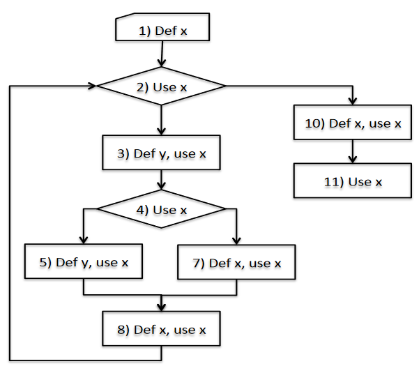

# Def-Use

Identify every time a variable is defined (modified) and used with that version, for example:
```c
1 int i, k = 0;
2 i = k;
3 while (i<10)
4 i++;
```
The def-use pairs for k are `<1, 2>` while the ones for i are `<2, 3>, <2, 4>, <4, 3>, <4, 4>`.

A more complex example:
```c
0  int foo() {
1    x = input();
2    while (x > 0) {
3        y = 2 * x;
4      if (x > 10)
5        y = x - 1;
6      else
7        x = x + 2;
8      x = x - 1;
9    }
10   x = x - 1;
11   return x;
12 }
```

A control flow graph could be useful:
[](../../../images/058b3b1861_24hsHhzw56BX3GOc-image-1644009411080.png)

The identified def-use pairs for x are:
- <1, 2> <1, 3> <1, 4> <1, 5> <1, 7> <1, 8> <1, 10>
- <7,8>
- <8, 2> <8, 3> <8, 4> <8, 5> <8, 7> <8, 8> <8, 10>
- <10, 11>

While we see for y: 
- <3,?> <5, ?>

So y is defined but never used.

## Past exam exercise
### 2021 07 26 Q3 (3 points)
Identify the def-use pairs for program my_func and say whether they highlight anything unusual.
```c
0  int my_func (int x, int y) {
1      int z, k, res;
2      if (x <= 0 || y <= 0)
3          return -1;
4      z = x;
5      k = y;
6      while (x != y) {
7          if (x > y)
8              x = x - y;
9          else y = y - x; }
10     if (z % x == 0) {
11         res = 1;
12         z = 1; }
13     else z = 0;
14 	   return res; }
```

**SOLUTION**

| Variable | Def-Use pairs |
| - | - |
| x | <0,2>, <0,4>, <0,6>, <0,7>, <0,8>, <0,9>, <0,10><br><8,6>, <8,7>,<8,8>, <8,9>, <8,10> |
| y | <0,2>, <0,5>, <0,6>, <0,7>, <0,8>, <0,9><br><9,6>, <9,7>,<9,8>, <9,9> |
| z | <4, 10>, <12,\?>, <13,\?> |
| k | <5, \?> |
| res | <\?,14>, <11,14> |

Variable z is set at lines 12 and 13, but it is then never used, which is not necessarily a problem, though
it is not ideal. Similarly, variable k is set at line 5, but it is never used. Variable res is potentially used at
line 14 without being initialized. However, an inspection of the paths that lead to line 14 show that line
13 is actually never executed (i.e., the condition at line 10 is always true), so variable res will actually be
always initialized when it is used.

### 2021 01 13 Q2 (3 points) Mixed def-use and symbolic execution
```c
0  int func (int x) {
1      int k, i, y;
2      int res = 0;
3      if (x < 1)
4          return res;
5      if (x % 2 != 0)
6          return res;
7      y = x;
8      i = 0;
9      while (i <= 10 && y % 4 != 0)
10         y = y*y;
11         i = i + 1;
12     }
13     if (i > 5)
14 	       res = k;
15     else
16         res = res + 1;
17     return res;
```

#### Point A: identify pairs and highlight unusual
Identify the def-use pairs for program func and say whether they highlight anything unusual.

**SOLUTION**

| Variable | Def-Use pairs |
| - | - |
| x | <0,3>, <0,5>, <0,7> |
| k | <\?,14> |
| i | <8,9>, <8,11>, <8,13><br><11, 9>, <11, 11>, <11, 13> |
| y | <7, 9>, <7, 10><br><10, 9>, <10,10> |
| res | <2,4>, <2,6>, <2,16>, <14,17>, <16,17> |

Variable k is used in line 14 but it is never initialized.

#### Point B: symbolic execution
Use symbolic execution to determine the feasibility (and, in case, the path condition) of the following path: 0, 1, 2, 3, 5, 7, 8, 9, 10, 11, 12, 9, 10, 11, 12, 9, 13, 15, 16, 17

**SOLUTION**

| Step | Definitions | Path Conditions                                              |
| ---- | ----------- | ------------------------------------------------------------ |
| 0    | x=X         |                                                              |
| 1    |             |                                                              |
| 2    | res=0       |                                                              |
| 3    |             |                                                              |
| 5    | X=2K        | X >= 1                                                       |
| 7    | y=X         | X >= 1                                                       |
| 8    | i=0         |                                                              |
| 9    |             |                                                              |
| 10   |             | X >= 1, X not divisible by 4 (not exists P s.t. 2K = 4P)     |
| 11   | y=X^2=4K^2  |                                                              |
| 12   | i = 1       |                                                              |
| 9    |             |                                                              |
| 10   |             | X >= 1, X not divisible by 4, X^2 not divisible by 4 (not exists P s.t. 4\*K\*K = 4P)  |

The last condition is not feasible, since it is enough to consider `K*K = P` to violate the condition. The path is not feasible.

#### Point C: mix def-use and symbolic execution
For any possibly erroneous situation highlighted by the def-use analysis, use symbolic execution to argue whether or not the problem can indeed manifest itself.

**SOLUTION**

We saw that variable k is used in line 14 but it is never initialized. This situation is impossible to occur since the loop can get executed at most 1 time and for this reason `i<=5` so the path is not taken.

### 2020 06 17 Q2.a (3 points)
```c
0  mycode (int S[], int Slength) {
1      int h, x, p, res = 0;
2      if (S == null)
3          return 23;
4      x = Slength;
5      if (x == 0)
6          return -5;
7      h = 0;
8      while (h < Slength) {
9          p = S[h] - S[x-(h+1)];
10         if (p != 0)
11             return 14;
12         h = h + 1;
13     }
14 	   return -5; }
```

Identify the def-use pairs for program mycode and say whether they highlight anything unusual.

**SOLUTION**

| Variable | Def-Use pairs |
| - | - |
| S | <0,2>, <0,9> |
| Slength | <0,4>, <0,8> |
| h | <7,8>, <7,9>, <7,12><br><12,8>, <12,9>, <12,12> |
| x | <4,5>, <4,9> |
| p | <9,10> |
| res | <1,\?> |

res is defined but never used which is not ideal.