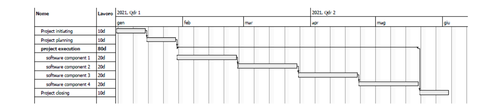

# Earned Value Analysis

- **Budget at completion ($BAC$)**: total budget for the project
- **Planned value ($PV$)**: budgeted cost of work planned
- **Earned value ($EV$)**: budgeted cost of work performed
- **Actual cost ($AC$)**: actual cost for the completed work

### Schedule
The project running behind schedule if the value produced is less than the value planned ($EV < PV$).
- **Schedule variance**: $SV = EV – PV$
- **Schedule performance index**: $SPI = EV /PV$

Both values are lower than zero if the project is running behind schedule.

### Cost
The project running over budget if the value produced is less than the cost ($EV < AC$).
- **Cost variance**: $CV = EV – AC$
- **Cost performance index**: $CPI = EV/AC$

Both values are lower than zero if the project is spending more than planned.

### Estimations
Perform an estimation of the budget at completion of the project using some assumptions:
1) continue to spend at the same rate (same CPI)
2) continue to spend at the baseline rate
3) continue at the same cost and schedule performance index (same CPI and SPI)

For example the **cost estimate at completion** can be:
1. If we continue to spend at the same rate $EAC = BAC/CPI$
2. If we continue to spend at the original rate $EAC = AC + (BAC – EV)$
3. Both CPI and SPI influence the remaining work: $EAC = \frac{AC + (BAC – EV)}{(CPI \times SPI)}$

## Past exams exercises
### 2020 09 04 Q3 (3 points)
A project has been setup to build an application composed by four software components. The budget assigned to the project is 14000 euros. The project costs are the following:
- 2000 euros for the initiating phase.
- 1000 euros for the planning phase.
- 9000 euros for the executing phase: 2000 euros for the first component, 3000 for the second, 2000 for the third, 2000 for the last.
- 2000 euros for the project closing.

The schedule is the following:

A planned review is provided after 60 days from the project start; the project manager calculates the following parameters according to the Earned Value Analysis:
- Earned Value is 7500 euros.
- Actual Cost is 6000 euros.

As PM of the project please answer the following questions:
1. Inform the stakeholders about the situation of the project in terms of schedule and cost.
2. Estimate the budget at completion ($EAC$) of the project considering the following two options:
    1. Continue to spend at the actual rate.
    2. Continue to spend at the original rate.
    
**SOLUTION**

From the project definition:
- $BAC  = 14000$
- $PV = 8000$ (after 60 days we should have completed the software component 2)

1. We are using less budget than planned since the value produced is greater than the cost $EV > AC$ ($7500 > 6000$) but we are behind in schedule since the value produced is less than the value planned $EV < PV$ ($7500 < 8000$).
2. The cost performance index of the running project is $CPI = EV/AC = 1.25$.
	1. Using the actual rate $EAC = BAC/CPI = 14000/1.25 = 11200 €$
    2. Continuing at the original rate $EAC = AC + (BAC – EV) = 6000 + (14000-7500) = 12500 €$

### 2019 02 01 Q3 (3 Points)
A project has been set up to build an application composed of three software components. The budget assigned to the project is 10000 euros.
At a planned review the project manager (PM) calculates the following parameters according to the Earned Value Analysis:
- Earned Value ($EV$) is 800 euros.
- Planned Value ($PV$) is 1500 euros.
- Actual Cost ($AC$) is 1000 euros.

As PM of the project please answer to the following questions:
1. Inform the stakeholders about the situation of the project in terms of schedule and cost.
2. Estimate the budget at completion ($EAC$) of the project considering the following two options:
	1. The project will progress spending at the actual rate.
	2. The project will progress spending at the original rate.

**SOLUTION**
1. The project is running over budget because the value produced is less than the cost ($EV < AC$); in addition, it is running behind schedule because the value produced is less than the value planned ($EV < PV$).
2. The cost performance index of the running project is $CPI = EV/AC = 0.8$
	1. Using the actual rate $EAC = BAC/CPI = 10000/0.8 = 12.500 €$
    2. Continuing at the original rate $EAC = AC + (BAC – EV) = 1000 + (10000-800) = 10200 €$