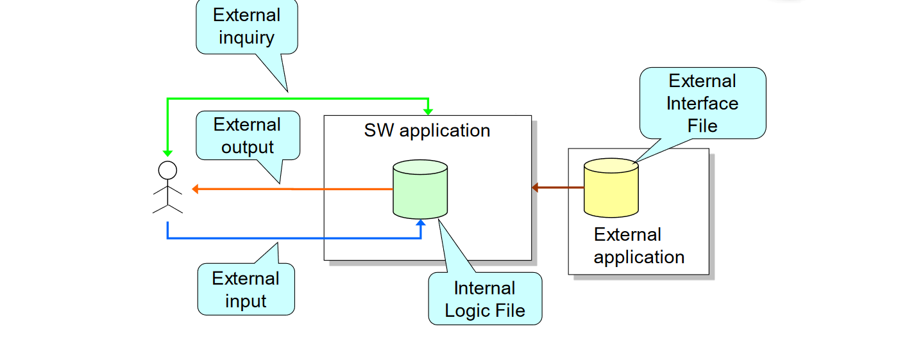
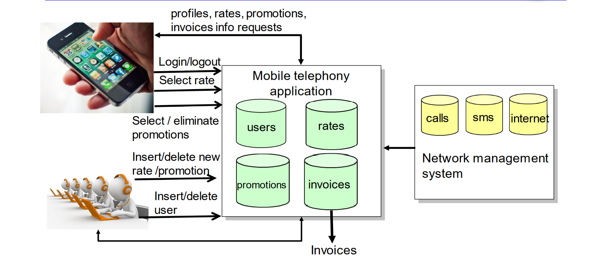

# Function Points

Function Points is a technique to measure the dimension of a software based on the functionalities that it has to offer.

A weight is associated with each FP counts of different types; the total **Unadjusted Function Points** is computed by multiplying each “raw” count by the weight and summing all partial values:
$$UFP = ∑ (nElements * weight)$$

There are multiple types:
- **Internal Logical File (ILF)**: homogeneous set of data used and managed by the application
- **External Interface File (EIF)**: homogeneous set of data used by the application but generated and maintained by other applications
- **External Input**: Elementary operation to elaborate data coming from the external environment
- **External Output**: Elementary operation that generates data for the external environment (It usually includes the elaboration of data from logic files)
- **External Inquiry**: Elementary operation that involves input and output (without significant elaboration of data from logic files)

A used reference for the weights is the following table:
<table>
    <thead>
        <tr>
            <th rowspan="2">Function Types</th>
            <th colspan="3">Weight</th>
        </tr>
        <tr>
            <th>Simple</th>
            <th>Medium</th>
            <th>Complex</th>
        </tr>
    </thead>
    <tbody>
        <tr>
            <td>External Inputs</td>
            <td>3</td>
            <td>4</td>
            <td>6</td>
        </tr>
        <tr>
            <td>External Outputs</td>
            <td>4</td>
            <td>5</td>
            <td>7</td>
        </tr>
        <tr>
            <td>External Inquiry</td>
            <td>3</td>
            <td>4</td>
            <td>6</td>
        </tr>
        <tr>
            <td>Internal Logical File</td>
            <td>7</td>
            <td>10</td>
            <td>15</td>
        </tr>
        <tr>
            <td>External Interface File</td>
            <td>5</td>
            <td>7</td>
            <td>10</td>
        </tr>
    </tbody>
</table>

### Example
Calculate FPs for an application managing a mobile telephony service.
The application:
- Manages data about both users and the different types of rates. The system will store the user data (phone number, personal data, the type of rate, any applying promotion). Each rate type is characterized by: call cost, cost of text messages, cost of surfing the Internet. Promotions change some of the cost items only for a well-defined period of time.
- Allows users to access their information, change rates, and activate promotions.
- Manages user billing based on information retrieved from the network management system. This last system sends to the service management system data concerning the voice calls (call duration, and the user location in case of roaming), SMSs (the information that messages have been sent, and the corresponding user location in case of roaming), and Internet surfing (connection duration, amount of downloaded data, user location) of each user.

#### ILFs
The application stores the information about:
- users
- rates
- promotions
- invoices

Each of these entities has a simple structure as it is composed of a small number of fields. Thus, we can decide to adopt for all the four the simple weight. Thus, 4 x 7 = 28 FPs concerning ILFs.

#### ELFs
The application manages the interaction with the network management system for acquiring information about:
- calls
- SMSs
- Internet usage

Three entities with a simple structure. Thus, we decide to adopt a simple
weight for the three of them. We get 3 x 5 = 15 FPs.

#### External inputs
With the customers:
- Login/logout: these are simple operations, so we can adopt the simple weight for them. 2 x 3 = 6 FPs
- Select a rate: this operation involves two entities, the rate and the user. It can still be considered simple, so, again we adopt the simple weight. 1 x 3 = 3 FPs
- Select/eliminate a promotion: These two operations involve three entities, the user, the rate and the promotion. As such, we can considered them of medium complexity. 2 x 4 = 8 FPs

The application also interacts with the company operators to allow them to:
- Insert/delete information about a new rate or promotion.
- Insert/delete information about a new user.

Both the above operations can be consider of average complexity. 4 x 4 = 16 FPs
In summary, we have FPs = 6+3+8+16 = 33

#### External inquiries
The application allows customers to request information about:
- their profiles
- rates
- promotions
- invoices

The application also allows the operator to visualize the information of all
customers.

In summary, we have 5 different external inquiries that we can consider
of medium complexity. Thus, 5 x 4 = 20 FPs.

#### External outputs
The application allows the creation of invoices.
This is a quite complex operation as it needs to collect information from IFLs and EFLs.
Thus, we can apply the weight for the complex cases: FP = 1 x 7.

#### Total number of FPs
- ILFs: 28
- ELFs: 15
- External Inputs: 33
- External Inquiries: 20
- External Outputs: 7
- Total: 103

## Past exams exercises
### 2021 09 03 Q2 (4 points) Grocery store
A grocery store is equipped with a dispenser of barcode readers (let us call them BCRs). Customers who own the grocery store fidelity card can take one BCR at a time. Customers can then use the acquired BCR to read the barcodes of the products they want to buy and add the product to their bill.

Besides the dispenser and the BCRs, it includes some cash registers that can either interface with the BCRs to collect information about the items scanned by the customers, or are manually operated by a cashier. Cash registers print the bills for the user, register the received amount of money and compute the change to be given to the customer. An external and preexisting central system communicates with the cash registers to receive information about the issued bills and the stored amount of money. Identify the function points associated with this system specifying, for each of them, the corresponding classification in terms of complexity (simple, medium and complex). Provide the rationale for your decisions.

**SOLUTION**

**Internal Logical File**
- BCR (id, batteryLevel, currentCustomer)
- Dispenser (id, storedBCRs)
- Customer (id, fidelityCard, billID)
- Bill (id, productID, numberOfItems)
- Product (id, cost)

The dataset has a simple structure. BCRs and Dispensers are limited in number as well, so they are certainly simple. Customers, Bills and Products may include a relatively large amount of data, so their complexity can range from simple to complex.

**External Interface File**
Even though the system interfaces with the external server, from the description it does not appear to receive data from it. Rather, it communicates data to this central server. So, we do not have EIF.

**External Input**
- Assign BCR to customer, offered by Dispense -> simple
- Deposit BCR, offered by Dispense -> simple
- Scan product: this operation is offered by the BCR -> simple
- Manual read product code from cash register -> simple
- Read products from BCD by cash register -> simple
- Register ammount, offered by cash register -> simple

**External Inquiry**
check battery level: this operation is offered by the BCR. It is simple.
computeChange: this operation is offered by the cash register. It is simple.

**External Output**
printBill: this operation is offered by the cash register. It is simple.
sendBillToCentral: this operation is offered by the cash register. It is simple.

### 2021 06 24 Q3 (4 points) Charity
A charity wants to build an information system supporting its processes in delivering humanitarian aid. More specifically, the charity wants to support its employees in:
1) entering and updating information about the assisted people (beneficiaries);
2) entering the amount of funds given to a beneficiary a certain day;
3) inserting and updating the information concerning the donors, including the amount of their donations;
4) searching donors and beneficiaries according to various criteria (name, region, amount of money received, etc.);
5) visualizing aggregated information such as the number of beneficiaries, the type of support they receive, the number of donors, etc.

As the charity was created by grouping together some local organizations, the data concerning the beneficiaries supported directly by these local organizations are stored in other local information systems.

Identify the function points associated with this system specifying, for each of them, the corresponding classification in terms of complexity (Simple, Medium and Complex).

**SOLUTION**

**Internal Logical File**
- Beneficiaries (include name, surname, address, annual income) → simple
- Donors (include name, surname, address) → simple
- Incoming funds (include the date, donor identifier, amount received, description) → simple
- Outgoing funds (include date, beneficiary identifier, amount spent, description) → simple

All these can be considered simple because of their structure and the limited number of entries.

**External Interface File**
We can assume to acquire from the external organizations info about local beneficiaries and donors as well as aggregated information about the performance of the local organization (amount of incoming and outgoing funds, number of assisted people, number of donors, ...). All can be considered simple because of their structure and the limited number of entries.

**External Input**
- Login/logout → simple
- Insert beneficiary → simple
- Update beneficiary → simple
- Insert donor → simple
- Update donor → simple
- Insert a new entry concerning incoming funds → it requires the join of two tables. Still, it can be considered simple.
- Insert a new entry concerning outgoing funds → it requires the join of two tables. Still, it can be considered simple.

**External Inquiry**
- Search for a specific beneficiary → simple
- Search for the support a beneficiary has obtained so far → simple
- Search for a donor → simple
- Search for beneficiaries with certain characteristics (e.g., living in a certain area, with a particularly low income, ...) → simple
- Search for donors with certain characteristics → simple

**External Output**
Create a report for the management with information about the number of beneficiaries supported in a timeframe, the donors, the money acquired, the money spent, ... → given that this report could be quite articulated, we can assume a medium complexity

### 2021 01 13 Q3 (3 points) publish-subscribe
Consider the mechanisms of a publish-subscribe framework. In the framework there are 2 types of components, publishers and subscribers. For simplicity, assume that a component can only be either a publisher, or a subscriber, but not both. Publishers publish events, and subscribers receive them. Each event regards a topic. Each publisher publishes events that correspond to a set of topics; dually, subscribers subscribe to topics in which they are interested, and for which they will receive events. Each publisher keeps a buffer of events to be sent of up to 10 events, and each subscriber keeps a buffer of at most 5 incoming events

Assume that the publish-subscribe framework described is implemented through a server that receives all publish and subscribe events and acts as dispatcher between publishers and subscribers. Calculate the function points for the part described server. Motivate your choices.

**SOLUTION**

**ILFs**
The application stores information about topics, events and subscription:
- Topics are simple -> 7
- Events are simle -> 7
- Subscriptions are simple -> 7

**EIFs** none

**External inquiry** none

**External outputs**
- Send events to subscribers is simple -> 4

**External inputs**
- Subscribe is simple -> 3
- Unsubscribe is simple -> 3
- Publish event is simple -> 3

Total number of FPs = 7+7+7 + 4 + 3+3+3 = 34

### 2020 07 13 Q3 (3 points) Public transport
Consider a system that counts the number of passengers on public transports and at their respective stops by scanning what Bluetooth devices are in the vicinity of the vehicles and of the stops.

The system considers 2 types of public transportation means: buses and trams. Vehicles of different types are differently equipped, in the sense that buses are equipped with 2 Bluetooth devices (one at the front, one at the back), whereas trams, which are smaller, are equipped with only one Bluetooth device in the center of the vehicle. Bus/tram stops are also equipped with one Bluetooth device each. On the passenger side, each passenger has a mobile device, which also has a Bluetooth device. Each Bluetooth device has a unique identifier, and it can be used to scan what other Bluetooth devices are in its vicinity (the result of the scan is the list of ids of detected Bluetooth devices).

Each bus/tram and each stop has its own id. Vehicles and stops keep track of the Bluetooth ids that they detect through Bluetooth scans. More precisely, each vehicle/stop has an internal function that periodically retrieves and updates the list of Bluetooth ids that are detected in its vicinity through scans. Each vehicle/stop offers a function that allows clients to retrieve the current list of stored Bluetooth ids.

The system offers to operators the possibility to look for specific buses/trams/stops and retrieve the number of passengers currently in the system. In addition, it allows operators to set, for each bus/tram/stop, the threshold of number of passengers over which the bus/tram/stop should be considered overcrowded. Finally, it periodically provides a report with the highest number of passengers reached in each bus/tram/stop, highlighting the overcrowded situations.

Calculate the function points for the part of the system targeted to operators. Motivate your choices. 

**SOLUTION**

**Internal Logic Files**
- Vehicles (vehicle ID, line number, capacity, Vehicle ID, threshold) → simple (weight 7)
- Stops (stop ID, address, threshold) → simple (weight 7)
- CollectedDeviceIDs (vehicle ID or stop ID, time of collection, deviceID) → medium as typically this is a table with a large number of elements (weight 10)

**External Interface File** None

**External Input**
Set overcrowded threshold for bus/tram/stop → simple (weight 3)

**External Output**
Produce a periodic report with all deviceIDs per vehicle/stop → medium, as the number of elements to be considered and the visualization of the situation might not be trivial (weight 5

**External Inquiry**
Get the number of passengers currently in a certain vehicle or stop → medium because it requires the processing of CollectedDeviceIDs joined with Vehicles or Stops (weight 4)e

**Total number of FP**: 24 + 3 + 5 + 4 = 36