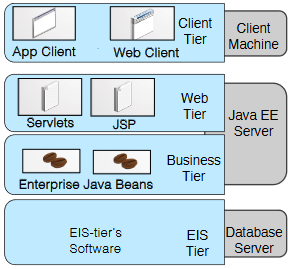
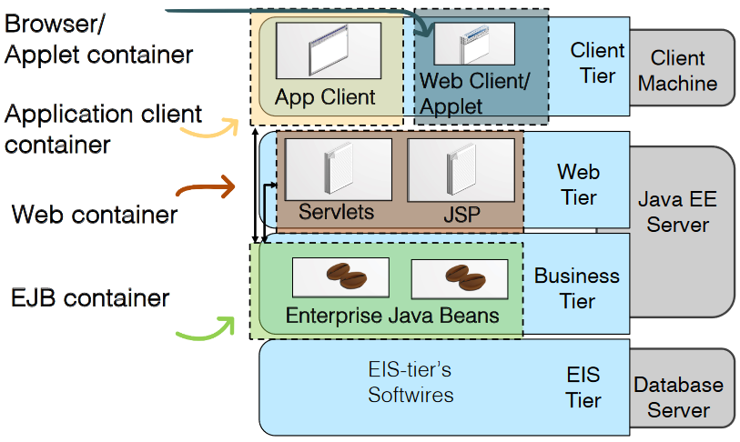
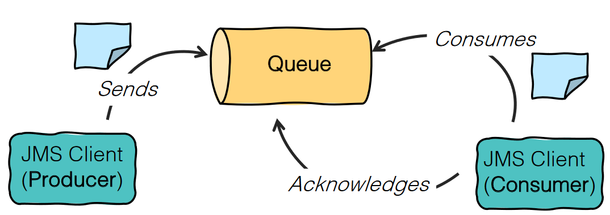
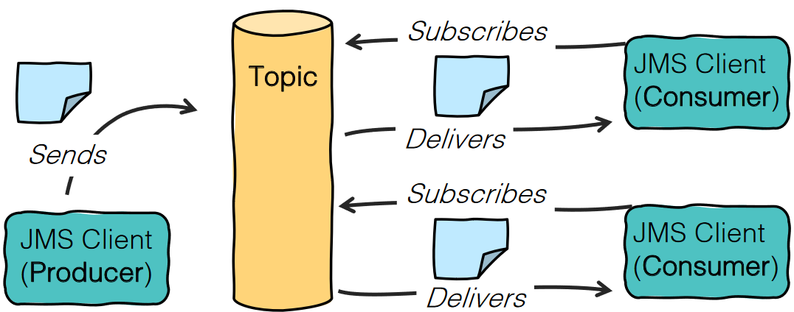
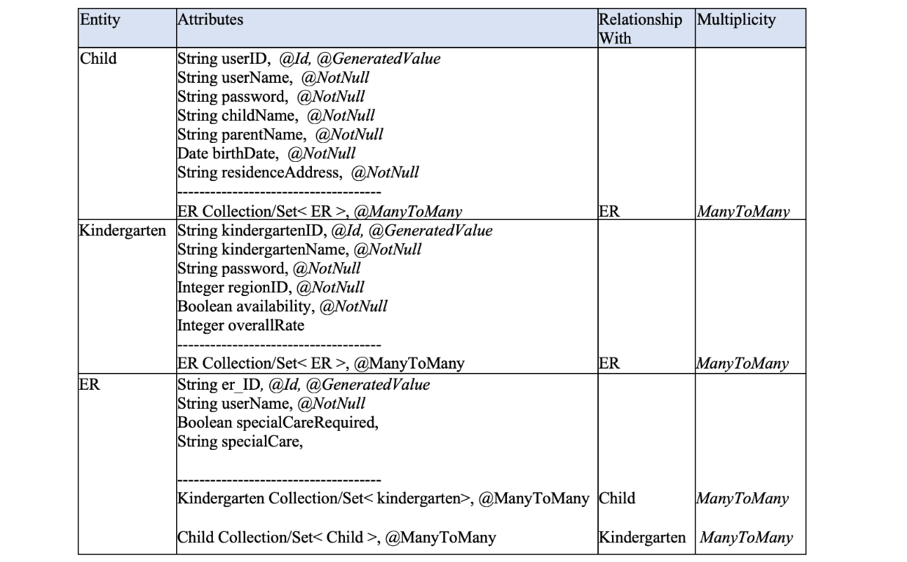

# JEE

### Architecture
Java EE platform suggests a distributed **multitiered** architecture model for enterprise applications:
- **Client Tier**
	- **Application Clients**: clients that run directly on the client machine. They are usuallyquite rich and they interact directly with the bussines tier.
	- **Web Clients**: Dynamic web pages (e.g. HTML, XHTML, JS) generated by web components. The web client simplifies the distribution, deployment, and update of the system.
	- **Applets**: small clients written in Java integrated as part of a web page and executed on the browser. They require tha Java plug-in.
- **Web Tier**
	- **Java Servlet**: Java class which lets applications and server communicate via of a request-response programming model
	- **JavaServer Faces**
	- **JavaServer Pages (JSP)**: text-based documents (i.e. HTML) with added JSP elements. It allows to combine Java code with HTML.
- **Business Tier**
	- **EJB (enterprise java bean)**: server-side component that encapsulates the business logic of an application
- **Enterprise information system (EIS) Tier**

A Tier is a logical grouping of several components that are served for specific purpose

[](../../../images/9dfddd45b0_JOp2x31qohV0Y8ZV-image-1644084556970.png)

#### Containers
Container offers services to manage:
- The component lifecycle
	- Deployment
	- Activation/instantiation
	- Configuration
	- Execution scope
	- Termination
- lookup of other components
- communication between components

Before a component (web, enterprise bean, or application client) can be executed, it must be assembled into a Java EE module and deployed into its container.
[](../../../images/8480da7fcd_e6fkNN54i35ICSow-image-1644084778757.png)

#### EJB Types
There are two types of EJB:
1. **Session**:Performs a task for a client; optionally, may implement a web service
	1. **Stateful**: the instance variables represent the state of a unique client/bean session. Yt can have only one client and each client creates a new instance.
    2. **Stateless**: does not maintain a conversational state with the client and all instances of a stateless bean are equivalent
    3. **Singleton**: maintains the state of the bean per lifecycle of the application. Instantiated once per application.
2. **Message-driven**: Acts as a listener for a particular messaging type, such as the Java Message Service API

### Injection Mechanism
Enable your objects to obtain references to resources and other dependencies without having to instantiate them directly. Declare the required resources and other dependencies in your classes by decorating fields or methods with one of the **annotations** that mark the field as an injection point. **Java Naming and Directory Interface (JNDI)** is responsible for injections.
1. **Resource Injection**: Applications can either directly call JNDI to locate resources, or, to inject them using the `@Resource` annotation
2. **Dependency Injection**: Allows to turn Java classes into managed objects. The injected object doesn’t need to be explicitly created (no new keyword) which allows to decouple your code from the implementations of its dependencies. Uses the `@Inject` annotation.

### Resource management
1. **Instance pooling** (Stateless, and Message-driven beans): the container can maintain pool of EJBs and when a client request arrives the container randomly choose one bean to serve the that request.
2. **Activation/Passivation** (Statefull beans): Since in Stateful bean, same instance has to keep the state between method invocation and to serve one client till the end of a conversation, passivate a Stateful Bean when it is in “idle” state and activate (or recover) it whenever it is needed.

## Java EE important APIs
### Java Message Service (JMS)
Java API that enables messaging communication pattern in JEE. It allows various components (Application clients, Enterprise JavaBeans (EJB) components, and web components) to create, send, receive, and read messages.

- **JMS provider** is a messaging system that implements the JMS interfaces and provides administrative and control features.
- **JMS clients** are the programs or components that produce and consume messages
- **Messages** are the objects that communicateinformation between JMS clients
- **Administered objects** are preconfigured JMS objects created by an administrator for the use of clients. The two kinds of JMS administered objects are destinations and connection factories

1. **Point-to-Point**: Each message is addressed to a specific **queue**, receiving clients extract messages from the queues
[](../../../images/bdcdbfc7ce_Ky2GIeR6QdtvPCrS-image-1644144726675.png)
2. **Publish/Subscribe**: Each message is addressed to a specific **topic**. A Topic could have multiple subscribers and publishers
[](../../../images/d7ae055b1b_F6N4YEp4SY2s9LVO-image-1644144961466.png)

#### Message-driven bean (MDB)
Enterprise bean that acts as a **JMS message listener**, that receives JMS messages. It executes upon receipt of a single client message and it **retains no data** or conversational state for a specific client. Therefore all instances of a message-driven bean are equivalent, allowing the EJB container to assign a message to any message-driven bean instance.

### Java Persistence API (JPA)
Java Persistence uses an object/relational mapping approach to bridge the gap between an object-oriented view of data layer and a relational database:
- A **Class** represents a Table in a database (or the **Entity** in ER model)
- The **class fields/properties** are mapped to columns of the table (or Entity **Attributes**)
- **Relationship** between two tables, is defined by some **properties which are common** in two classes
- **Multiplicity** of a relation is declared using the relationship **annotations**

#### Relations
1. Unidirectional One-to-one Relationship
```java
@Entity
public class Company {
  // ...
  @OneToOne
  @JoinColumn(name="maID")
  public MailingAddress address;
}

@Entity
public class MailingAddress {
  @Id
  private int maID;
  // ...
}
```
2. Bidirectional One-to-many Relationship
```java
@Entity
public class Company {
  // ...
  @OneToMany(mappedBy='company')
  public Set<Product> products;
}

@Entity
public class Product {
  // ...
  @ManyToOne
  @JoinColumn(name="cID")
  public Company company;
}
```
3. Many-to-many Relationship
```java
@Entity
public class User {
  // ...
  @ManyToMany
  @JoinTable(name='order', joinColumns=@JoinColumn(name='uID'), inverseJoinColumns=@JoinColumn(name ="pID")))
  public Set<Product> orderedProduct;
}

@Entity
public class Product {
  // ...
  @ManyToMany(mappedBy='orderedProduct')
  public Set<User> order;
}
```

## Past exams exercises
### 2021 02 05 Q3 (6 points) Milan kindergarten
The Municipality of Milan wants to create a web-based system to let parents register their children in a public kindergarten in various regions of the city. The Municipality would like to have a robust architecture to manage this system. Parents use the system to enter an Enrollment Request (ER) where they specify the information about their child, including the area they live in. Kindergartens receive through the system the ER, evaluate it and contact the applicants to inform them if they are rejected/accepted and to further communicate with them. In particular, the system offers the following functions to parents:
- F1 - Child registration: The parent should be able to register his/her child in the system by giving information such as name/surname, birthdate of the child, working status, phone number, and e- mail address of the parents. As a result of the registration, parents will be able to log in to the system.
- F2 - Enrollment request: When logged in, parents issue the ER by giving the following data in addition to the data in their profile: city area of interest, and if the child needs any special medical care.
- F3 - Kindergarten rating: Parents can rate the kindergarten of their child.
- F4 - Visualization of ER status: This can be one of the following: pending or accepted (for simplicity, we assume that there is enough availability for all children of a certain area, so no application is rejected). 

Moreover, the system offers the following functions to kindergartens’ staff:
- F5 - Kindergarten registration: This is performed by providing at least the following data: kindergarten name, city area, email, capacity.
- F6 - Profile update: Kindergartens can update their capacity. They will stop receiving ERs whenever their capacity is full.
- F7 - ER evaluation: The kindergarten’s staff can accept/reject an application.

Finally, the system offers the following support functions:
- F8 - Upon submission, the system sends ERs to all available kindergartens of the desired city area. Notice that a parent cannot apply for a specific kindergarten, but only for a region.

Notice that when one of the kindergartens accepts an ER, then the ER status is changed to accepted. Also, the system keeps track of who is enrolled in each kindergarten, based on the acceptance information.
#### Point A (2 points) Web Tier Components
Identify at least two different Components of the Web Tier, their main responsibility and, for each Component, list the requirements that it satisfies.

**SOLUTION**

The web tier of the application is composed of various JSPs containing HTML forms and Servlets to manage them. For example, below are listed some of the needed components:

|Component| Responsibility| Requirement|
|-|-|-:|
|JSP| Front-end for Child Registration |F1
|JSP| Front-end for kindergarten Registration |F5
|JSP| Front-end for ER form |F8
|ChildRegistration_Servlet| To forward the forms data to corresponding Bean |F5
|KindergartenRegistration_Servlet| To forward the forms data to corresponding Bean |F1
|ER_Servlet| To forward the ER-Form data to corresponding Bean |F8

#### Point B (3 points) Identify beans
Given the entities defined in the following table, focus on the business layer part of your system, and in particular on the definition of the Beans. More precisely, identify the required Beans, specify their types and, for each Bean, list the functions it satisfies (F1-F8) and at least one method (the most important one).
[](../../../images/e2077f772d_F4djYacZRFHfBZWZ-image-1644078129675.png)

|Component| Type | Requirement|
|-|-|-:|
|Kindergarten_Manager|Stateless Bean|F5, F6, F7|
|ER_Manager|Stateless Bean|F4, F8|
|Child_Manager|Stateless Bean|F1,F2,F3|

Kindergarten_Manager, Child_Manager are stateless beans to manage the operations related to the Kindergarten and Child entities such as registration, profile updating and so on.

ER management could be implemented as a stateless bean, the ER_Manager. To address F8, when a new request is generated by filing the ER form, the main task of the ER_Manager bean is to first extract the requested region in the ER, then query the database to find all the available kindergartens in that region and then send them the ER.

Some methods of Child_Manager, Kindergarten_Manager, and ER_Manager are the following:
1. Child_Manager:
```java
public Integer updatePassword(String userID, Integer rate) {}
public Integer updateResidenceAddress(String addr) {}
```
2. Kindergarten_Manager:
```java
public void SetAvailability(Boolean availability) {}
public Integer updateRating(String userID, Integer rate) {}
```
3. ER_Manager:
```java
public Collection<Kindergarten> findKindergartenByRegion(String RegionName){}
public void sendERs(Collection<Kindergarten> kindergartensInRegion) {
    for (kindergarten k : kindergartensInRegion) {
        // send the ER to k
    }
}
```

#### Point C (1 point) Reflect on Message-Based model
Reflect on the possibility to adopt a Message-Based Communication model. Which part of the business layer is most suited to be addressed through such model? What is the JEE API to use in this case? Explain how you would incorporate such JEE API in your system.

**SOLUTION**

The JMS style that could be used here is the publisher-subscriber model, so each region would be a Topic and upon ER submission the Publisher notifies the Subscriber of the respected region. The main advantage of having JMS versus Stateless bean is that here the load of the ER management task is distributed over different Beans, each one responsible for single region.

### 2020 02 14 Q2 (6 points) Translation service
Alphabet is a website that allows users to choose from a list of freelancers for a *Translation Service*.
Freelancers offer different types of *Translation Services*, including technical translation, legal, medical and financial translation in various languages.
We focus on the functions offered to clients. The system allows clients to:
1. Register.
2. Log in.
3. View the list of available freelancers in a selected date, categorized based on the type of the *Translation Service* offered.
4. View each freelancer’s profile that displays his/her reputation (total completed *Translation Services*, and a rating of 1 to 10 stars given by her/his previous clients), and cost of the *Translation Service* per 1000 words (which is not negotiable).
5. Select the desired freelancer for a specific translation package offered by her/him. When a client selects a freelancer, she/he specifies also the length of the manuscript to be translated and the anticipated delivery date; this initiates a new Translation Service, which is thus created and its status is “initiated”. The freelancer then has up to three days to respond to such proposal, by either accepting or rejecting it. In the case of approval of the proposal, the status of the Translation Service is updated to “activated” and the client must send the manuscript within three days (if the client fails to send the manuscript within three days, the status of the Translation Service turns to “cancelled”). After the proposal is accepted and the manuscript is delivered, the Translation Service automatically starts and the countdown to the delivery date begins. If the freelancer rejects the proposal, then the Translation Service automatically terminates, and its status is updated to “rejected”.
6. Cancel any proposed and ongoing Translation Services (in the latter case, any compensation of the freelancers would be paid according to Alphabet’s agreed cancellation terms and conditions).
7. View the list of all her/his Translation Services and their status (initiated, rejected, activated, cancelled, countdown to the delivery date, completed).
8. Give a score to the freelancer who has completed a Translation Service.

#### Point A
Identify the main data entities, their main attributes (including their types and corresponding annotations, if any) and their relationships to each other using the features of such API, and specify the multiplicity of the relationship.

**SOLUTION**
- Client:
	- id, String, @Id, @GeneratedValue
    - name, String, @NotNull
    - surname, String, @NotNull
    - email, String, @NotNull
    - password, String, @NotNull
    - translationService, Collection\<TranslationService\>, @OneToMany
- Freelencer:
  - id, String, @Id, @GeneratedValue
  - name, String, @NotNull
  - surname, String, @NotNull
  - email, String, @NotNull
  - password, String, @NotNull
  - rating, Double
  - completed, Int
  - translationService, Collection\<TranslationService\>, @OneToMany
- TranslationService:
  - id, String, @Id, @GeneratedValue
  - status, Enumerated, @NotNull
  - type, String/Enumerated, @NotNull
  - length, Int, @NotNull
  - manuscript, String
  - proposed_delivery_date, Date
  - creation_date, Date
  - activation_date, Date
  - rejection_date, Date
  - rating, Int
  - client, Client, @ManyToOne
  - freelancer, Freelancer, @ManyToOne

#### Point B
Give two examples of possible bidirectional relations among those identified in part A). Justify your choice by explaining the assumptions behind it and the purpose of making the relations bidirectional.

**SOLUTION**
The relation between Client Entity and TranslationService Entity is Bidirectional because the system needs to retrieve all the instances of TranslationService entity associated with a given instance of the client (to address function 7), as well as retrieve the particular instance of client associated with a given instance of TranslationService (to generate the bill and to let the client score the freelancer as described in functions 4,8)

The relation between Freelancer Entity and TranslationService Entity could be Bidirectional as well. The direction from a TranslationService instance to a Freelancer instance is necessary to record a particular TranslationService information, to track Freelancer to deliver the order and to update the availability of freelancers. In addition, the direction Freelancer to TranslationService is needed to retrieve all accepted TranslationServices for by each Freelancer to be shown in their profile and to compute the reputation of that freelancer.

#### Point C
Identify the required Session Bean Entities, specify their types, and for each Bean list the requirements that it satisfies.

**SOLUTION**
| Entity | Type | Requirements
| - | - | - |
| ClientManager | Stateless | 1, 2, 7 |
| FreelancerManager | Stateless | 3,4,8 |
| TranslationServiceManager | Stateless | 5,6 |

#### Point D
Referring to the identified types of beans, explain the motivations for your choices.

**SOLUTION**
None of beans need to maintain the conversational state of the clients, so accordingly we can model all of them as Stateless beans. In other words, a specific "state of the client" is not required for invocations of any methods of the beans. Indeed, each method is not client-specific, it performs a generic tasks for any client, for example to register a new user, to generate a new translation service, or to update the status of a translation service (the information which is required to perform such tasks is either persisted-and so fetched from the database-or it is included in the stateless communication between user and system).