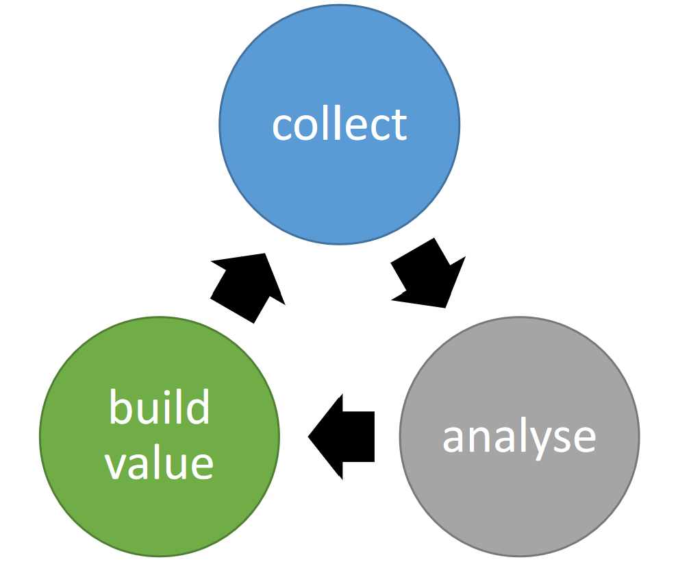

# 01 The Data-driven Virtuous Cycle

## Collect
Widely different data sources:
- Logs
- IoT
- Social Media
- Ecommerce
- Traditional businness databases

## Analyze
The analyse step is focussed on description and prediction.
It must be stakeholder drive where with stakeholders we mean:
- Customers / Clients
- Staff
- Shareholders
- Citizens
- Partners
- Etc.

## Build Value
Using data to take decions which will build more value.