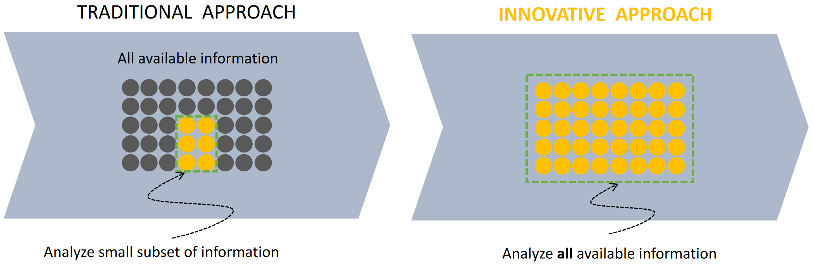
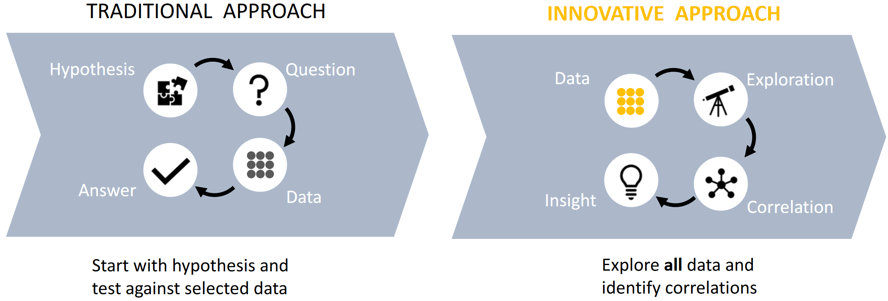
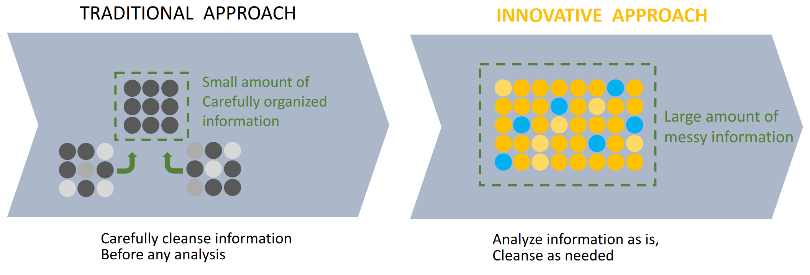
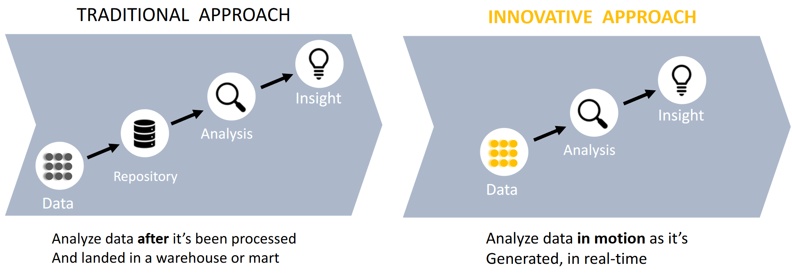
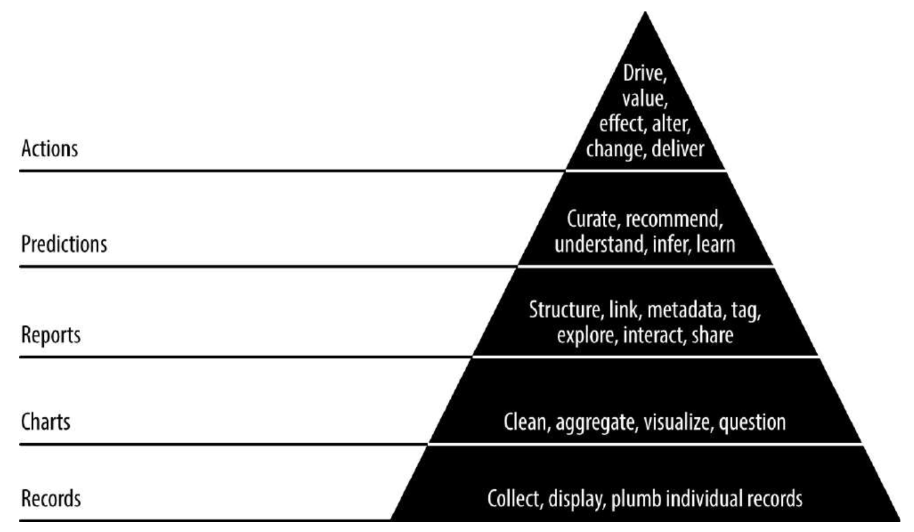

# 02 What is Big Data and new ways to solve problems

## Definition of the four Vs
1. **Volume** (Data at scale): terabytes to hexabyte of data cumulated on cheaper and cheaper storages
2. **Variety** (Data in many forms): structured, unstructured, text, images, video and general multimedia
3. **Velocity** (Data in motion): straming data analitics
4. **Veracity** (Data uncertainty): managing the reliability and predictability of inherently imprecise data type

Other Vs: Value, Volatility

## "oil" metaphor for Big Data, Data Science and Data Engineering
> Data is just like crude oil. It’s valuable, but if unrefined it cannot really be used. It has to be
changed into gas, plastic, chemicals, etc to create a valuable entity that drives profitable activity;
so data must be broken down and analyzed for it to have value.

- **Exploration**: just like we need to find oil, we need to locate relevant data before we can
extract it
- **Extraction**: after locating the data (oil), we need to extract it
- **Transform**: we then need to clean, filter and aggregate data (oil)
- **Storage**: data (oil) needs to be stored and this may be challenging if it is huge
- **Transport**: getting the data (oil) to the right person, organization or software tool (to the
petrol station)
- **Usage**: while driving a car one consumes oil. Similarly, providing analysis results requires
data

However, there are some important differences between data and oil:
- **Copying data is relatively easy and cheap**. While it is impossible to simply copy a
product like oil.
- **Data is specific, i.e., it relates to a specific event, object, and/or period**. Different
data elements are not exchangeable. When going to a petrol station, this is very different;
drops of oil are not preallocated to a specific car on a specific day.
- Typically, **data storage and transport are cheap** (unless the data is really Big Data). In
a communication network, data may travel (almost) at the speed of light and storage costs
are much lower than the storage costs of oil.

## New ways to solve problems
### Data analysis

| Traditional | Innovative |
| - | - |
| Traditionally when you have finite analytical capabilities, you use a good statistical sample of the entire space of data. It takes time to design an experiment with a significant sample. |  The innovative approach is enabled by the possibility to tame the data volume. Doesn’t matter how much data, it fits somewhere. Instead of defining which data you want first, you explore your data searching for useful information. |

### Data-driven exploration

| Traditional | Innovative |
| - | - |
| Starts with a hypothesis and tests against selected data. You guess that something can be true, and you go to the data warehouse writing a query, and checking if your hypothesis is true. | The innovative approach is one of unstructured machine learning. Explore data and look for patterns getting insights. Building models and describing statistical phenomena being able to do it at scale. |

### Data selection

| Traditional | Innovative |
| - | - |
| Traditionally when you have finite storing capabilities, you store a small ammount of carefully organized data. |  The innovative approach is enabled by the possibility to tame the data volume. Doesn’t matter how much data, it fits somewhere. Instead of defining which data you want first, you explore your data searching for useful information. |

### Laverage data as its captured

| Traditional | Innovative |
| - | - |
| Traditional approach analyses data after it’s been processed and landed in a warehouse or mart. | Innovative approach analyse data in motion as it’s generated, in real-time. |

## Data driven value
