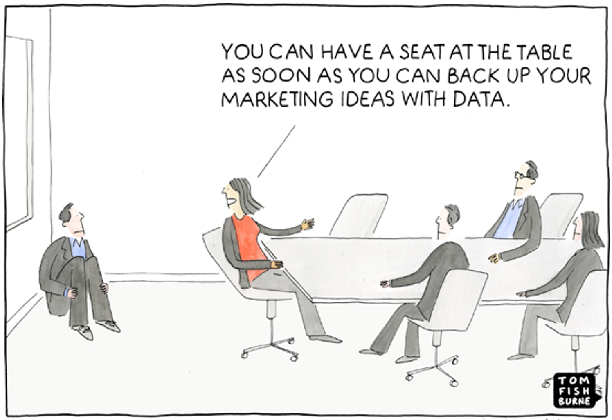

# 03 Data-driven decisions

Using data decisions no longer have to be made in the dark or based on gut instinct; they can be based on evidence, experiments and more accurate forecasts.

Data driven organizations perform better, are operationally more predictable and are more profitable.

## Data science
**Data Science is the art of discovering what we don’t know from data. It allows
obtaining predictive and actionable insights from data**. Indeed, Data Scientists are a new
breed of analytical data expert who have the technical skills to solve complex problems. They’re
part mathematician, part computer scientist and part trend-spotter

The duties of a Data Scientist are:
- Obtaining predictable,actionable insights from data
- Creating data product with immediate impact
- Communicating relevant business stories from data
- Building confidence in decisions that drive business value

## Data engineering
Following the crude oil example, data engineers build “the refinery”. **A data engineer is a
specialist that maintain data and models available and usable by others** (i.e., data scientists). According to Google, a professional data engineer enables data-driven decision making
by collecting, transforming and publishing data. He should be also able to leverage, deploy and
continuously train pre-existing machine learning problems.

- Design and build data processing systems
- Operationalize machine learning models
- Ensure solution quality