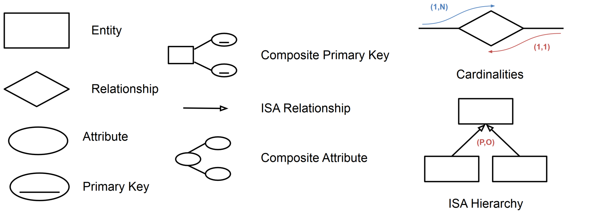

# 01 ER

# Foundations
An entity–relationship model (or ER model) describes interrelated things of interest in a specific domain of knowledge. A basic ER model is composed of entity types (which classify the things of interest) and specifies relationships that can exist between entities (instances of those entity types). 

- **Entity**: Real-world object distinguishable from other objects. An entity is described using a set of *attributes*.
- **Entity Set**: A collection of entities of the same kind (E.g., all employees).
	- All entities in an entity set have the same set of attributes.
	- Each entity set has a *key* (a set of attributes uniquely identifying an entity).
	- Each attribute has a *domain*.
- **Relationship**: Association among two or more entities.
- **Relationship Set**: Collection of similar relationships.
- **ISA Hierarchies**: Divide an entity in subentities which share the attributes and relationship of the parent entity.
	- *Total*: each instance of the parent entity must be part of at least one of the children entities
    - *Exclusive*: each instance of the parent entity must not be part of more than one of the children entities
    - *Partition*: A total end exclusive hierarchy

## Design Methodology
Three main strategies:
1. **Top down**
2. **Bottom up**
3. **Inside out**