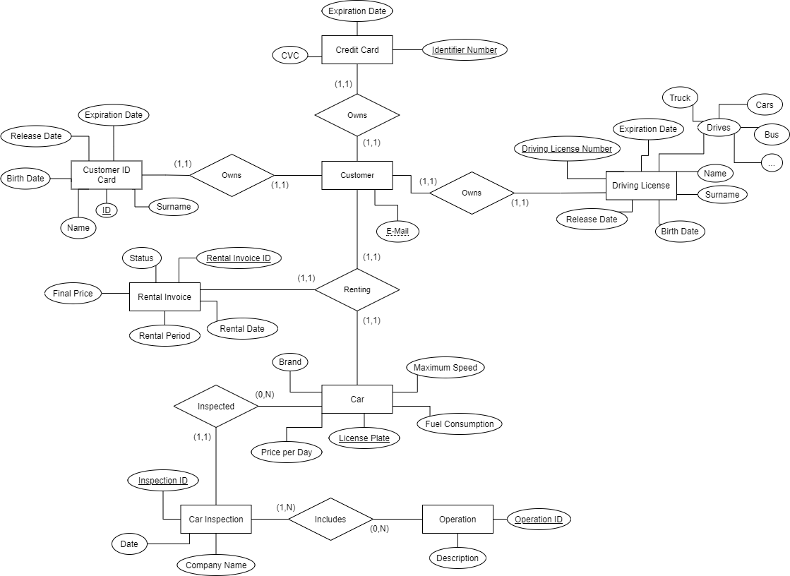
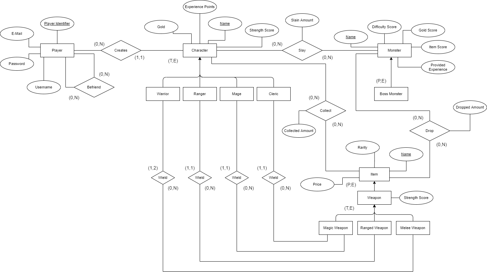
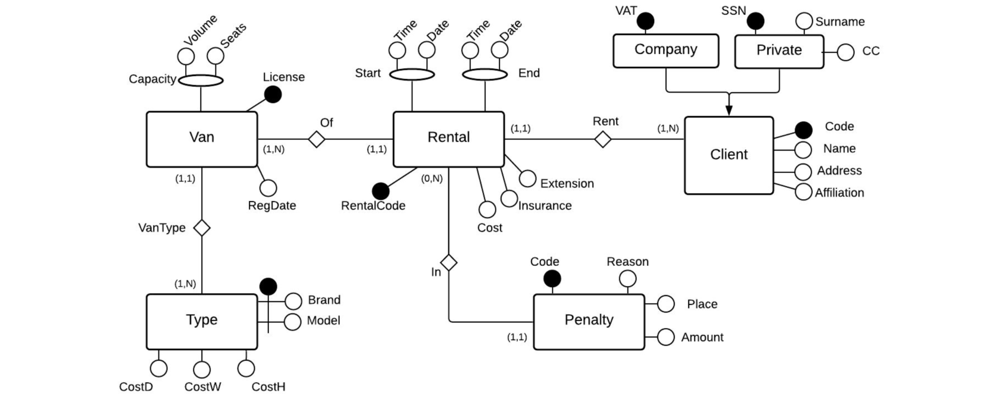
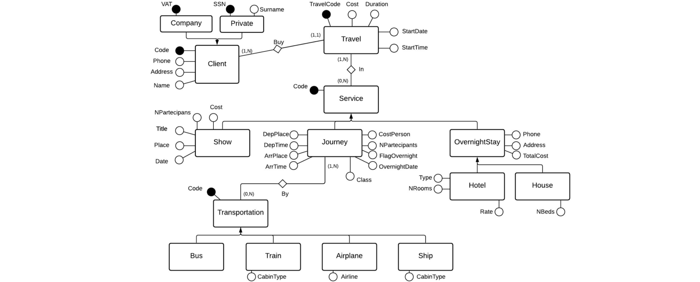
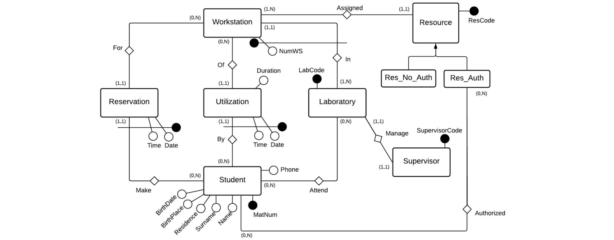

# 03 ER Exercises

### Exercise 1
Design an ER Model for a car rental system that manages the customers, the cars and their related
elements. If a customer wants to rent a car, they should provide their personal ID card (9-digit ID, name,
surname, birth date, address, release date, expiration date), driving license (10-digit drive license
number, name, surname, birthdate, release date, expiration date and the list of vehicles they are
allowed to drive, e.g. truck, car, motorcycle, bus, etc.) and credit card (16 digit number and expiration
date). Then, the list of cars is shown to the customer. Each car is described by its brand, the price per
day, the maximum speed, and the fuel consumption per km. Before proposing the car, the system
checks whether a car inspection has been performed in the last 3 months. Such data includes all the
inspections (described by date and the name of the company who took care of it), alongside the list of
all the operations the car underwent in each inspection. As soon as the customer picks the car they
want, the keys are provided to the customer and the system stores the rental invoice (described by
rental date, the period for which the car has been rented, and the final price). When the car is returned,
the customer is charged. As soon as the payment is completed, the system marks the rental invoice as
“closed” and the customer is provided with his invoice.

  
Solution

  

### Exercise 2
Design an ER Diagram for “Dungeons & Dragons RPG”. During the registration, a player is asked for
username, password, password confirmation, e-mail, e-mail confirmation and when the registration is
complete, they are assigned a unique 10-digits identifier To play the game, each player creates one or
more characters and explores the world, defeating monsters and acquiring items. Each character is
defined by a class (warrior, ranger, mage or cleric), experience points, name and strength score
(derived from the strength of the items equipped). When a monster is defeated, a random amount of
items and gold is provided to the player. Items can be of two types: generic items or weapons.
Weapons can be equipped to improve the strength score of the character, although warriors can wield
one or more (maximum 2) melee weapons, rangers can only wield one ranged weapon, mages and
clerics can only wield one magical weapon. Each item also has a name, a price, a rarity and a unique
identifier. monsters are defined by the amount of experience points they provide the player, their
difficulty score (ranging between 1 and 20), a gold score (amount of gold dropped when defeated), an
item score (amount of items dropped when defeated), a name and a unique identifier. Some monsters
can be boss monsters, yelding to more loot and experience points. A monster can be defeated by one
or more players. Players can add other players to their friend list.

  
Solution

  

### Exercise Extra 1
A small van rental company wants to automate rental management. Vans, characterized by a type
(usually a pair: model, brand of the manufacturer), a capacity (in terms of both seating and cubic meters
available in the rear compartment), a registration date and a license plate, are rented to customers,
characterized by name, address, company name (in the case of companies), a VAT number (mandatory
for companies) and a credit card number (mandatory for private individuals). Some affiliated customers
enjoy a special discount on rental rates. The rental data includes: start date and time, agreed end date
and time, total agreed rental cost, any additional insurance coverage, possible extension of the rental
agreement agreed with the customer during the rental itself, cost per week, day, and additional time (for
a maximum of three hours of delay on delivery); these last three data depend exclusively on the type of
van rented. The data relating to the rental are recorded at the time of booking; that is, they can refer to
rentals that will take place in the future, or to a rental in progress, or finally to a past rental; the data is
deleted two months after the end of the rental period. Furthermore, together with each customer, any
penalty received during a specific rental are recorded, indicating the place, amount and purpose;
various fines are obviously possible in relation to a specific rental. When designing the database, it
should be kept in mind that it must be possible to query the database to derive the list of vans available
at a certain date and their daily and weekly cost.

  
Solution

  

### Exercise Extra 2
A travel agency manages information about its customers and their travels. For each client it is known whether it is a
company (name and a VAT number) or a private individual; in any case, there are known address, various telephone
numbers and a customer identification, assigned by the agency. Each trip is associated with a customer (even if it
can be done by more than one person) and is characterized by an identification, a cost and an overall duration. The
cost also includes agency fees, in addition to the cost of the various services that make up each trip. These services
are:
- Routes, from a place and time of departure to a place and time of arrival, which can take place by train, bus,
plane or ship. Each journey has a number of participants, an individual cost and a class, supposedly identical
for all participants. For air travel, the airline is known. For night journeys by train or by boat, various berths
can be used (which can be single, double or triple).
- Overnight stays, which take place on consecutive nights from the beginning to the end of the trip. A total cost
is known for each overnight stay. If the overnight stay is in a hotel, the number and type (single, double, triple)
of rooms and the treatment are known (overnight stay, half board, full board), which is supposed to be the
same for all participants. In the case of overnight stays in homes, their total number of beds is known. In both
cases, the address and telephone number are known. Finally, some overnight stays take place during a
journey; in this case, their cost is zero as it is already covered by the cost of the journey.
- The shows, characterized by a title, a place, a date, an individual cost and a number of participants.

  
Solution

  

### Exercise Extra 3
A database relating to the management of workstation reservations in a university teaching laboratory
must be designed. Each student is characterized by his/her matriculation number, name, surname, date
and place of birth, residence, telephone number. Students attend some educational workshops. The
educational laboratories contain a set of jobs and a set of resources. Some resources are assigned to
each workstation (computing unit, printers, applications). Some of the resources are made available to
all students without controls, others are assigned to students who attend certain laboratories, subject to
authorization. A student can only use a workstation if he/she makes a reservation. You must keep track
of all the bookings and every time the student uses a workstation. Each laboratory has only one
manager, who can take care of only one laboratory.

  
Solution

  

