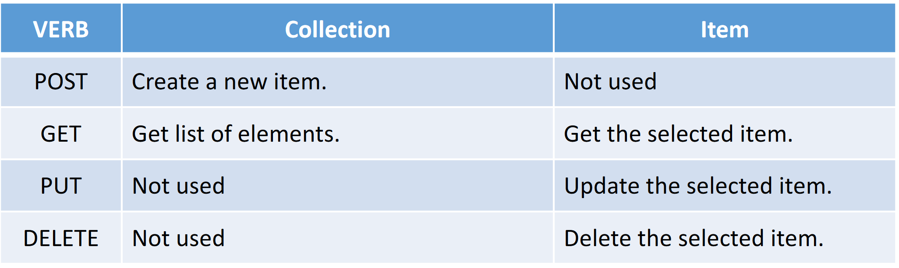
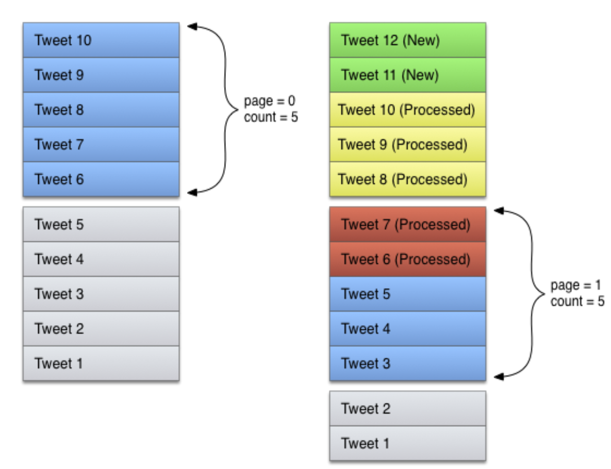

# 02 RESTful API

Is a standardized resource based way of designing API.

The RESTful API uses the available HTTP verbs to perform CRUD ("Create, Read, Update, Delete")
operations based on the “context”:
- **Collection**: A set of items (e.g.: /users)
- **Item**: A specific item in a collection (e.g.: /users/{id})

## Authentication
Almost all the APIs require a kind of user authentication. The user must
register to the developer of the provider to obtain the **keys** to access the API.

Most of the main API providers use the **OAuth protocol to authenticate a
user**.

The user registers to the developer portal to obtain a key and a secret.
Platform authenticates the user via key/secret pair and supply a token that
can be used to perform HTTP(S) requests to the desired API endpoint.

# Challanges
## Crawling
Problem: getting a lot of data points from an API.
AKA. When one call is not enough.

“An API Crawler is a software that methodically
interacts with a WebAPI to download data or to
take some actions at predefined time intervals.”

## Pagination
Most APIs support
data pagination to split huge chunks of data into smaller set
of data.

Smaller chunks of data are easier to create, transfer (avoid
long response time), cache and require less server
computation time.

## Timeline
Most of the Social
Networks leverage on the
concept of timelines
instead of standard
pagination to iterate
through results.

The problem is that
data are continuously
added to the top of the
Twitter timeline.
So the next request
request can lead to
retrieving the already
processed tweets.

The solution is to use the
**cursoring technique**.
Instead of reading from the
top of the timeline we read
the data relative to the
already processed ids.

## Parallelization
When possible make parallel requests to gather more data in less
time.

## Multiple accounts
Handling multiple accounts can increase the system
throughput but increases the complexity of the system.

Strategies to handle multiple accounts:
- **Request based**
	- **Round robin**
	- **Account pool**: The account through which the request is made is chosen
sequentially until it’s rate limit is reached, then we use the next
available one.
- **Account based**
	- **Requests stack**: This strategy overturn the roles. Now the accounts, in parallel, get
the next request to do from the pool. Once an account completes a
request the cycle restarts until the pool is empty.

## Fill Gaps
Sometimes the API does not give us all the data we want, so we need to fill those
gaps.