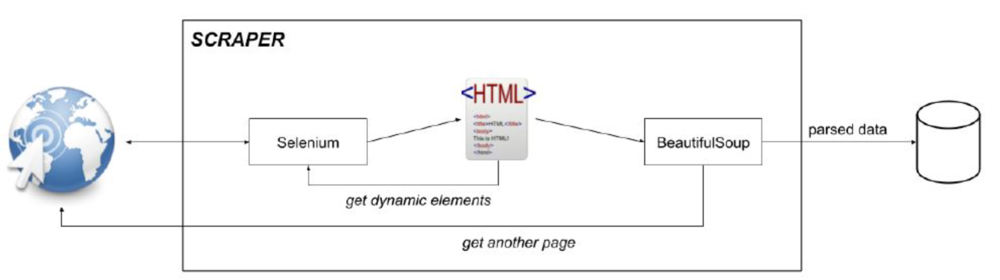

# 03 Scraping

Web crawling, data crawling, and web scraping are all names to define the process of data extrac-
tion. With the help of this technique, data is extracted from various website pages and repositories.
The data is then saved and stored for further use and analysis. Basically, what web scraping
does is that it **copies all the content from a web page and delivers raw data of your
choice in a specific structured format**.

## Advantages
1. Up-to-date data
2. No rate limitations to scraping
3. Customization and well-structured data
4. Anonymous

## Document Object Model (DOM)
“The W3C Document Object Model (DOM) is a platform and
language-neutral interface that allows programs and scripts to
dynamically access and update the content, structure, and style of a
document.”

In other words it is a standard for how to get, change, add, or delete
HTML elements.

When a web page is loaded, the browser creates a Document Object
Model of the page.

In particular, it defines
- The HTML elements as objects
- The properties of all HTML elements
- The methods to access all HTML elements
- The events for all HTML elements

## Protections
Some websites have some protections against scraping. They are
able to detect weird behaviours (e.g., repeated scrolling) and prevent
you from scraping.

## Static pages
We define static pages as HTML pages which does not change according to the user iteractions with the page (they do not have dynamic content).

The problem to solve is to correctly and efficiently process HTML
pages to extract valuable information. Since HTML code is tagged
text, any tool that allows to manipulate and process text could be
potentially used to parse a page.

Scraping is done in two steps:
- **Retrieving a static page**: many tools that support this action:
	- curl, using command line
    - requests, using Python scripts
- **Parsing the page**: extracting data that respects specific
patterns:
	- XPath
    - Regular Expressions
    
## Dynamic Pages
What we need to do if the page loads the content we need only after
clicking a specific field or while scrolling the page itself (e.g.:
Facebook and Instagram posts)?

We need to simulate a full blown browser that interacts with the page and arrives at the point we want doing some programmable actions. Then we can finally download the HTML and parse the content.

## Website updates
Most of the times, the HTML changes over time, especially the
classes and sometimes the structure of the HTML.
Therefore, it is really important to keep the scraper **updated**.

# Scraping in practice
Python is one of the best languages to build scrapers: it is easy to
learn, fast to code and it has plenty of libraries to get anything done
efficiently.

Two modules are needed to set up a scraper:
- **Selenium**: module developed for automating websites testing. It
simulates clicks, drags, scrolls and any other possible interaction
with a website. 
- **BeautifulSoup**: HTML (and XML) parser module

