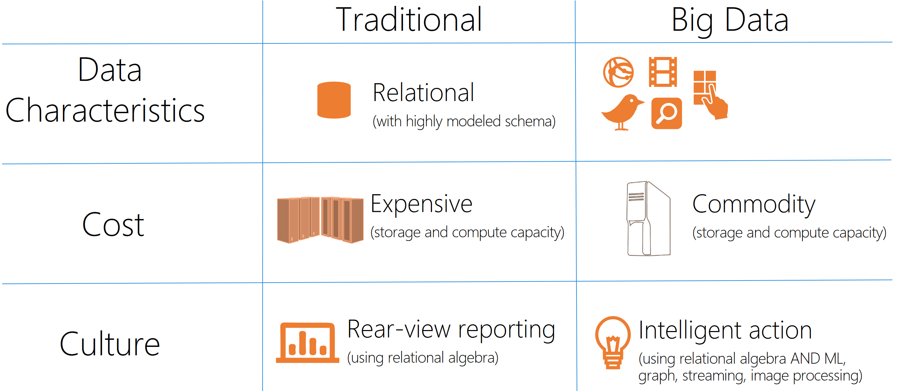
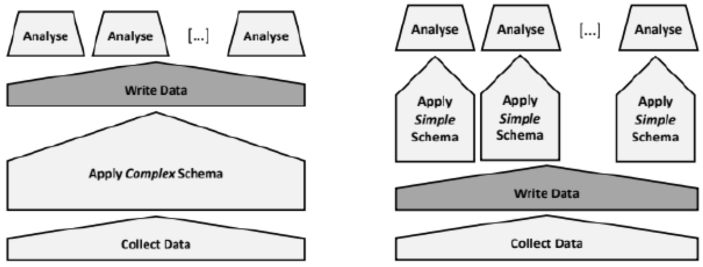

# 01 NoSQL General Concepts

## Differences with the traditional data model

## Schema Less Approach
This new types of data model require lot of flexibility,which is usually implemented by getting rid of the traditional fixed schema of the relational model, using
a so called ”schema-less” approach where data doesn’t need to strictly respect
a predefined structure in order to be stored in the database.

This way the definition of the schema is postponed from the moment in which
the data is written to the moment when the data is read. This approach is
called **Schema-On-Read** as opposed to the traditional **Schema-On-Write**. This
new philosophy has many advantages over the old one:
- Since we don’t have to check the correctness of the schema the database writes are much faster
- We have a smaller IO throughput since when reading data we can only fetch the properties we need for that particular task
- The same data can assume a different schema according to the needs of the analytical jobs that is reading it, optimizing performance.

## Data Lakes
The better define this new kind of data storage systems,the concept of Data
Lake was invented: **a reservoir of data, which is just a rough container, used to
support the needs of the company**.

A Data Lake has **incoming flows of both structured and unstructured** data and
outgoing flows consumed by the analytical jobs.
This way organizations have only one centralized data source for all its analytical
needs, as opposed to silos based approaches.

Building such a huge and centralized data storage system has many challenges:
it’s important to organize and **index** well all the incoming data, or we could end
up with a huge Data Swamp where it’s impossible for everyone to find what
they’re looking for.

And so usually in a Data Lake the incoming raw data gets **incrementally refined
and enriched** in order to improve accessibility, by adding metadata and indexing
tags and by performing quality checks.

## Scalability
Traditional data systems scale **vertically**, meaning
that when the machine doesn’t have enough ram or disk to store all the data it
just gets replaced with a more powerful and bigger one.

This approach only scales up to a certain point and after that it just isn’t
efficient anymore, so when dealing with Big Data we need to scale **horizontally**
instead, meaning that the computing system is composed of many commodity
machines and when there’s a need for more resources more machines are added
without replacing the old ones.

- **traditional SQL system scale vertically**: when the machines, where the SQL system
runs, no longer performs as required, the solution is to buy a better machine (with more
RAM, more cores and more disk)
- **Big data solutions scale horizontally**: when the machines, where the big data solution
runs, no longer performs as required, the solution is to add another machine.

## Data partitioning/sharding
**Sharding is the practice of optimizing database management systems by separating
the rows or columns of a larger database table into multiple smaller tables**. The new
tables are called “shards” (or partitions), and each new table either has the same schema but
unique rows (as is the case for “horizontal sharding”) or has a schema that is a proper subset of
the original table’s schema (as is the case for “vertical sharding”).

Sharding and partitioning are both about **breaking up a large data set into smaller
subsets**. The difference is that sharding implies the data is spread across multiple
computers while partitioning does not. Partitioning is about grouping subsets of data within
a single database instance

## Replication
**Data replication is the process of making multiple copies of data and storing them
at different locations to improve their overall accessibility across a network**. Similar
to data mirroring, data replication can be applied to both individual computers and servers. The
data replicas can be stored within the same system, on-site and off-site hosts, and cloud-based hosts.

Although data replication can be demanding in terms of cost, computational, and storage re-
quirements, businesses widely use this database management technique to achieve one or more of
the following goals:
- **Improve the availability of data**: once a node in the distributed system is down, data
can still be access from another working node
- **Enhance server performance**: data replication reduces the load on the primary server
by dispersing it among other nodes in the distributed system, thereby improving network
performance
- **Accomplish disaster recovery**: Data replication facilitates the recovery of data which
is lost or corrupted by maintaining accurate backups at well-monitored locations, thereby
contributing to enhanced data protection.

## Data pipeline
Set of steps in a process that from a very raw and diverse and heterogeneous
format tries to make things a little more accessible and usable in the future:
1. First you just ingest data and build a catalog.
2. In the second step, where the data is still raw, at least you add some metadata (e.g., who is
the owner, what is describing etc.)
3. Then, you run some kind of quality check and validation. The data you get could be noisy,
messy or dirty, so you need some quality check. Towards big data, data becomes bigger but
also messy. The probability of having noise is increasing.
4. Now we have the problem of enrichment of the data. Because the data we get may be very
narrow or granular, and so we need to empower it with integration with other data.
5. In the end, when someone wants to read some output, we will build a data extractor, analyser
and visualizer to show data.

### Ingestion
The process of importing,
transferring and loading data for
storage and later use

It involves loading data from a
variety of sources. It can involve altering and
modification of individual files to fit
into a format that optimizes the
storage

### Data Wrangling
The process of cleansing "raw" data
and transforming it into data that
can be analysed to generate valid
actionable insights.

It includes understanding, cleansing,
augmenting and shaping data.
The results is data in the best format
(e.g., columnar) for the analysis to
perform.

### Extract Transform Load
The process that extracts data
from heterogeneous data
sources, transforms it in the
schema that better fits the
analysis to perform and loads
it in the system that will
perform the analysis.