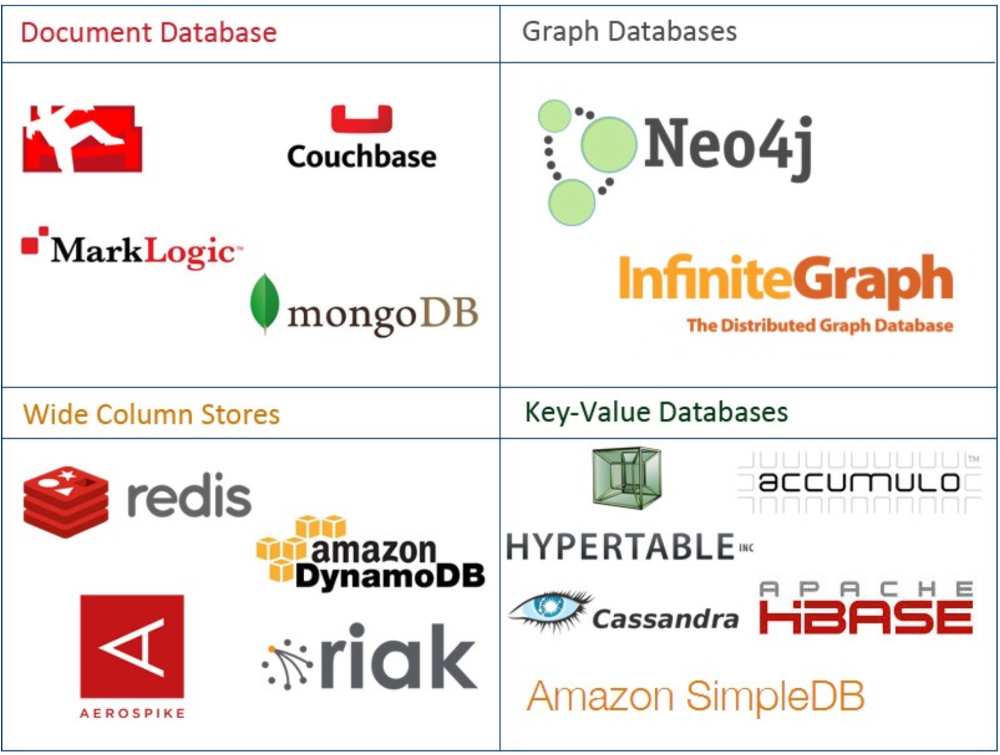

# 04 A map of NoSQL technologies

## Key-Value Store
A key that refers to a payload (actual content / data). E.g. MemcacheDB, Azure Table Storage, Redis

Key-value databases work by storing **dictionaries or hash tables**, which are a collection of
key-value pairs in which a key serves as a unique identifier to retrieve an associated value. Values
can be anything from simple objects, like integers or strings, to more complex objects, like JSON
structures. A key-value database treats any data held within it as an opaque blob; it’s up to the
application to understand how it’s structured.

Key-value databases are often described as **highly performant, efficient, and scalable**. Com-
mon use cases for key-value databases are **caching, message queuing, and session
management**.

## Column Store
Columnar databases are database systems that **store data in columns**. The goal of a columnar
database is to **efficiently write and read data to and from hard disk storage in order
to speed up the time it takes to return a query**.

This design allows queries to only read the columns they need, rather than having to read
every row in a table and discard unneeded data after it’s been stored in memory. 
Varius storage optimizations are possible since the data stored in this way can be **highly compresses**.

In terms of performance, there’s a breakeven point in which relational databases
are convenient vs columnar databases since traditional queries always read all the
rows. If columnar databases are required to read too much data, after a certain point, they are
then outperformed by relational databases (whose read performance is constant).

Columnar databases have become widely used **for data analytics** since the columnar data model
lends itself well to **fast query processing**. They’re also seen as advantageous in cases where an
application needs to frequently perform aggregate functions. More in general, columnar
databases excel at:
- **Queries that involve only a few columns**
- **Aggregation queries against vast amount of data**
- **Column-wise compression**

## Document / XML / Object Store
Document-oriented databases are NoSQL databases that store data in the form of
documents. Document stores are a type of key-value store: each document has a unique
identifier and the document itself serves as the value.

The main difference between these two models is that, in a key-value database, the data is treated
as opaque and the database doesn’t know or care about the data held within it; it’s up to the
application to understand what data is stored. In a document store, however, each docu-
ment contains some kind of metadata that provides a degree of structure to the data which can be queried.

Document stores are considered
**highly scalable, with sharding being a common horizontal scaling strategy**. They are
also excellent for keeping large amounts of unrelated, complex information that varies
in structure.

Key features document stores:
- **Flexible schema**: structure of individual documents does not have to be consistent; easier
to integrate new information
- **Better read performance**: information is contained in a single location (a document), no
relations needed to access nested data

## Graph Store
Nodes are stored independently, and the relationship between
nodes (edges) are stored with data. E.g. Neo4j

Graph databases can be thought of as a subcategory of the document store model, in
that they store data in documents and don’t insist that data adhere to a predefined
schema. The difference though is that graph databases add an extra layer to the document model
by highlighting the relationships between individual documents.

These databases are commonly used in cases where
it’s crucial to be able to gain insights from the relationships between data points as in a social network.

The main advantages of graph databases are on:
- **Performance**: in contrast to relational databases, where join-intensive query performance
deteriorates as the dataset gets bigger, with a graph database performance tends to remain
relatively constant, even as the dataset grows.
- **Flexibility**: As developers and architects, we want to connect data as the domain dictates,
thereby allowing structure and schema to emerge in tandem with our growing understanding
of the problem space, rather than being imposed upfront. 
- **Agility**: schema-free nature of graph data mode