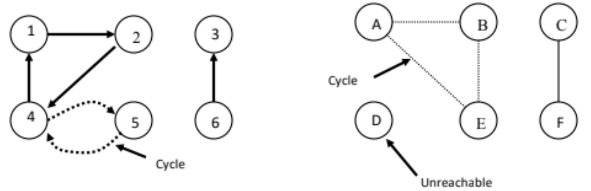

# 01 Graph Theory

# Basic definitions
The Graph is a data structure that was first used in 1736 to represent a city and
its water canals and have been used ever since for a huge number of optimizations
of problems that can be modeled has a set of entities connected by a relation
of some kind.

From a mathematical point of view, a graph is an ordered triple G: (V,E,f) where:
- V is a set f nodes/vertex.
- E is a set of arcs/edges.
- f is a function that maps every edge of E to an unordered pair of nodes of
V

In particular:
- A **vertex** is the basic element of a graph
- An **edge** is a set of two vertex
- A **path** is a sequence of consecutives vertex,and a node A is reachable from
another one B if exists a path that goes from A to B.

## Graph properties

- If a path starts from a node and returns to the same node its called a **cycle**, a
graph is called **acyclic** if there it doesn’t have any cycle, **cyclic** otherwise.
- A graph is **connected** if every node is reachable from any other node and is
**strongly connected** if every node it’s directly connected to every other one.
- If a graph as n nodes then in can have up to v = n(n-1) edges, if v ≈ n(n-1)
then the graph is called **dense**, otherwise it’s called **sparse**.
- If the edges can have a direction,meaning that given the two nodes A and B
(A,B) != (B,A) can be true, then the graph is called **directed**.
- A graph is **simple** if it has no multiple edges or self-loops.
- A graph is weighted if each edge has an associated weight, usually
given by a weight function w: E -> R.
- **Complete Graph**: Every pair of vertices are adjacent and has n(n-1) edges where there are n nodes
- **Planar Graph**: Can be drawn on a plane such that no two edges intersect. 
- **Tree**: Connected Acyclic Graph where Two nodes have exactly one path between
them
- **Subgraph and Supergraph**: Vertex and edge sets are subsets of those of G a supergraph of a graph G is a graph that contains G as a subgraph.

## Possible representations
- **Incidence Matrix**: E x V
- **Adjacency Matrix**: V x V, Boolean values (adjacent or not)
- **Edge List**: pairs (ordered if directed) of vertices
- **Adjacency List**