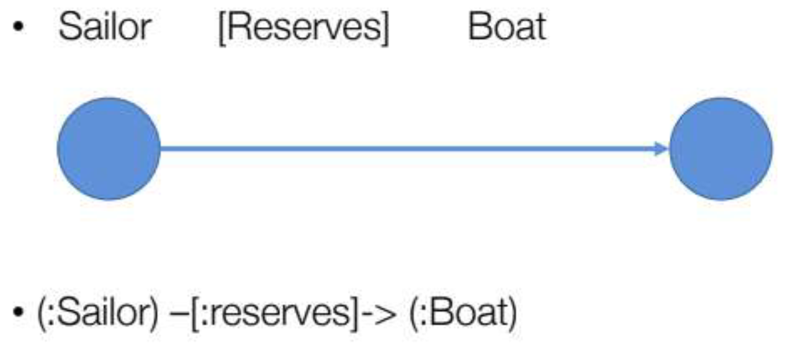

# 02 Graph Databases

# Motivations
The table based structure of relational databases makes it hard to represent
relationships between rows in the same table,and moreover whenever someone
needs to find a relationship between records of different tables the db has to
perform a **JOIN operation, which is usually very expensive**.

So for the use cases in which relationships are the most important feature of our
data (e.g. social network friendships) it would be best to go with a technology
who can implement relationships in a native and efficient way,and that’s where
graph dbs come in.

# Definition
"Database that uses graph structures with nodes, edges and
properties to store data"

Graphs provides **index-free adjacency**: every node is a pointer to its adjacent element. Edges hold most of the important information.

In these kind of storage systems data are represented as entities connected by
information rich relations,just like in a real graph.

# Query model
The typical query based approach for managing data in relational databases isn’t
a good fit for graph dbs,in these cases it’s preferred a different approach called
**Graph Matching**, or more in general **Pattern Matching**. In these technique the
user specifies a particular shape or structure he wants to find in the graph, and
the system searches for and returns all the subgraphs that match that request.