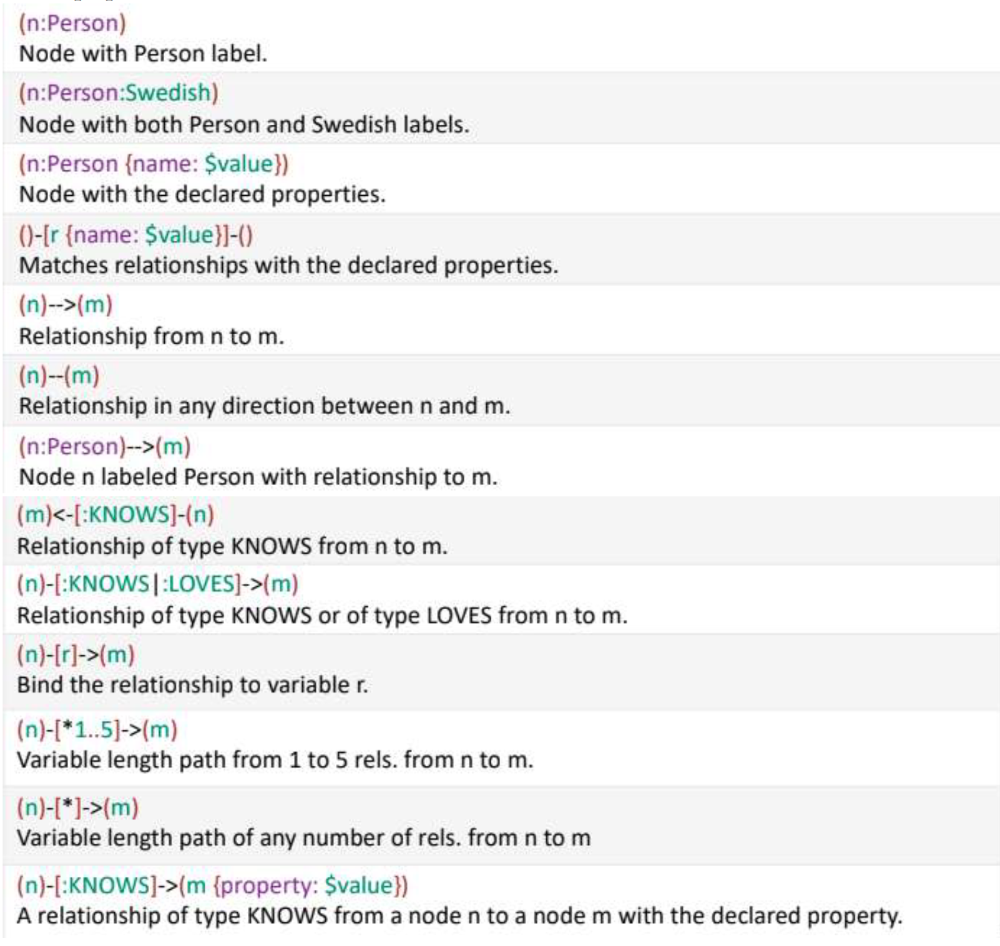
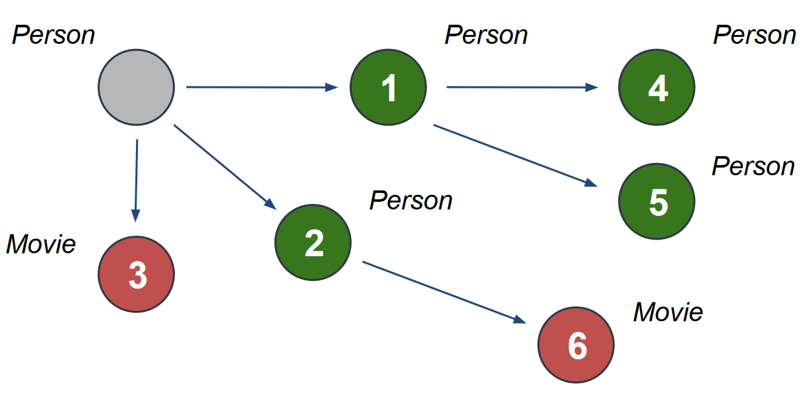
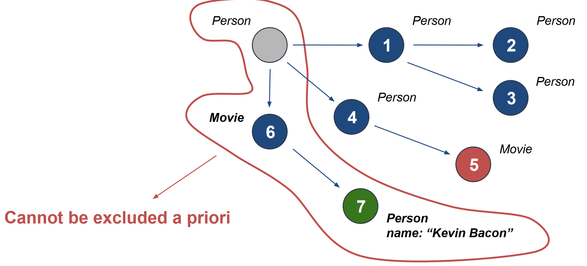
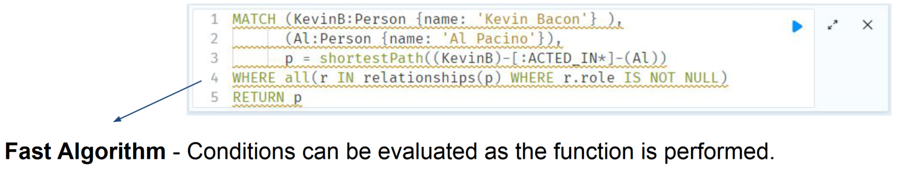
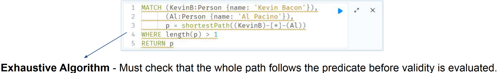

# 03 Neo4J

The most popular graph database is Neo4J, implemented in Java by Neo Technologies, and it has the following characteristics:
- Open Source
- Operational db
- ACID guarantees
- Not efficient for large scale graph analysis
- Nodes and edges are a native feature
- Each node has an identifier tag and can have many properties
- Node can have types, called labels
- Schemaless (nodes with new types can be created an any time)
- traditional CA architecture

## Cypher
Queries are expressed with a custom made declarative language called Cypher.
With Cypher is easy to express queries based on relationships (who are the main
focus in a graph db),and it’s much more efficient than SQL in doing operations
equivalent to the JOINs in relational databases

### Basic commands
- Create a node of type Crew and label Neo,with attribute name of value ’Neo’:
  ```
  CREATE (Neo:Crew {name:'Neo'})
  ```
- Create Node with multiple labels:
  ```
  CREATE (n:Actor:Director {name:’Clint Eastwood’})
  ```
- Add an edge of type ”Knows” from the node Neo to the node Morpheus
  ```
  (Neo) - [:KNOWS] -> (Morpheus)
  ```
- Create and index on a Node attribute (used as a starting point for a query)
  ```
  CREATE INDEX ON : Customer(customerID)
  ```
- Create a constraint enforcing uniqueness of attribute customerID on nodes with
type customer:
  ```
  CREATE CONSTRAINT ON (c:Customer)
  ASSERT c.customerID IS UNIQUE;
  ```
- Import Data from CSV file:
  ```
  LOAD CSV WITH HEADERS FROM "file:customers.csv" AS row
  CREATE (:Customer {companyName: row.CompanyName,
  customerID: row.CustomerID, phone: row.Phone});
  ```
- Merge operator,creates new nodes only if it doesn’t exist another node with the
same label:

  ```
  LOAD CSV WITH HEADERS FROM "file:///transfers.csv" AS Row
  MERGE (player:Player {id:row.playerUri})
  ON CREATE SET player.name = row.name,
  player.position = row.playerPosition
  ```
- The `DELETE` clause allows the removal of nodes and relationships.
- `DETACH` removes all the relationships before removing the nodes.
- `PROFILE` provides the complete set of operations provided to perform the query.
- `ORDER BY` - Sort the result of the query.
- `LIMIT` - Limit the amount of results provided by the query.
- Using `WITH`, you can manipulate the output before it is passed on to the following query parts. it is
usually combined with other clauses, like

### Queries
Cypher’s query system,which is  based on pattern matching and has the following structure:
```
START
MATCH Pattern Matching
WHERE Expressions, Predicates
RETURN Output
```

This is a more general query structure with additional features such as aggre-
gations,skip and limit:
```
MATCH (user)-[:FRIEND]-(friend)
WITH user, count(friend) AS friends
ORDER BY friends DESC
SKIP 1 LIMIT 3
RETURN user
```

[](../../../images/e1fb2a23d1_hIYpS8tc7j10NN9K-image-1640527458274.png)

#### Shortest Path
Depending on the predicates to be evaluated, Neo4j plans the shortest path in different ways.

By default, Neo4j uses a **Fast Bidirectional Breadth-first Search Algorithm** if the conditions can be
evaluated whilst searching for the path.
[](../../../images/96c21ef407_7RNGaFNN8QCkqbOr-image-1640527831569.png)

If the predicates need to inspect the whole path before deciding on whether it is valid or not, Neo4j may
have to resort to using a Slower **Exhaustive Depth-first Search Algorithm** to find the path.

When the Exhaustive Search is planned, it is still only executed when the Fast Algorithm fails to find
any matching paths.
[](../../../images/1a431ec2c3_vl5SSR5dfOgGQQ4E-image-1640527855610.png)

##### Examples
[](../../../images/5e9110ec76_QRLlujipQymlTM8I-image-1640527982895.png)
[](../../../images/03f18f594b_CPFtbdBS5DeLIye6-image-1640528026146.png)
[](../../../images/8aa6025fad_z6aJwl6as6uBu4LO-image-1640528043916.png)