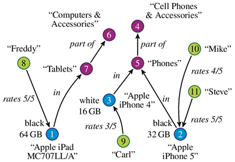

# Exam Questions

## 2021 06 22 Q1 (8 points)
A dedicated online review and social networking system tracks the activities of customers of hotels, including their stays, their searches and their online interactions, friendships, and activities. Hotels are described by their services, rooms, owner, and employees. Customers can write reviews about each of these aspects. Suppose you want to create a graph database for this.
1) 	Motivate if and how a graph DB could help the organization (2)

<details>
  <summary>Solution 1</summary>
  
Entities in a social network database are highly connected. A graph database brings a native support for relations without needing expensive joins. For this reason it would provide high performance a ease of implementation.
</details>

2) 	Represent a sketch of the data model that can be used. Show it by sketching a model including examples of all the relevant concepts and relations. (2)
3)   Write a command that adds a new review to the database, and connects it  to the respective hotel and author. (2)
<details>
  <summary>Solution 3</summary>
  
```cypher
MATCH
  (c:Person),
  (h:Hotel)
WHERE id(c) = 0 AND id(h) = 10
CREATE (c)-[r:REVIEW {stars: 3, coment: "Lorem Ipsum dolor sit amet"}]->(h)
RETURN type(r)
```
</details>

4)   Write a Cypher query that extracts the reviews of hotels whose owner is the same as the author of the review. (2)

<details>
  <summary>Solution 4</summary>
  
```cypher
MATCH (owner:Person)-[:OWNS]->(hotel:Hotel)&lt;-[review:REVIEW]-(reviewer:Person)
WHERE id(owner) = id(reviewer)
RETURN review
```
</details>


## 2021 02 04 Q2 (6 points)
A maintenance and service management company supports public administrations in the management of public properties (parks, streets, and so on). The company needs to record the notification of maintenance needs and how they are addressed. Citizens can submit issues in the system which can be of different types (urgent maintenance, cleaning services, damage repair), and are described by a title, city, address, and description, possibly including photos.
City administrators can review the notifications and approve them. Approved ones need to be addressed, therefore the company assigns a maintenance team to the issue and assigns a schedule for the operations. The team may be composed of employees, including a team leader plus one or more team members, plus a set of vehicles and of devices (cleaning machines, lawn mowers, and so on). At the end, a report on the work done is filed into the system.  Information about the employees, vehicles and devices is stored in the system.

1) 	How would you structure the graph? Show it by drawing a model including examples of all the relevant concepts and relations. Remember to add types/labels to every item, together with important attributes (2)
2) 	Write a graph query using Cypher that finds employees that have worked both in tasks, that are either of type cleaning or repair. (more precisely, in at least one task of type cleaning and at least one of type repair) (1.5)
<details>
  <summary>Solution 2</summary>

```cypher
MATCH (employee:Employee)-[:WORKED]->(:Task{type: "cleaning"})
WHERE exists((employee)-[:WORKED]->(:Task{type: "repair"})
RETURN DISTINCT employee
```
</details>

3) 	Write a graph query using Cypher that finds employees that worked for tasks in more than 10 different cities (1.5)
<details>
  <summary>Solution 3</summary>

  ?????????????????????????????????????????????
```cypher
MATCH (employee:Employee)-[:WORKED]->(task:Task)
WITH DISTINCT employee, collect(task.city) AS cities
WITH DISTINCT employee, count(DISTINCT cities) as citiesNum
WHERE citiesNum > 10
RETURN DISTINCT employee
```
</details>

4) 	Write a command that adds a new issue and connects it to an existing citizen. (1)
<details>
  <summary>Solution 4</summary>

```cypher
MATCH (employee:Employee)-[:WORKED]->(:Task{type: "cleaning"})
WHERE exists((employee)-[:WORKED]->(:Task{type: "repair"})
RETURN DISTINCT employee
```
</details>


## 2021 01 15 Q2 (5 points)
Consider the following excerpt of a graph model, possibly implemented in Neo4J, describing reviews of products written by users. Colours of nodes represent node labels as follows: 
- Green = User (with attribute: UserName)
- Blue = Product (with attributes: Model, Color, Memory)
- Purple = Category (with attribute: CategoryName)

A product is “in” a category; and a category may be “part of” a supercategory, with maximum 3 levels of categorization. Users review products assigning a rate.

[](../../../images/bb08ac32e9_2IetbuSMDBidH2sT-image-1641158607898.png)

Write the following queries:
1. Find the top category of products with more than 32GB of RAM.
<details>
  <summary>Solution 1</summary>

```cypher
MATCH (product:Product)-[:IN]->(category:Category)
WHERE product.Memory > 32
WITH category, COUNT(product) AS num
ORDER BY num DESC
LIMIT 1
RETURN category
```
</details>

2. Find the list of lowest-level categories of products reviewed by users that always rate products only with rate  equal to 5.
<details>
  <summary>Solution 2</summary>

```cypher
  MATCH (user:User)-[:RATES{rating: 5}]->(product:Product)-[:IN]->(category:Category)
  WHERE NOT (category)-[:PART_OF]->(:Category)
  AND NOT EXISTS {
    MATCH (user)-[ratings:RATES]->(:Product)
    WHERE ratings.Rating &lt; 5
  }
  RETURN DISTINCT category
```
</details>