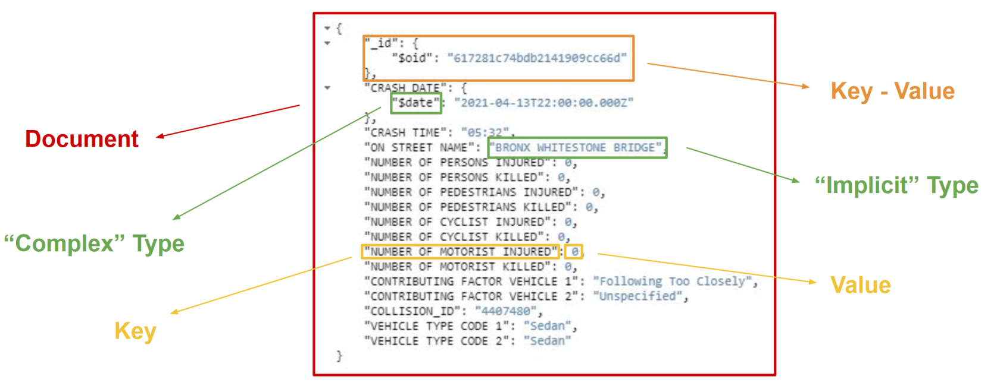
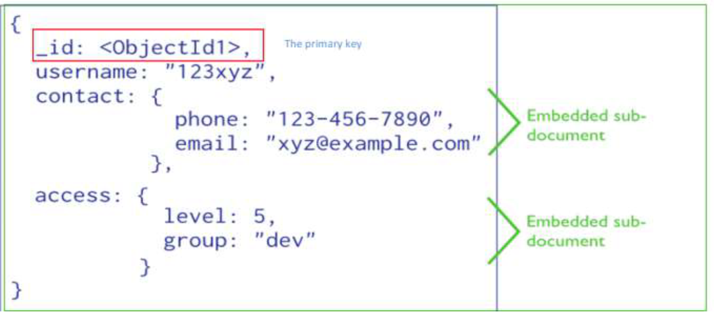
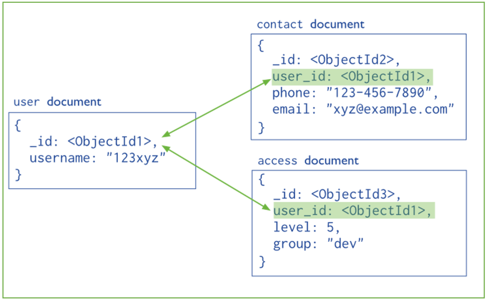
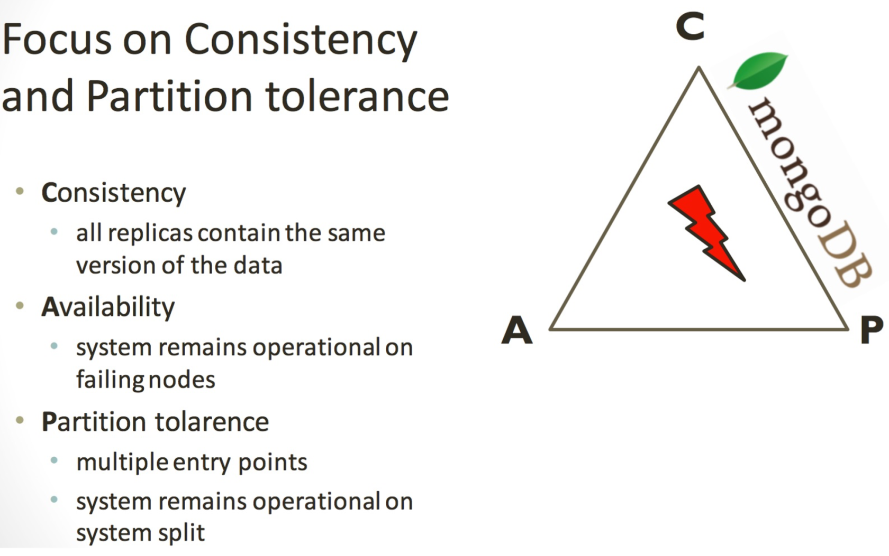

# 02 MongoDB

MongoDB is a document-oriented database that stores data within:
- **Documents**: consist of key-value pairs which are the basic unit of data in MongoDB.
- **Collections** contain sets of documents. Databases are made by one or more collections.

Some of the main feature:
- An **open source** and document-oriented database.
- Data is stored in **JSON-like documents**.
- Designed with both scalability and developer agility.
- **Dynamic schemas**: Document don’t need to have a schema defined beforehand. Fields can be created on the fly.
- **Automatic data sharding**

# Data model

Its data model is based on **documents structured just like a JSON file**, many
documents form a collection. Every document must have ad **unique id** and **can
have nested documents** inside him.

These data model is convenient for many applications (especially web based
ones) since unlike relational databases you don’t have to reconstruct business objects from the normalized tables with expensive joins.

This approach gives you the possibility of structuring your data using the granurality which fits best your application needs.

It’s however **possible to extablish references between documents**, but it doesn’t
make much sense to overuse this feature since that would be just like recreating a relational database.

## BSON Format
BSON is a **binary-encoded serialization of JSON-like documents** which is optimized for space and speed.

BSON types are a superset of JSON types (JSON does not have a date or a
byte array type, for example), with one exception of not having a universal
"number" type as JSON does.

- **Simple Type**: Double, String, Undefined, Boolean, Null, Int32, Int64, Decimal128
- **Set Type**: Array
- **Complex Type**: Object, Binary Data, ObjectId, Date, Regular Expression, Timestamp

### ObjectId
ObjectId is the type associated with the predefined field created by MongoDB to uniquely identify the
documents within a collection, like a primary key. Such field is named _id.

The 12-byte ObjectId value consists of three different elements:
- A **4-byte timestamp** value, representing the value creation, measured in seconds since the Unix epoch.
- A **5-byte random value** generated once per process. This random value is unique to the machine and process.
- A **3-byte incrementing counter**, initialized to a random value.

# Indexes
Indexes are **data structures** ($B^+$ tree) that store a small portion of the collection's data set in an easy to traverse
form, ordered by the value of the field. Indexes **support the efficient execution of queries** in MongoDB.

An index is automatically created on the \_id field and users can create addition indexes on other signle or compound fields. Like SQL order of the fields in a compound index matters and if you index a field that holds an array value, MongoDB creates
separate index entries for every element of the array.

### Sparse property
Sparse property of an index ensures that the index only contain
entries for documents that have the indexed field. (so ignore
records that do not have the field defined).

If an index is both unique and sparse – then the system will
reject records that have a duplicate key value but allow records
that do not have the indexed field defined.

# Sharding
User defines shard key for partitionin which defines a range of data.

Initially there is only one chunk, then MongoDB utomatically splits & migrates chunks when max
reached.

There are multiple sharding strategies:
- **Ranged**: Splits shards based on sub-range of a key (or also multiple keys combined).
- **Hashed**: A subset of Range Sharding. MongoDB apples a MD5 hash on the key when a hash shard key is used. Ensures data is distributed randomly within the range of MD5 values.
- **Tag-aware**: Allows subset of shards to be tagged, and assigned to a sub-range of the shard-key. E.g. Sharding User Data according the user region.

| **Need** | **Strategy** |
|--|:----:|
| Scale | Range or Hash |
| Geo-Locality | Tag-aware |
| Hardware optimization | Tag-aware |
| Lower recovery times | Range or Hash |

# Mongod and Mongos
- **Mongod**: main daemon
- **Mongos**: Process that
	- Acts as a router / balancer between shards
    - Has ho local data (persists to config database)
    - Can have one or many
    
# CAP Theorem and Mongo
