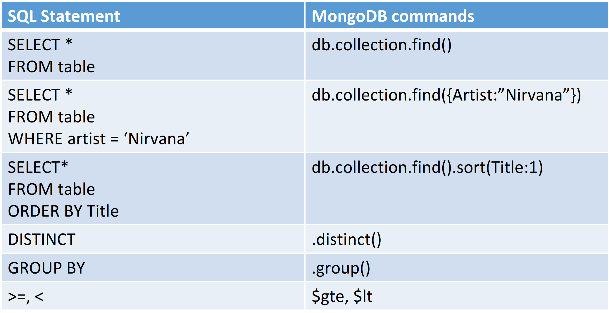
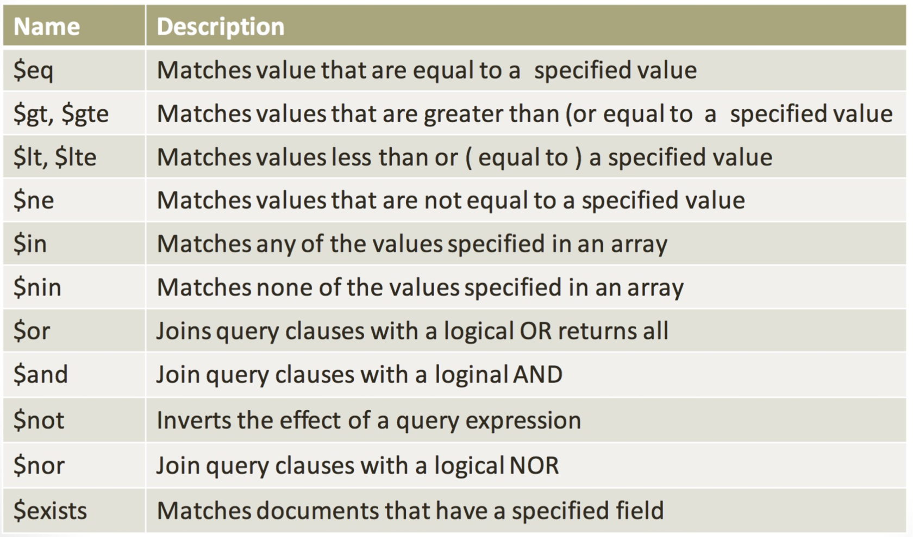

# 03 MongoDB Queries

# Create
Create a database: **use database_name**
Create a collection: **db.createCollection(name, options)**

MongoDB provides two methods to create new documents.
- **db.collection.insertOne(document)** inserts one document in the selected collection.
- **db.collection.insertMany([document1, ...])** inserts a group of documents in the selected collection.

# Read
- **db.collection.findOne(query, projection)**
- **db.collection.find(query, projection)**

| Parameter | Type | Description |
| :-- | :--: | :-- |
| query | document | Optional. Specifies selection filter using query operators). |
| projection | document | Optional. Specifies the fields to return in the documents that match the query filter. |

[](../../../images/bb114c4e34_oZplXIanLlceUuuI-image-1640699776875.png)
[](../../../images/1dc059287a_1rAUEI1x0l2BKeTY-image-1640699791733.png)

# Update
- **db.collection.updateOne(filter, update)** update one document in the selected collection.
- **db.collection.updateMany(filter, update)** update a group of documents in the selected collection.

# Delete
- **db.dropDatabase()** delete database.
- **db.collection.drop()** delete a collection.
- **db.collection.deleteOne(filter)** delete one document in the selected collection.
- **db.collection.deleteMany(filter)** delete a group of documents in the selected collection.

# Sort & limit
The **limit()** function will limit the amount of documents retrieved by a query.

The **sort()** function organizes the retrieved documents depending on the key-value arguments it
receives.
Documents can be sorted in an **ascending (value = 1)** or **descending (value = -1)** order.

# Aggregations
Aggregations are operations that are used to aggregate with respect to one or more fields. MongoDB provides SQL-like aggregation functionality.

Aggregations are **pipelines**, therefore the operations included in the query are performed sequentially.

Rather than the usual db.collection.find() operations, aggregations requires the usage of the
**db.collection.aggregate(pipeline)** function.

Such function includes two different parts, a filter one (i.e., the conditions w.r.t. the documents are
collected) and the aggregation one (i.e., the part that manages the aggregate operations).

The aggregation function supported are various, the main ones are
- **$min** returns the lowest expression value for each group
- **$max** returns the highest expression value for each group
- **$avg** returns an average of numerical values. Ignores non-numeric values.
- **$sum** returns a sum of numerical values. Ignores non-numeric values.

An example with the following documents:

```
{ _id: 1, cust_id: "abc1", ord_date: ISODate("2012-11-02T17:04:11.102Z"), status: "A", amount: 50 }
{ _id: 2, cust_id: "xyz1", ord_date: ISODate("2013-10-01T17:04:11.102Z"), status: "A", amount: 100 }
{ _id: 3, cust_id: "xyz1", ord_date: ISODate("2013-10-12T17:04:11.102Z"), status: "D", amount: 25 }
{ _id: 4, cust_id: "xyz1", ord_date: ISODate("2013-10-11T17:04:11.102Z"), status: "D", amount: 125 }
{ _id: 5, cust_id: "abc1", ord_date: ISODate("2013-11-12T17:04:11.102Z"), status: "A", amount: 25 }
```

Group by and Calculate a Sum:
```javascript
db.orders.aggregate([
    { $match: { status: "A" } },
    { $group: { _id: "$cust_id", total: { $sum: "$amount" } } },
    { $sort: { total: -1 } }
])
```