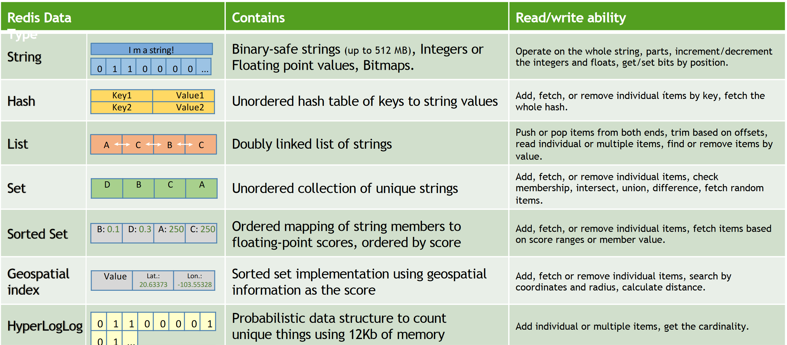
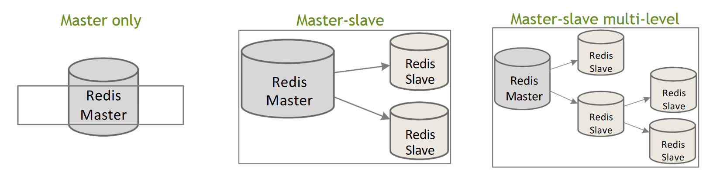
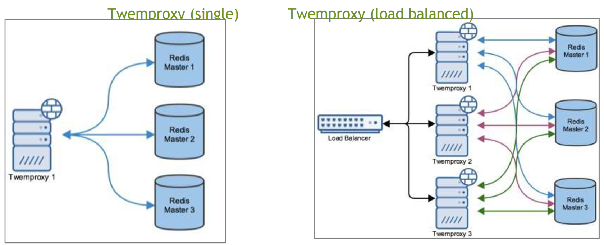
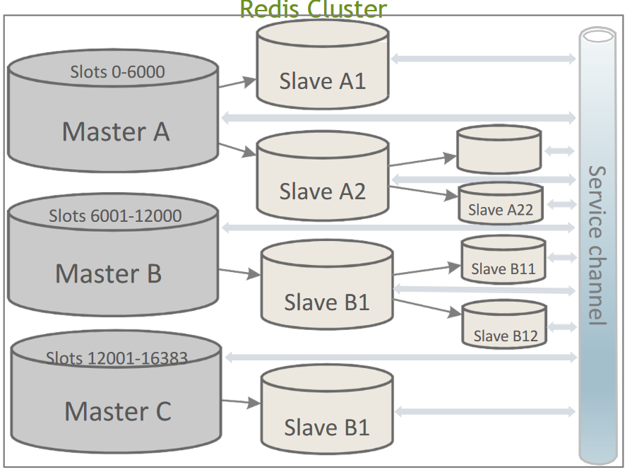
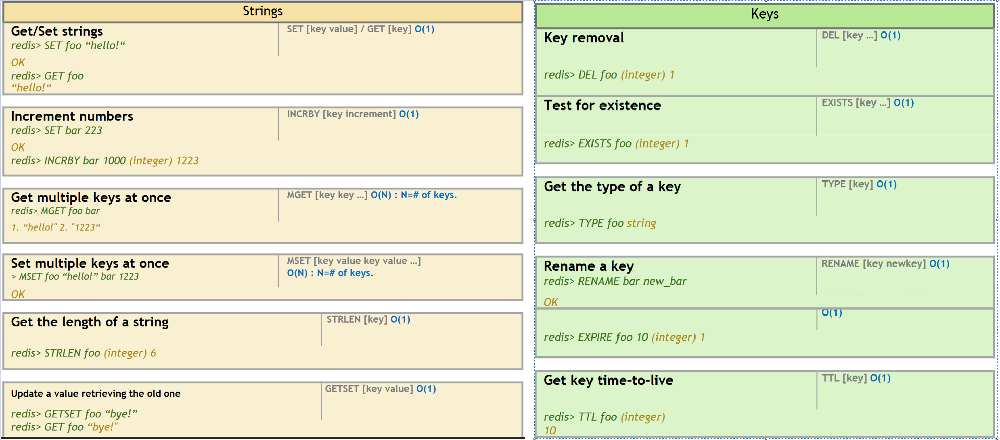
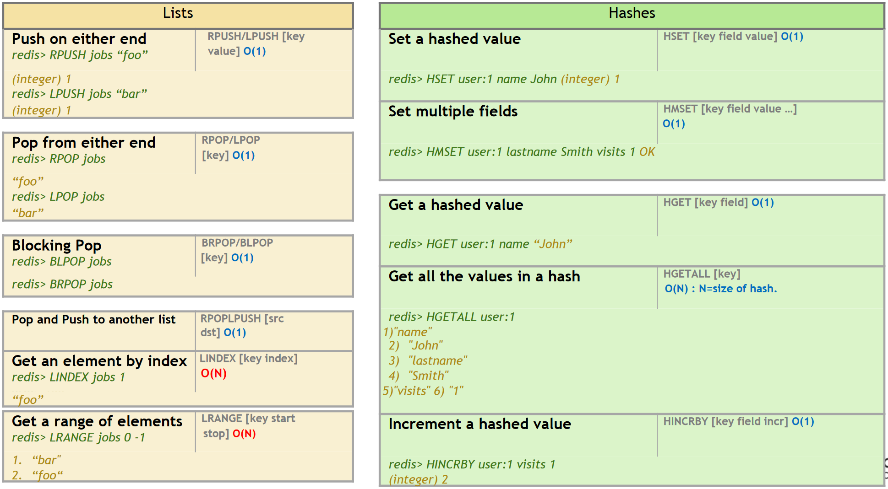
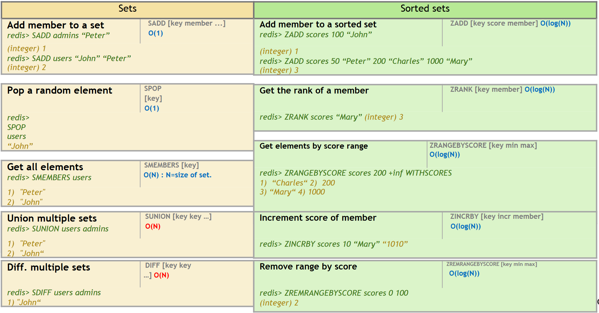

# 02 Redis

Redis is an advanced key-value store, where keys can contain data structures such
as strings, hashes, lists, sets, and sorted sets. Supporting a set of atomic
operations on these data types.

Redis is not a replacement for Relational Databases nor Document Stores. It might be used complementary to a SQL relational store, and/or NoSQL
document store.

It’s performance and ease of use were made possible
by simplifying its architecture as much as possible:
- Written in C
- Single Threaded
- Atomic operations only
- No official support for Windows
- Executes most commands with costant O(1) complexity
- Based on 2 fundamentals commands: SET(k,v) ,which sets the value v to the key, v and GET(k), which returns the value associated to the key k
- In Memory in DB

These characteristics make Redis very **fast on reads**, but **not very efficient for
general purpose long term storage** system (since being in-memory means that a
single shutdown will cost you all your data).

Redis is the best technology for the use cases where:
- Speed is critical
- You need fast access to complex data structures
- Dataset can fit in memory
- Data is not critical

## Data types

## Redis topologies
### Standalone
- The master data is optionally replicated to slaves.
- The slaves provides data redundancy, reads offloading and save-to-disk offloading.
- Clients can connect to the Master for read/write operations or to the Slaves for read operations.
- Slaves can also replicate to its own slaves.
- There is no automatic failover.

### Sentinel
Redis Sentinel provides a reliable automatic failover in a master/slave topology,
automatically promoting a slave to master if the existing master fails. Sentinel does not distribute data across nodes.

### Twemproxy
Twemproxy (from Twitter, not part of Redis) works as a **proxy** between the clients and many Redis instances. It is able to automatically **distribute data** among different standalone Redis instances and **supports consistent hashing** with different strategies and hashing functions. However **Multi-key commands and transactions are not supported**.

### Cluster
Redis Cluster distributes data across different Redis instances and perform automatic
failover if any problem happens to any master instance.
- All nodes are directly connected with a service channel.
- The keyspace is divided into hash slots. Different nodes will hold a subset of hash slots.
- Multi-key commands are only allowed for keys in the same hash slot.

## Scaling Redis
- **Persistence**: while all main operations are done in main memory, Redis
provides a couple of features to implement disk persistence. The first one
allows you to take a snapshot of the db and save it to a file (RDB), while
the second one works by keeping track of changes in append only log file
(AOF)
- A Redis instance known as the **master**, ensures that one or more instances
kwown as the **slaves**, become exact copies of the master. Clients can
connect to the master or to the slaves. **Slaves are read only** by default.
- **Partitioning**: Breaking up data and distributing it across different hosts in
a cluster ;can be implemented in different layers:
	- *Client*: Partitioning on client-side code.
	- *Proxy*: An extra layer that proxies all redis queries and performs parti-
tioning
	- *Query Router*: instances will make sure to forward the query to the right
node. (i.e Redis Cluster).
- **Failover**: it can be either Manual, Automatic with Redis Sentinel (for
master-slave topology) or Automatic with Redis Cluster (for cluster topol-
ogy)

## Commands
Other than the basic GET and SET commands there are a few other utility
functions, but they only build upon the 2 original ones. There are commands to
delete and check existence of a key and get the type of a value, for example.

Another important feature is the ability to set an expiration time to a key ,after
which the key it’s deleted from the db.

