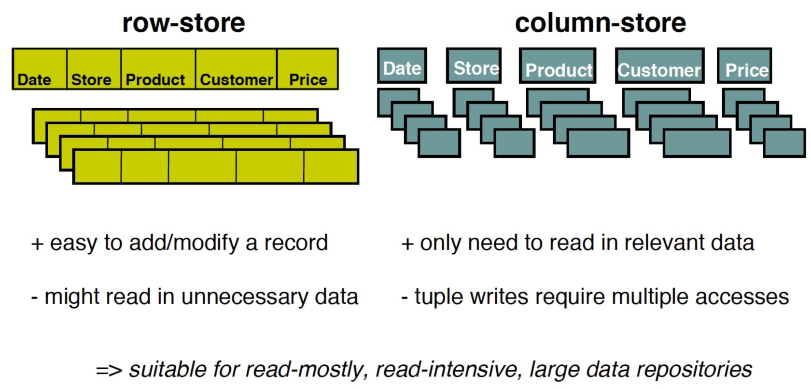
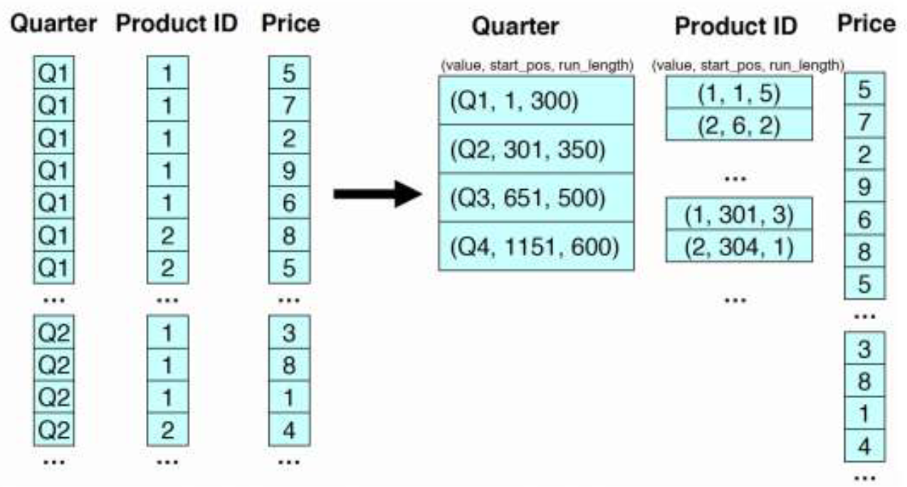

# 01 Introduction

In the recent years there has been a ever growing need for technologies capable
of handling large scala data analysis Thas need was born because dataset of
”Big Data” size have often very different characteristics than the ones usually
stored in realtional databases:
- Data Large and unstructured
- Lots of random reads and writes
- Less use of foreing keys in favour of denormalized data structures

What this new kind of data needs instead is:
- Incremental scalability
- Speed
- No single point of failure
- Low cost and administration
- Horizontal scalability

To address this new needs a new set of databases was invented: columnar databases, who
owe their name to the fact that they **store data by column**, as opposed to tradi-
tional dbs that store data by row.

Row based databases work well in an OLTP application because it is easy to
insert and update records and there isn’t much need for bulk reads; however in
**OLAP environments** where analytical jobs often read a huge number of records
at once it’s fundamental to be able to load only the necessary columns, otherwise
the overhead of having to load the entire rows in main memory would be un-
sustainable.

## Pros and cons
Pros:
- Data compression
- Improved bandwidth utilization
- Improved code pipelining
- Improved cache locality

Cons:
- Increased disk seek times
- Increased cost of Inserts
- Increased tuple reconstruction costs

## Data compression
It happens very often that a column is composed of a few different values repeated many times, what we can do is to group
all the equal values together and instead of storing that same values many
times just store that datum once alongside the number of times that value is
repeated. 

With data compression we are trading CPU for time. 

Data compression is expecially important for columnar databases because:
- Higher data value locality in column stores
- Techniques such as run length encoding far more useful
- Can use extra space to store multiple copies of data in different
sort orders

### Run-Length Encoding
For example if we have one column called ”Quarter” who only has
the values ”Q1”,”Q2”,”Q3” and ”Q4” instead of repeating the full string for
every record we can just sort the db by that column and save tuples of this sort
(”Q1”,200),meaning that the value ”Q1” appears 200 times (this approach is
called **Run-Length Encoding** which exploits the so called s**pacial-locality**, which means storing similar
data values next to each other.).
