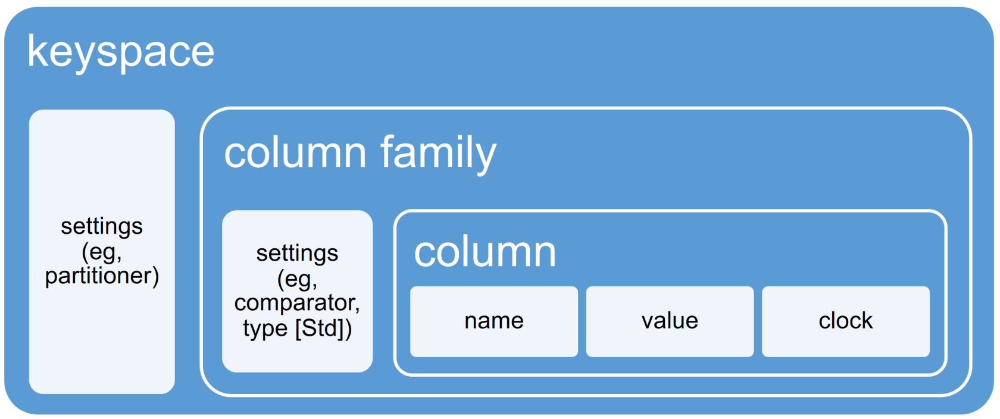
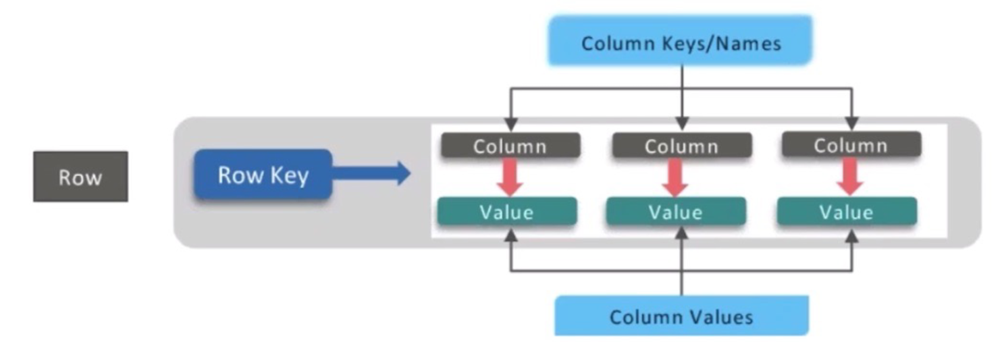
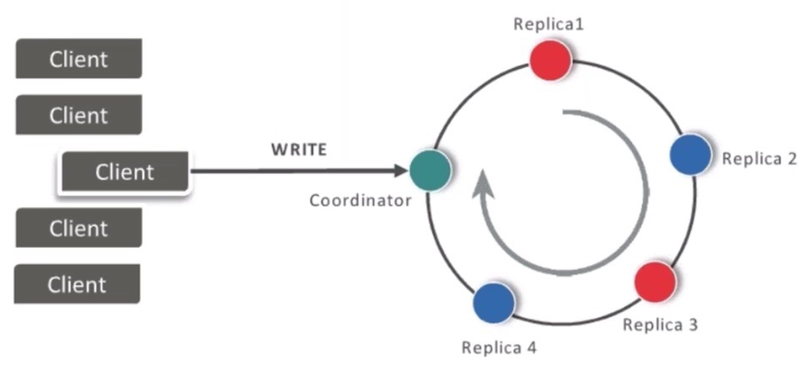
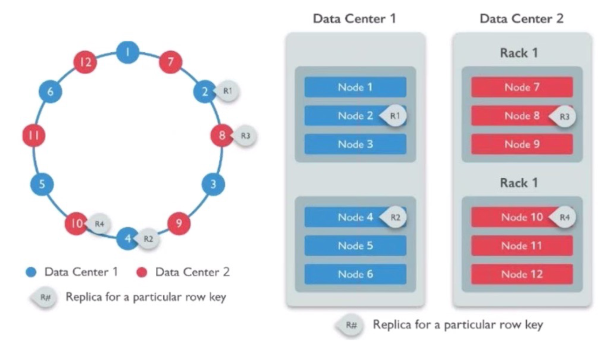
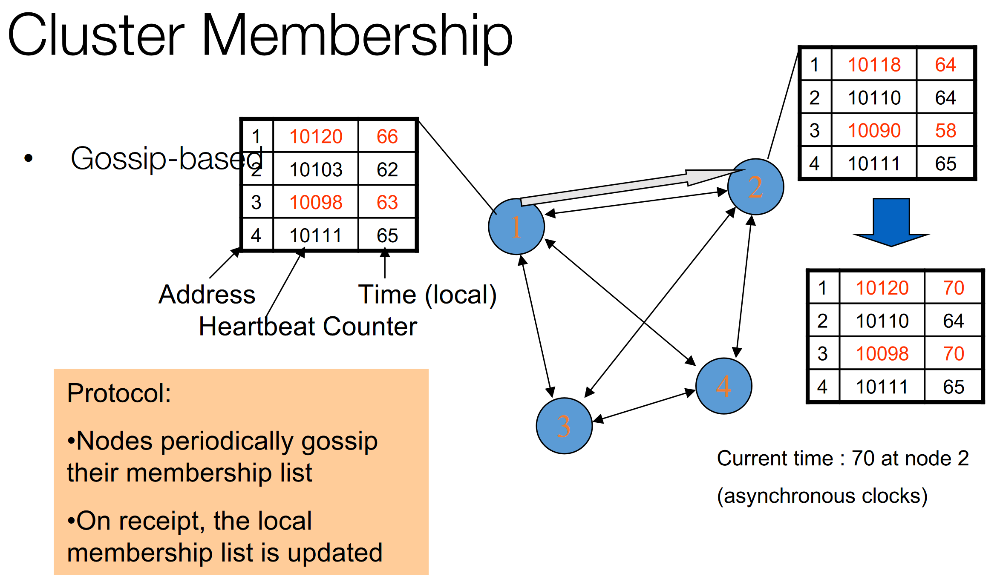

# 02 Cassandra

Apache Cassandra is a highly scalable, high-performance distributed database designed
to handle large amounts of data, providing high availability with no single point of failure.
It’s a column-based NoSQL database created by Meta (ex. Facebook).

The main features are:
- Highly and Linearly Scalable
- No Single Point of Failure (i.e., no single part of the system can stop the entire system
from working)
- Quick Response Time
- Flexible Data Storage (i.e., supports structured, unstructured and semi-structured data)
- Easy Data Distribution (i.e., supports flexible data duplication)
- ACID Properties
- Fast Writes

According to CAP:
- Eventual consistency
- Strong availability
- Partition-tolerance

Cassandra is fault-tolerant. It places replicas of data on different nodes based on
these two factors:
- **Replication Strategy**: where to place the next replica
- **Replication Factor**: total number of replicas placed on different nodes

# Data Model
Cassandra data model is based around the concept of column family, which is a group
of columns. Column families are organized by rows indentified by an unique
key (hence the key value approach). While this approach my seem similar to
relational tables at firts glance, there are many significant differences that makes
it a NoSQL db:
- Each cell in a table could be missing or different from the others
- Schemaless
- Increased tuple reconstruction costs
- Support for key getters and setters

Each column is composed by a **name, a value and a clock** (which is the timestamp
of the last update on that column).

The value of a column can contain other
columns inside him and in that case that column is called a **super-column.**

Columns are grouped in **families**, and many group families make up a keyspace
(which is the equivalent of a database in SQL)

We can see Cassandra also as a **key-value store**, where the key is the row
identifier and the values are the schemaless column families.

Cassandra can be seen as **row-oriented**, where every row is made up of many
columns with values of similar kind but not necessarily equal to the ones in the
other rows of the same Column Family.

Cassandra uses a **Query First
Approach**, where designers first think about the requests the system will need to
be able to answer to, and then they build the db structure around them.

Cassandra can be seen as an ”**index factory**”,meaning that for each query there
is a table optimized to handle it.
So the UserByCity cf would be a list of rows with the city as a key and a column
for each id of the users living in that city. This way a row single row can have
a huge number of columns and that is why columnar db are also often
called **Big Column** stores.

# Architecture
One Cassandra’s main difference from RDBMS it’s that it relies on data duplication and denormalization and following it’s query-first philosophy it **doesn’t
support JOINs** (instead of joining 2 different tables you just build an unique
column family).

Here’s a list of it’s main characteristics:
- Tuneably consistent (we can’t have full consistency as stated by the CAP
theorem)
- Fast writes
- Highly available
- Fault tolerant
- Linear,elastic scalability
- Decentralized
- around 12 client languages
- O(1) dht

Cassandra follows the **Gossip protocol**: each node picks up to 3 discussants and exchange messages with them.

## Replica placement strategies
### Ring architecture
In a **single datacenter** Cassandra implements **Ring Architecture**:
this means that the cluster is **masterless** and made up of equivalent nodes, and
each of them as a predecessor and a successor. *Each node can only send data
to its successor and receive data from its predecessor*. 

When a client wants to write data to the database any one of the nodes can
answer to that request and if it does it becomes the **coordinator** for that operation, and after it has finished writing all data to disk he passes the data to its
successor so that it can be replicated in other nodes.

### Network Topology
In a distributed systems within **multiple datacenters** Cassandra implements **Network Topology**.

## Writes
Cassandra was designed to enable **very fast writes**, in order to do so it had to
**abandon many transactional guarantees**. In order to avoid locks on resources a
WORM (Write Once Read Many) methodology, were data in written only one
time and then never updated again.

The write process works in an **asynchronous** way: the client sends the data to
the coordinator which sends it to all the replica nodes responsible for that key
via partitioning function. This method grants atomicity for a given key, since
in the case of fault in a replica during the write,the coordinator can just keep
sending the data to the working nodes which in turn will send the data again
to the broken replica once it’s up and running again.

To speed up even more the write process all record are initially stored in main
memory and then flushed to disk later on (in case of fault the node can restart
interrupted operations since every action is writted to a changelog).

## Deletes and Reads
When dealing with reads and deletes we need to handle the problem of
consistency (since we have many replicas ).

A Delete operation works by adding a **tombstone** to the item in the changelog
and later on during the compaction that item will be effectively deleted from all
replicas.

The Read operation is similar to the Write, but with some differences:
the coordinator fetches the same data from multiple replicas and if there is any
inconsistency the right data is determined by a **quorum mechanism** and then a
read repair operation is performed. In the quorum mechanism **consistency level is tuneable in the sense that the user can configure the minimum number
of nodes required to reach the quorum**.

Different quorum policies:
- ANY: any node (may not be replica)
- ONE: at least one replica
- QUORUM: quorum across all replicas in all datacenters
- LOCAL_QUORUM: in coordinator’s DC
- EACH_QUORUM: quorum in every DC
- ALL: all replicas all DCs

## Cluster membership
Every node keeps a membership list of the others machines in the cluster
alongside the timestamp of the last heartbeat message that was received from
them, after a certain period of time without has passed receiving any message
from one of its peers that node is considered down.
