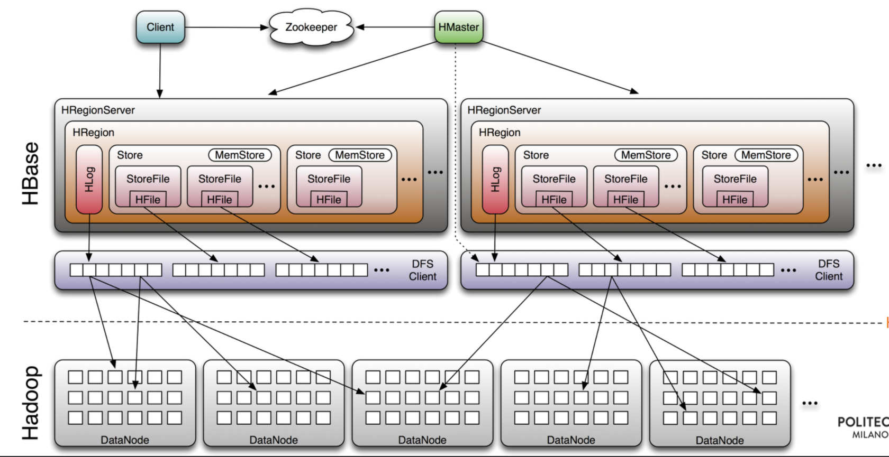

# 03 HBase

- **HBase Table**: Split it into multiple regions: replicated across servers.
- One Store per ColumnFamily (subset of columns with similar query patterns)
per region.
- Memstore for each Store: in-memory updates to Store; flushed to disk when full.
- StoreFiles (**HFile**) for each store for each region: where the data live 

**Strong consistency** (different from Cassandra): **HBase Write-Ahead Log**