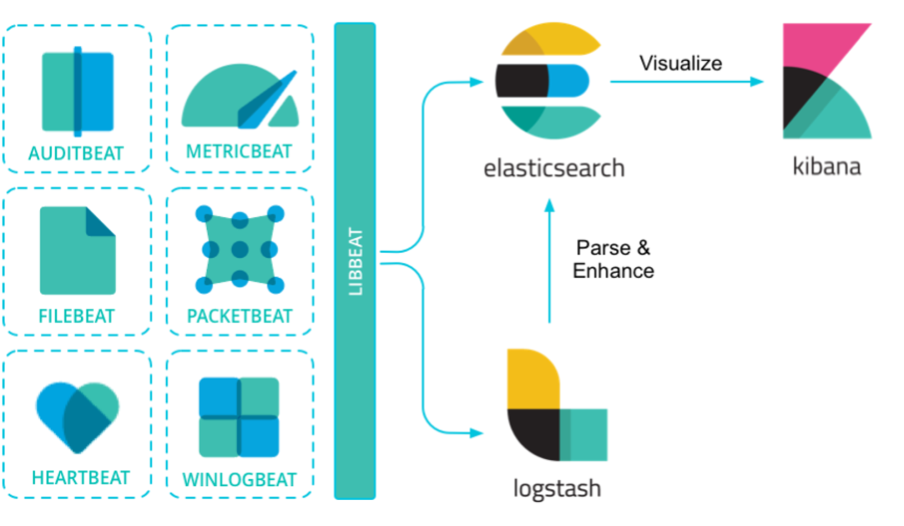

# 01 ELK stack

- **Kibana**: Visualize and Manage
- **Elasticsearch**: Store, Search and Analyze
- **Logstash + Beats**: Ingest

## Elasticsearch
Elasticsearch is the core of the Elastic Stack.

It’s a search and analytic engine
- Near real-time
- Full-text search
- Distributed (JSON format data storage)
- RESTful

## Logstash
- Streaming ETL engine
- Provides centralized data collection,
processing and enrichment on the fly
- Data agnostic
- Wide range of integrations and
processors
- Ready-to-use monitoring and
administrative panes built in Kibana

## Beats
- Platform for data shippers
- Collect and ship logs and metrics
from hosts or containers
- Many available
	- Filebeat
	- Metricbeat
    - Packetbeat
    - Heartbeat

## Kibana
- Kibana is an open source data visualization dashboard
- It provides visualization capabilities on top of the content
indexed on an Elasticsearch cluster.
- Kibana is simple and pretty intuitive to begin with. Despite
such simplicity, it is highly customizable, allowing complex
and detailed representations.