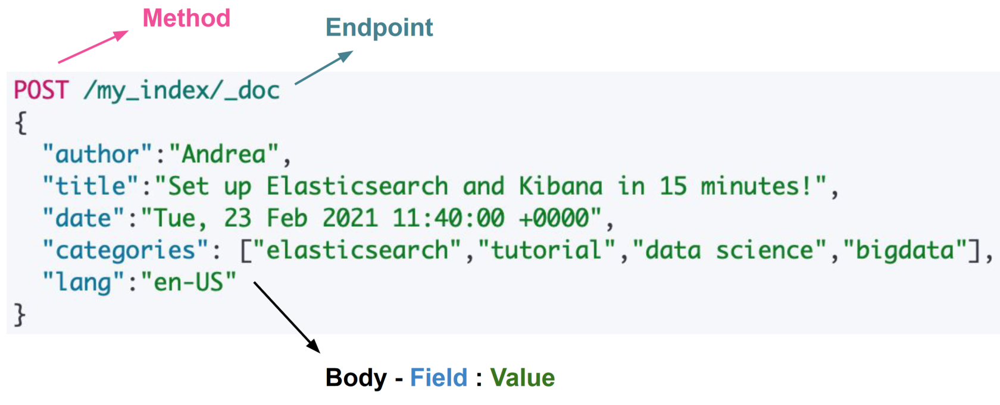

# 02 Elasticsearch

Elasticsearch stores data structures in **JSON documents** which are **distributed** and can be accessed from any ES node when in a cluster.

When stored, new documents are indexed and made **fully searchable**.

## Indices
- Data organization mechanism
- Define the structure of documents via mappings
- Partitioned in shards
- Automatic indexing of new data

Elasticsearch is based on the concept of **Inverted Index**: lists every unique word from every
document and identifies which documents
a word appears in.

## Shards and Replicas
**Shards** distribute operations to
- Increase resistance to faults
- Improve performance

**Replicas** are copies of primary shards stored on a different node.

**Write Operation** are performed on the Primary shard then on Replicas (to copy)

**Read Operation** are either performed on the Primary shard or a Replica

## Term Frequency-Inverse Document Frequency (TF-IDF)
Results are scored with a Practical Scoring Function, which uses **Term
Frequency-Inverse Document Frequency (TF-IDF)**:
- Measures the **relevance** of a term inside a document
- Penalizes the words that appear too often across different documents

**Term Frequency** measures the frequency of term i in document j:
$$tf_{i,j} = \frac{n_{i,j}}{|d_j|}$$
Where $n_{i,j}$ is the number of time term i
appear in document while $|d_j|$ is the number of terms in
document j.

**Inverse Document Frequency** measures how common a term is across the
collection of documents, the lower the less important that term is (because it is an inverse frequency):
$$idf_{i} = \log{\frac{|D|}{\lbrace d: i \in d \rbrace}}$$
Where $|D|$ is the number of documents in a collection while $\lbrace d: i \in d \rbrace$ is the number of documents
containing the term i.

**TF-IDF**
$$(tf-idf)\_{i,j} = tf_{i,j} \times idf_{i}$$

## Mapping
By defining a mapping for an index you can tell Elasticsearch the types of your
documents’ fields
- Define searchable fields
- Enable full-text search, time and geo-based queries

N.B. you can’t change the mapping on an existing index that already has
documents!

**Dynamic Mapping**, it’s risky (e.g. dates could be parsed as strings)

## Schemaless
Elasticsearch is schemaless, i.e., if a
schema is not provided, it tries to
guess the structure of the documents.

## Interaction
Interactions with Elasticsearch happen through requests to REST endpoints
The actions that can be performed depend on HTTP verb
- GET is used to read document, indices metadata, etc.
- POST and PUT are often used to create new documents, indices, etc.
- DELETE is used to delete documents, indices, etc.

[](../../../images/16c0609eb4_nlf3bAT7gJRu9lCT-image-1640776715304.png)

Beware of the differences between POST and PUT
- POST doesn’t require the ID of the resource → duplicates
	- When omitted, Elasticsearch takes care of creating and assigning IDs to
documents
```
POST /index_name/_doc
```
- PUT requires the ID of the resource → create or update the same one
```
PUT /index_name/_doc/document_id
```

## Language analyzer
Language analyzers preprocess textual field, for example
- It removes stopwords of a given language
- Perform stemming

**Standard Analyzer**
The standard analyzer divides text into terms on word boundaries, as defined by the Unicode Text
Segmentation algorithm. It removes most punctuation, lowercases terms, and supports removing stop
words.

**Simple Analyzer**
The simple analyzer divides text into terms whenever it encounters a character which is not a letter. It
lowercases all terms.

**Whitespace Analyzer**
The whitespace analyzer divides text into terms whenever it encounters any whitespace character. It does
not lowercase terms.

**Stop Analyzer**
The stop analyzer is like the simple analyzer, but also supports removal of stop words.

**Keyword Analyzer**
The keyword analyzer is a “noop” analyzer that accepts whatever text it is given and outputs the exact
same text as a single term.

**Pattern Analyzer**
It performs the analysis according to a custom regexp pattern