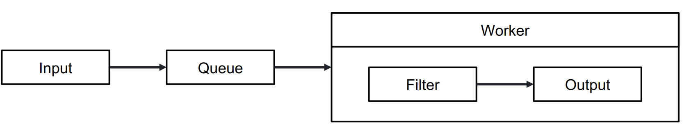

# 04 Logstash

## Working with Beats
Beats focus on data collection and shipping while Logstash focuses on processing and data normalization.

Logstash can also receive data from
devices for which Beats are not
deployed
- Via TCP, UDP, HTTP protocols
- Pool-based inputs like JDBC

## Processing
- Filter plugins (a.k.a. Processors)
	- Help with data wrangling
	- Use them to build pipelines that structure, normalize and enrich data
- Examples:
	- Derive geographic coordinates from IP addresses
	- Exclude sensitive fields
    
## Emission
Plugins are available to emit data to Elasticsearch, to other data stores or via
TCP, UDP and HTTP protocols

## Events
- Primary unit of data in Logstash
- Similar to JSON documents
- Flow through pipelines
```json
{
  “@timestamp” => 2021-16-02T01-01-01,
  “message” => “hello”,
  “other_field” => {
  “nested_field” => 5678
  }
}
```

## Pipeline
Logical flow of data
- Supports multiple inputs
- Single queue to buffer data
	- Either in-memory or persistent
- Workers ensure server-side scalability
[](../../../images/6d52901952_0PQ5Ky5Y1N7WQ1Fc-image-1640777359522.png)

Logstash processes are called **Instances**.

Logstash uses **Codecs**:
- Used to change the data representation of an event
	- Serialization and de-serialization
- Can be used as part of an input or output

An exampe of a pipeline is: 
```json
input {
	beats { port => 5043 }
}
filter {
	mutate { lowercase => [“message”] }
}
output {
	elasticsearch {}
}
```

### Filters
- **mutate**: field manipulation filter
  - Convert types
  - Add, rename, replace, copy fields
  - Upper and lowercase transformations
  - Join arrays
  - Split field into arrays
- **split**: divide a single event
into multiple events
- **drop**: delete an event
- **geoip** and **dns**: enrich IP addresses
- **useragent**: record information like browser type from web logs
- **translate**: use local data to translate parts of the events
- **elasticsearch**: query Elasticsearch
- **jdbc**: query databases that support Java

## Message management
- “At Least Once” message delivery
	- In most conditions messages are delivered exactly once
	- Unclean shutdowns could lead to duplicates
- DLQ - Dead Letter Queue
	- Events that are not processable
	- Due to “at least once” policy these are undeliverable
	- Avoids losing those events and halting the pipeline, freeing processing
resources for subsequent events