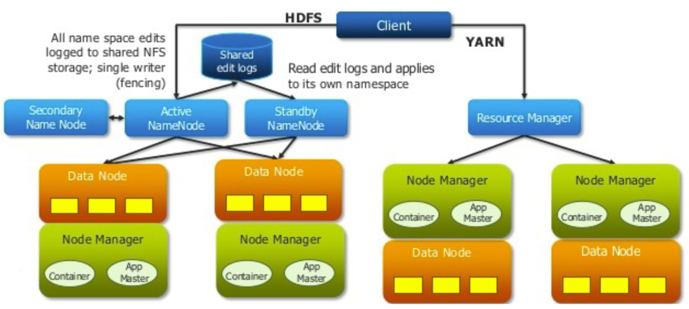

# Hadoop 2.0

## YARN
- Splits up the two major functions of JobTracker
	- **Global Resource Manager** - Cluster resource management
	- **Application Master** - Job scheduling and monitoring (one per application).
- The Application Master negotiates resource containers from the Scheduler,
tracking their status and monitoring for progress. Application Master itself
runs as a normal container.
	- Tasktracker
	- NodeManager (NM) - A new per-node slave is responsible for launching
the applications’ containers, monitoring their resource usage (cpu,
memory, disk, network) and reporting to the Resource Manager.
- YARN maintains compatibility with existing MapReduce applications and
users.

### Classic MapReduce vs. YARN
**Fault Tolerance and Availability**:
- Resource Manager
	- No single point of failure – state saved in ZooKeeper
	- Application Masters are restarted automatically on RM restart
- Application Master
	- Optional failover via application-specific checkpoint
	- MapReduce applications pick up where they left off via state saved in HDFS

**Wire Compatibility**:
- Protocols are wire-compatible
- Old clients can talk to new servers
- Rolling upgrades

Support for programming paradigms other than MapReduce (**Multi tenancy**)