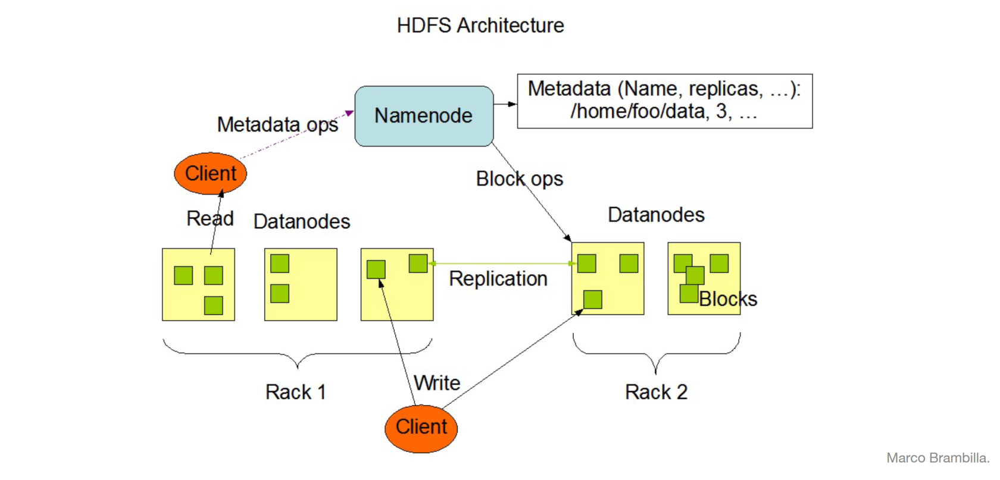
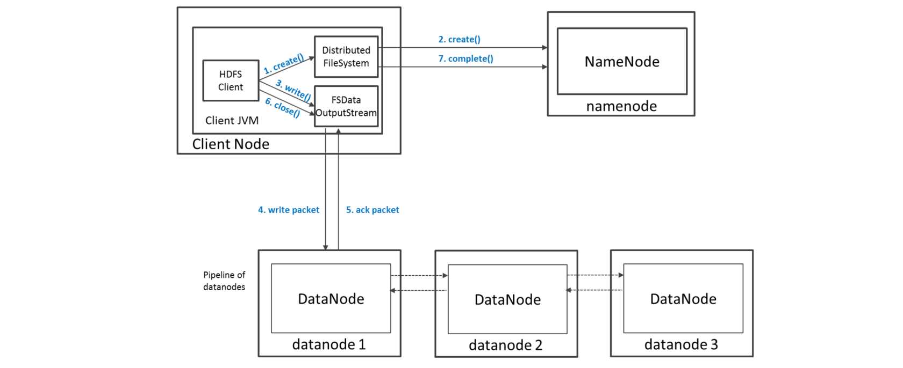
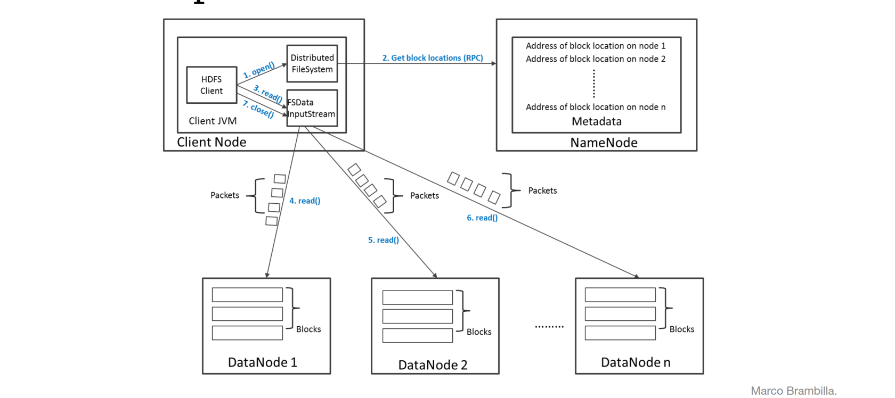

# HDFS Architecture, Security and Configuration

# HDFS Architecture

## NameNode
- Manages File System Namespace
	- Maps a file name to a set of blocks
	- Maps a block to the DataNodes where it resides
- Cluster Configuration Management
- Replication Engine for Blocks: NameNode detects DataNode failures
	- Chooses new DataNodes for new replicas
    - Balances disk usage
    - Balances communication traffic to DataNodes
- Keeps a **Transaction Log**: Records file creations, file deletions etc
- Was a **single point of failure in Hadoop 1.0**

The NameNode stores **metadata** in memory. There are multiple type of metadata:
- List of files
- List of Blocks for each file
- List of DataNodes for each block
- File attributes, e.g. creation time, replication factor

There is a **Secondary NameNode** which:
- Copies FsImage and Transaction Log from
Namenode to a temporary directory
- Merges FSImage and Transaction Log into
a new FSImage in temporary directory
- Uploads new FSImage to the NameNode

## DataNode
- A Block Server
	- Stores data in the local file system (e.g. ext3)
	- Stores metadata of a block (e.g. CRC)
	- Serves data and metadata to Clients
- Block Report
	- Periodically sends a report of all existing blocks to
the NameNode
- Facilitates Pipelining of Data
	- Forwards data to other specified DataNodes
- **Heartbeats**:
	- DataNodes send hearbeat to the NameNode
    - NameNode uses heartbeats to detect
DataNode failure
    
## Block Placement
- Strategy
	- One replica on local node
	- Second replica on a remote rack
	- Third replica on same remote rack
	- Additional replicas are randomly placed
- Clients read from nearest replicas

## Data Correctness
- Use Checksums to validate data
	- Use CRC32
- File Creation
	- Client computes checksum per 512 bytes
	- DataNode stores the checksum
- File access
	- Client retrieves the data and checksum from
DataNode
	- If Validation fails, Client tries other replicas
    
## Data Pieplining
- Client retrieves a list of DataNodes on
which to place replicas of a block
- Client writes block to the first DataNode
- The first DataNode forwards the data to the
next node in the Pipeline
- When all replicas are written, the Client
moves on to write the next block in file

## Data Retrieval
When a client wants to retrieve data first it communicates with the NameNode to determine
which blocks make up a file and on which data nodes
those blocks are stored. Then communicated directly with the data nodes to
read the data.

# HDFS Security
There are multiple authentication strategies (set by `hadoop.security.authentication=simple|kerberos`):
- **Simple**: insecure way of using OS username to determine hadoop identity
- **Kerberos**: authentication using kerberos ticket

File and Directory permissions are same like in POSIX: read (r), write (w), and execute (x) permissions and it also has an owner, group and mode enabled by default (`dfs.permissions.enabled=true`).

**ACLs** are used for implemention permissions that differ from
natural hierarchy of users and groups
enabled by `dfs.namenode.acls.enabled=true`

# HDFS Configuration
HDFS Defaults:
- Block Size – 64 MB
- Replication Factor – 3
- Web UI Port – 50070

HDFS conf file `/etc/hadoop/conf/hdfs-site.xml`