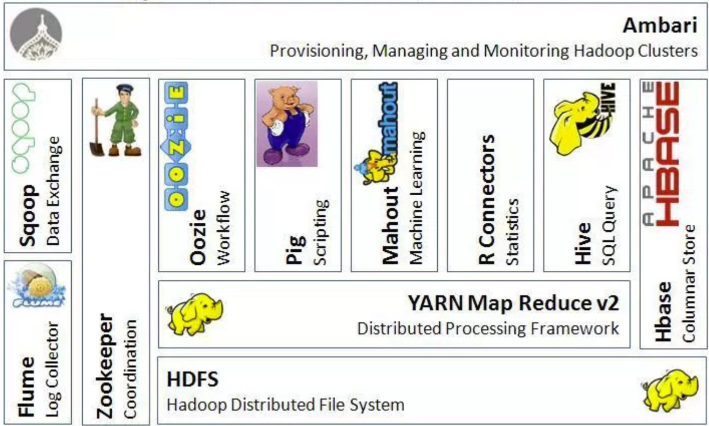
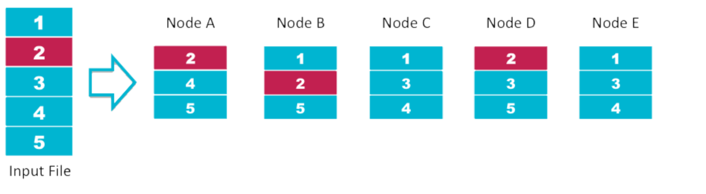

# Introduction

Software platform to easily process vast amounts of data. The main features are:
- **Scalable**: It can reliably store and process petabytes.
- **Economical**: It distributes the data and processing across clusters of commonly available
computers (in thousands).
- **Efficient**: By distributing the data, it can process it in parallel on the nodes where the
data is located.
- **Reliable**: It automatically maintains multiple copies of data and automatically redeploys
computing tasks based on failures.

Hadoop implements Google’s MapReduce,
using HDFS.

## Components overview
- Apache Hadoop
- Apache Hive
- Apache Pig
- Apache HBase
- Apache Zookeeper
- Flume, Hue, Oozie, and Sqoop

## HDFS
It is a **file system** responsible for storing data on the cluster.
Data files are split into blocks and distributed
across the nodes in the cluster where each block is replicated multiple times.
- written in Java based on the Google’s GFS
- Provides redundant storage for massive
amounts of data
- HDFS works best with a smaller number of large
files
- Files in HDFS are write once read many
- Optimized for streaming reads of large files and
not random reads

### File storing
- Files are split into blocks and these blocks are split across many machines at load
time
- Different blocks from the same file will be stored on
different machines
- Blocks are replicated across multiple machines
- The NameNode keeps track of which blocks
make up a file and where they are stored
- Single Namespace for entire cluster
- The default replication strategy is **3-fold**.

## Hadoop Properties
1. **Fault Tolerance**:
	- Worker failure – handled via re-execution
    - Master failure rare and can be recovered from checkpoints
2. **Disk Locality**:
	- Leveraging HDFS
    - Map tasks are scheduled close to data
    - Conserves network bandwidth
3. **Task Granularity**:
	- No. of map tasks > no. of worker nodes
    - Increases load on Master
    - Map could be chosen w.r.t to block size of the file system
    - Reduce is usually specified by users