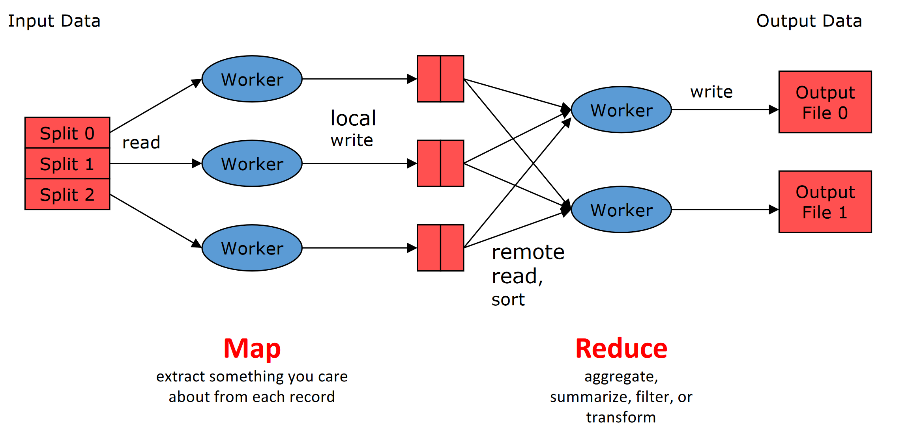

# MapReduce

## Introduction
> MapReduce is a programming model and an associated implementation for processing and generating big data sets with a parallel, distributed algorithm on a cluster.

A MapReduce program is composed of a **map procedure**, which performs filtering and sorting (such as sorting students by first name into queues, one queue for each name), and a **reduce method**, which performs a summary operation (such as counting the number of students in each queue, yielding name frequencies).

The "MapReduce System" (also called "infrastructure" or "framework") orchestrates the processing by running the various tasks in parallel, managing all communications and data transfers between the various parts of the system, and providing for redundancy and fault tolerance. 

The model is a specialization of the **split-apply-combine** strategy for data analysis.

The key contributions of the MapReduce framework are not the actual map and reduce functions, but the **scalability and fault-tolerance** achieved for a variety of applications by **optimizing the execution engine**.

[](../../../images/e2c31b8726_tD8pPHWVGVgtpu2n-image-1640960449904.png)

A  MapReduce framework (or system) is usually composed of three operations (or steps):
- **Map**: each worker node applies the map function to the local data, and writes the output to a temporary storage. A master node ensures that only one copy of the redundant input data is processed.
- **Shuffle**: worker nodes redistribute data based on the output keys (produced by the map function), such that all data belonging to one key is located on the same worker node.
- **Reduce**: worker nodes now process each group of output data, per key, in parallel.

## Logical view
The Map and Reduce functions of MapReduce are both defined with respect to data structured in (key, value) pairs. Map takes one pair of data with a type in one data domain, and returns a list of pairs in a different domain: 

`Map(k1,v1)` → `list(k2,v2)`

The Map function is applied in parallel to every pair (keyed by `k1`) in the input dataset. This produces a list of pairs (keyed by `k2`) for each call. After that, the MapReduce framework collects all pairs with the same key (`k2`) from all lists and groups them together, creating one group for each key.

The Reduce function is then applied in parallel to each group, which in turn produces a collection of values in the same domain: 

`Reduce(k2, list (v2))` → `list((k3, v3))`

Each Reduce call typically produces either one key value pair or an empty return, though one call is allowed to return more than one key value pair. The returns of all calls are collected as the desired result list. 

Thus the MapReduce framework **transforms a list of (key, value) pairs into another list of (key, value) pairs**.

### Example: counts the appearance of each word in a set of documents
```python
function map(String name, String document):
  // name: document name
  // document: document contents
  for each word w in document:
    emit (w, 1)

function reduce(String word, Iterator partialCounts):
  // word: a word
  // partialCounts: a list of aggregated partial counts
  sum = 0
  for each pc in partialCounts:
    sum += pc
  emit (word, sum)
```
For example with the following input:
```
<Q1,“The teacher went to the store. The store was closed; the
store opens in the morning. The store opens at 9am.” >,
```
The Map function:
```
<The, 1> <teacher, 1> <went, 1> <to, 1> <the, 1> <store,1> <the, 1> <store,
1> <was, 1> <closed, 1> <the, 1> <store,1> <opens, 1> <in, 1> <the, 1>
<morning, 1> <the 1> <store, 1> <opens, 1> <at, 1> <9am, 1>
```
And the Reduce function:
```
<The, 6> <teacher, 1> <went, 1> <to, 1> <store, 3> <was, 1>
<closed, 1> <opens, 1> <morning, 1> <at, 1> <9am, 1>
```