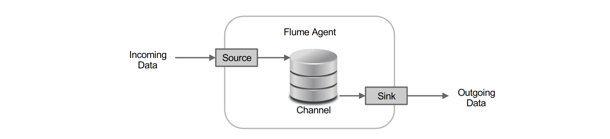
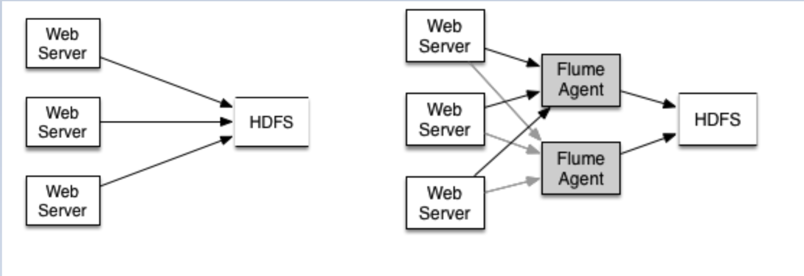

# Flume

Apache Flume is a **distributed, reliable, and available software for efficiently collecting, aggregating, and moving large amounts of log data**.

It is *robust and fault tolerant* with tunable reliability mechanisms and many failover and recovery mechanisms. It uses a simple extensible data model that allows for online analytic application.

It suports multiple sources which can change over time and be in different locations.

Flume provides **weak ordering guarantee**, i.e., in the absence of
failures the data will arrive in the order it was received in the Flume
pipeline

## Architecture
Flume has a simple and flexible architecture based on streaming data flows.

### Flume Agents
The basic of Flume is the **Flume Agent** which can connect any number of sources to any
number of data stores.

Agents are chained in a Fully customizable and extendable Distributed Pipeline Architecture, optimized for commonly used data sources and destinations and with built in support for contextual routing.

### Flume events
A Flume Event is the base unit of
communication between components: a **source pushes event and a sink polls for them**.

**Transactional exchange** ensures that Flume never loses any data in
transit between Agents. Sinks use transactions to ensure data is not
lost at point of ingest or terminal destinations.

| Source | Channel | Sink |
| - | - | - |
|Accepts Data incoming and writes data to Channel|Stores data in the order recived|Removes data from channels and sends it downstram|

## Log Aggregation Example

Using flume:
- Insulation from HDFS downtime
-  Quick offload of logs from Web
Server machines
-  Better Network utilization
-  Redundancy and Availability
-  Better handling of downstream
failures
-  Automatic load balancing and
failover

## Multi-Step Flow
Flume can be setted up as a **multi-step converging flow** where closer a tier is to the destination,
larger the batch size it delivers
downstream.

## Planning and sizing
- **Number of Tiers**: Calculated with upstream to downstream Agent ratio ranging from 4:1 to
16:1. Factor in routing, failover, load-balancing requirements...
- **Exit Batch Size**: Calculated for steady state data volume exiting the tier, divided by
number of Agents in that tier. Factor in contextual routing and duplication
due to transient failure impact...
- **Channel Capacity**: Calculated as worst case ingest rate sustained over the worst case
downstream downtime. Factor in number of disks used etc...