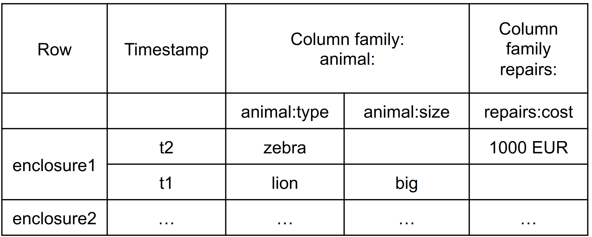
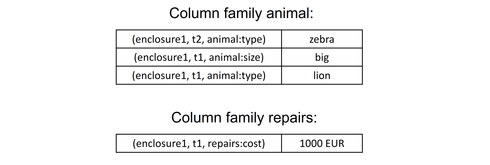

# HBase

HBase is a **key-valued row/column store** modeled on Google’s Bigtable providing Bigtable-like capabilities for Hadoop. That is, it provides a **fault-tolerant** way of storing large quantities of **sparse data** (small amounts of information caught within a large collection of empty or unimportant data, such as finding the 50 largest items in a group of 2 billion records, or finding the non-zero items representing less than 0.1% of a huge collection). 

Unlike relational and traditional databases, HBase does not support SQL scripting; instead the equivalent is written in **Java**, employing similarity with a MapReduce application.

In the parlance of Eric Brewer's CAP Theorem, HBase is a **CP type system**. 

## Data model
[](../../../images/ee767d888e_2P698CoVM4pQQtV9-image-1641042079790.png)

## Data Storage
[](../../../images/9f222d53be_OWpYeQPPvbTpWsUP-image-1641042126845.png)

## Querying
Retrieve a cell: 
```java
Cell cell = table.getRow(“enclosure1”).getColumn(“animal:type”).getValue();
```
Retrieve a row: 
```java
RowResult row = table.getRow( “enclosure1” );
```
Scan through a range of rows: 
```java
Scanner s = table.getScanner( new String[] { “animal:type” } );
```