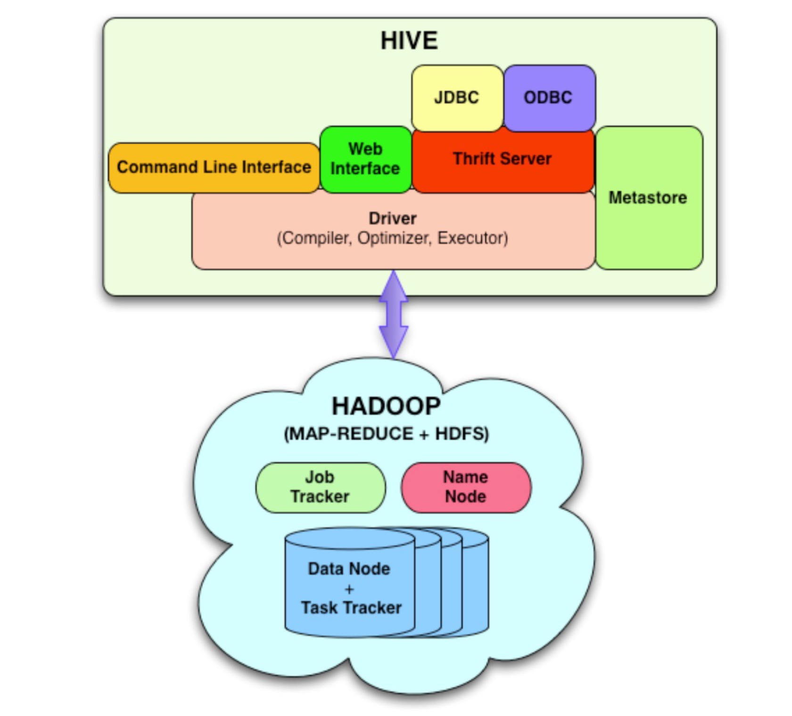

# Hive

Apache Hive is a **data warehouse software** project built on top of Apache Hadoop for providing data query and analysis.

Hive gives an **SQL-like interface to query data stored** in various databases and file systems that integrate with Hadoop. Traditional SQL queries must be implemented in the MapReduce Java API to execute SQL applications and queries over distributed data. Hive provides the necessary SQL abstraction to integrate SQL-like queries (**HiveQL**) into the underlying Java without the need to implement queries in the low-level Java API. Since most data warehousing applications work with SQL-based querying languages, Hive aids portability of SQL-based applications to Hadoop.

## Architecture
[](../../../images/49aa09a657_gjTwe5AmvUcRv8SH-image-1641043352030.png)

Major components of the Hive architecture are:
- **Metastore**: Stores metadata for each of the tables such as their schema and location.The metadata helps the driver to keep track of the data and it is crucial.
- **Driver**: Acts like a controller which receives the HiveQL statements. It starts the execution of the statement by creating sessions, and monitors the life cycle and progress of the execution.
- **Compiler**: Performs compilation of the HiveQL query, which converts the query to an execution plan.
- **Optimizer**: Performs various transformations on the execution plan to get it optimized for better performance.
- **Executor**: After compilation and optimization, the executor executes the tasks. It interacts with the job tracker of Hadoop to schedule tasks to be run.
- **CLI, UI, and Thrift Server**: A command-line interface (CLI) provides a user interface for an external user to interact with Hive by submitting queries, instructions and monitoring the process status. Thrift server allows external clients to interact with Hive over a network.

## Data Model
**Tables**
- Typed columns (int, float, string, date, boolean)
- Also, array/map/struct for JSON-like data

**Partitions**
- e.g., to range-partition tables by date

**Buckets**
- Hash partitions within ranges (useful for sampling,
join optimization)

## Storage
**Warehouse directory in HDFS**
- Table row data stored in subdirectories of warehouse
- Partitions form subdirectories of table directories

**Actual data stored in flat files**

## Hive CLI
List tables:
```shell
hive> show tables;
```
Describe a table:
```shell
hive> describe <tablename>;
```
More information:
```shell
hive> describe extended <tablename>;
```