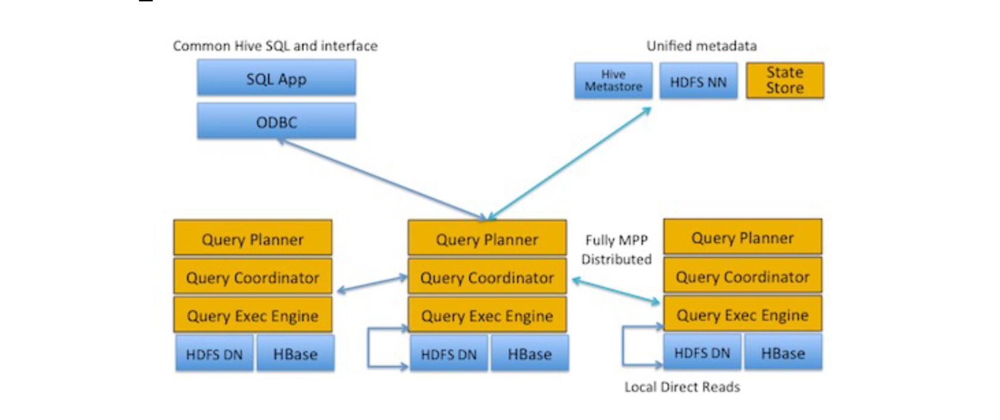

# Impala

Apache Impala is an open source **massively parallel processing (MPP) SQL query engine** for data stored in a computer cluster running Apache Hadoop. 

Integrated into Hadoop stack on the same level
as MapReduce, and not above it (process data
without using MapReduce). Impala brings **scalable parallel database technology** to Hadoop, enabling users to issue **low-latency SQL queries** to data stored in HDFS and Apache HBase without requiring data movement or transformation.

Impala is promoted for analysts and data scientists to **perform analytics** on data stored in Hadoop **via SQL** or business intelligence tools. The result is that large-scale data processing (via MapReduce) and interactive queries can be done on the same system using the same data and metadata – **removing the need to migrate data sets into specialized systems** and/or proprietary formats simply to perform analysis. 

## Architecture
