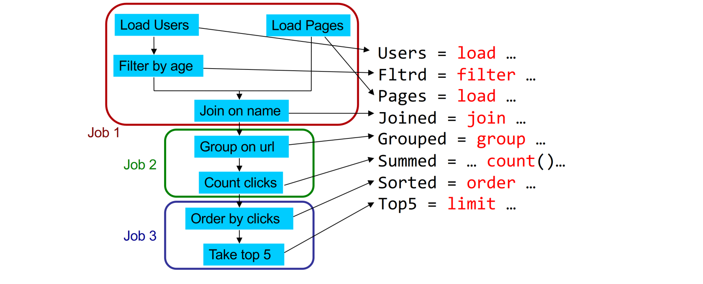

# Pig

Apache Pig is a high-level platform for creating programs that run on Apache Hadoop. The language for this platform is called **Pig Latin**. Pig can execute its Hadoop jobs.

Pig Latin abstracts the programming from the Java MapReduce idiom into a **notation which makes MapReduce programming high level, similar to that of SQL** for relational database management systems. Pig Latin can be extended using user-defined functions (UDFs) which the user can write in Java, Python, JavaScript, Ruby or Groovy and then call directly from the language. 

